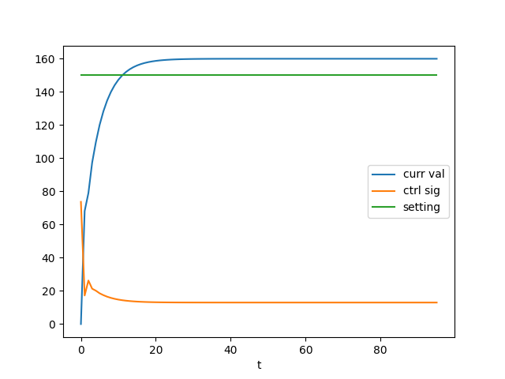

<p align="center">Министерство образования Республики Беларусь</p>
<p align="center">Учреждение образования</p>
<p align="center">"Брестский Государственный технический университет"</p>
<p align="center">Кафедра ИИТ</p>
<br>
<br>
<p align="center">Лабораторная работа №2</p>
<p align="center">По дисциплине: "Общая теория интеллектуальных систем"</p>
<p align="center">Тема: "ПИД-регуляторы"</p>
<br>
<br>
<p align="right">Выполнил:<br>Студент 2 курса<br>Группы ИИ-24<br>Рудецкий Е.В.</p>
<p align="right">Проверил:<br>Иванюк Д. С.</p>
<br>
<p align="center">Брест 2023</p>

---

# Общее задание #
1. Написать отчет по выполненной лабораторной работе №2 в .md формате (*readme.md*) и с помощью **pull request** разместить его в следующем каталоге: **trunk\ii0xxyy\task_02\doc**.
2. Исходный код написанной программы разместить в каталоге: **trunk\ii00xxyy\task_02\src**.
---

# Выполнение задания #

Вывод программы:
```
value:
0,132.929,154.043,189.844,214.052,234.267,250.13,262.796,272.861,280.868,287.237,292.303,296.333,

signal:
143.707,33.6037,51.1938,41.5638,39.2089,36.1443,33.9742,32.1881,30.7808,29.6584,28.7663,28.0566,28.0566,

setting:
312,312,312,312,312,312,312,312,312,312,312,312,
```

