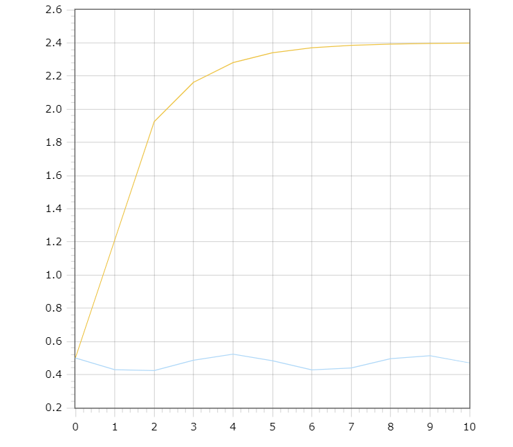

<p align="center"> Министерство образования Республики Беларусь</p>
<p align="center">Учреждение образования</p>
<p align="center">“Брестский Государственный технический университет”</p>
<p align="center">Кафедра ИИТ</p>
<br><br><br><br><br><br><br>
<p align="center">Лабораторная работа №1</p>
<p align="center">По дисциплине “Общая теория интеллектуальных систем”</p>
<p align="center">Тема: “Моделирования температуры объекта”</p>
<br><br><br><br><br>
<p align="right">Выполнил:</p>
<p align="right">Студент 2 курса</p>
<p align="right">Группы ИИ-23</p>
<p align="right">Волкогон Н.И.</p>
<p align="right">Проверил:</p>
<p align="right">Иванюк Д. С.</p>
<br><br><br><br><br>
<p align="center">Брест 2023</p>

---

# Общее задание #
1. Написать отчет по выполненной лабораторной работе №1 в .md формате (readme.md) и с помощью запроса на внесение изменений (**pull request**) разместить его в следующем каталоге: **trunk\ii0xxyy\task_01\doc** (где **xx** - номер группы, **yy** - номер студента, например **ii02302**).
2. Исходный код написанной программы разместить в каталоге: **trunk\ii0xxyy\task_01\src**.

## Task 1. Modeling controlled object ##
Let's get some object to be controlled. We want to control its temperature, which can be described by this differential equation:

$$\Large\frac{dy(\tau)}{d\tau}=\frac{u(\tau)}{C}+\frac{Y_0-y(\tau)}{RC} $$ (1)

where $\tau$ – time; $y(\tau)$ – input temperature; $u(\tau)$ – input warm; $Y_0$ – room temperature; $C,RC$ – some constants.

After transformation we get these linear (2) and nonlinear (3) models:

$$\Large y_{\tau+1}=ay_{\tau}+bu_{\tau}$$ (2)
$$\Large y_{\tau+1}=ay_{\tau}-by_{\tau-1}^2+cu_{\tau}+d\sin(u_{\tau-1})$$ (3)

where $\tau$ – time discrete moments ($1,2,3{\dots}n$); $a,b,c,d$ – some constants.

Task is to write program (**C++**), which simulates this object temperature.

---

# Выполнение задания #

Код программы:
```C++
#include <iostream>

using namespace std;

double a = 0.5,
b = 1,
c = 0.15,
d = 0.3,
u = 1.2;


void liner(double& y1)
{
	y1 = a * y1 + b * u;
	cout << y1 << endl;
}

void unliner(double& y2, double& y_pr, bool& second_iteration)
{
	if (second_iteration)
	{
		y_pr = y2;
		y2 = a * y2 + c * u + d * sin(u); 
		cout << y2 << endl;
		second_iteration = false;
	}
	else
	{
		double buf;
		buf = a * y2 - b * pow(y_pr, 2) + c * u + d * sin(u);
		y_pr = y2;
		y2 = buf;
		cout << y2 << endl;
	}
}


int main()
{
	double y1, y2, y_pr;
	bool second_iteration = true;
	cout << "Input temperature: ";
	cin >> y1;
	y2 = y1;
	int n = 10;
	cout << "Liner model\n" << y1 << endl;
	for (int i = 0; i < n; i++)
		liner(y1);
	cout << endl << "Unliner model\n" << y2 << endl;
	for (int i = 0; i < n; i++)
		unliner(y2, y_pr, second_iteration);
}
```     

Вывод программы:

   		Input temperature: 0.1
		Liner model
		0.1
		1.25
		1.825
		2.1125
		2.25625
		2.32812
		2.36406
		2.38203
		2.39102
		2.39551
		2.39775
		
		Unliner model
		0.1
		0.509612
		0.704418
		0.552116
		0.239466
		0.274512
		0.539524
		0.654017
		0.495534
		0.279641
		0.353878

