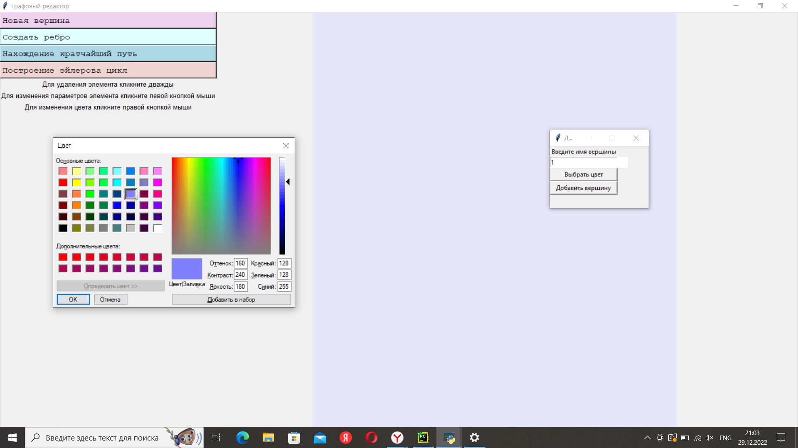
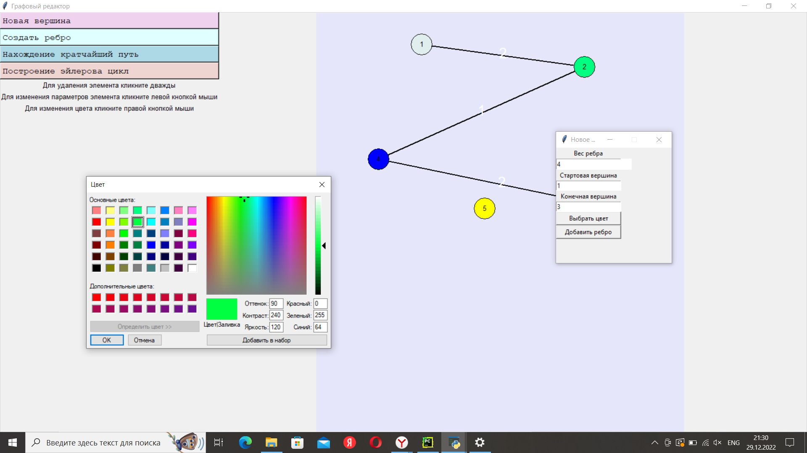
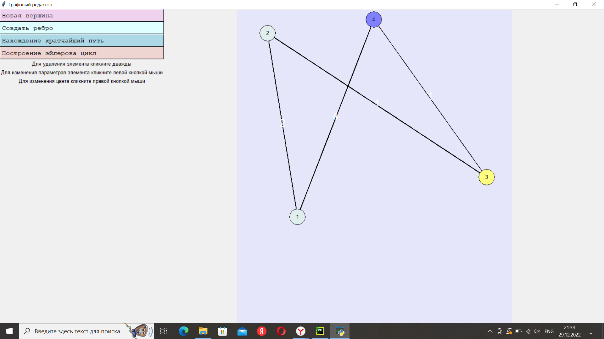
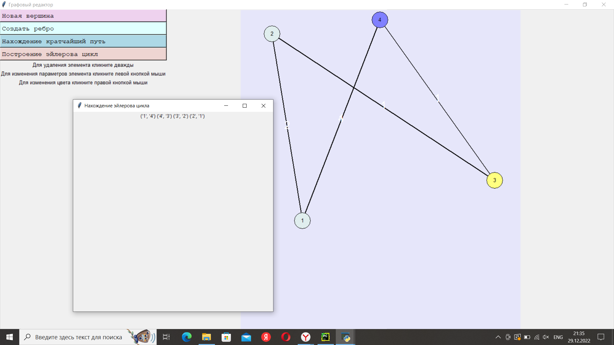
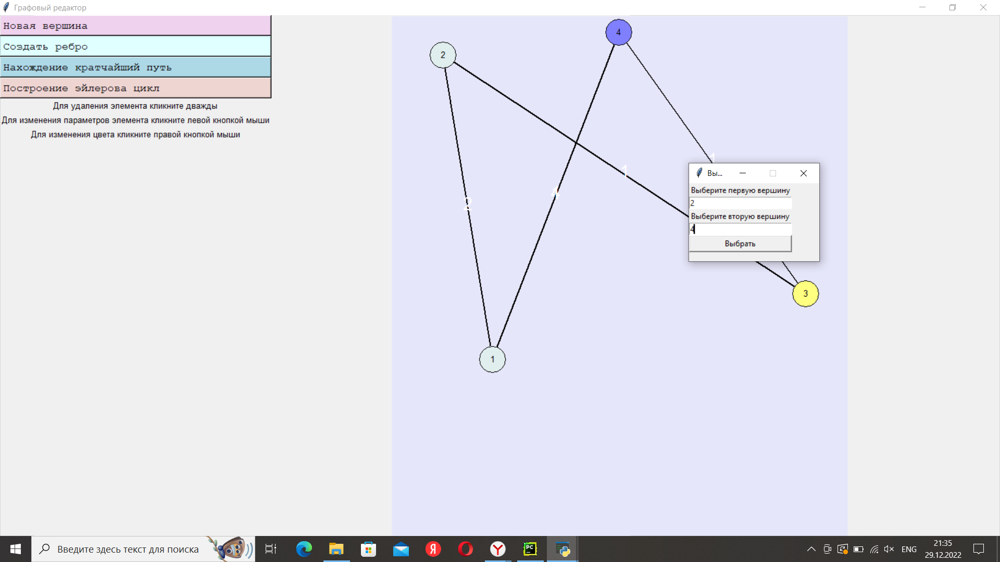
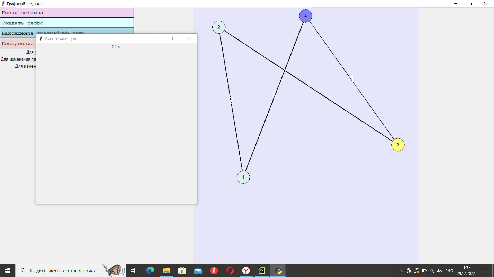
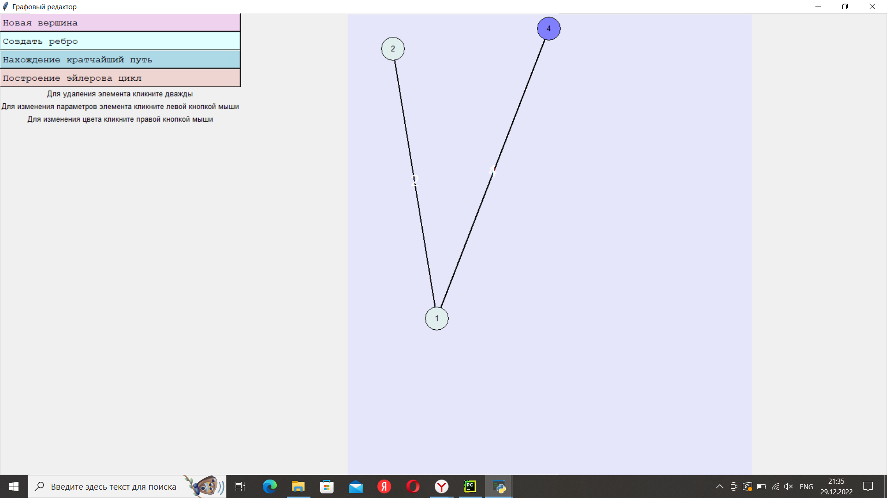
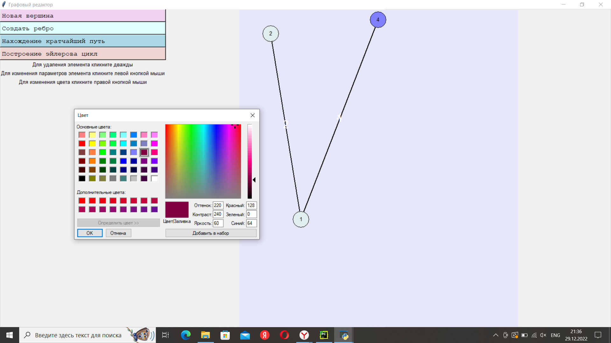

Министерство образования Республики Беларусь

Учреждение образования

«Брестский государственный технический университет»

Кафедра ИИТ

     

Лабораторная работа №3

За третий семестр

По дисциплине: «Общая теория интеллектуальных систем»

Тема: «Разработка редакторов графов»

     

Выполнила:

Студентка 2 курса

Группы ИИ-23

Волкогон Н.И.

  

Проверил:

Иванюк Д.С.

Брест 2023  

--
# В работе было реализованно: #
1. Разработка и реализация программного продукта позволяющего
редактировать графовые конструкции различных видов и производить над
ними различные действия.

2. Редактор позволяет:  
  a) одновременно работать с несколькими графами (MDI);  
  b) **[\*]** выделение одновременно нескольких элементов графа, копирование
выделенного фрагмента в clipboard и восстановление из него;  
  c) задавать имена графам;  
  d) сохранять и восстанавливать граф во внутреннем формате программы;  
  e) экспортировать и импортировать граф в текстовый формат (описание
см. ниже);  
  f) создавать, удалять, именовать, переименовывать, перемещать узлы;  
  g) создавать неориентированные дуги, удалять дуги;  
  h) добавлять, удалять и редактировать содержимое узла (содержимое в
виде текста и ссылки на файл);  
  i) задавать цвет дуги и узла, образ узла;  
  j) **[\*]** создавать и отображать петли;  
  k) **[\*]** создавать и отображать кратные дуги.

3. Программный продукт позволяет выполнять следующие операции:  
  a) выводить информацию о графе;
  b) поиск всех путей (маршрутов) между двумя узлами и кратчайших;  
  c) вычисление расстояния между двумя узлами;    
  d) **[\*]** раскраска графа;  
  e) нахождения эйлеровых циклов.  

4. Отчет по выполненной лабораторной работе в .md формате (readme.md). Разместить его в следующем каталоге: **trunk\ii0xxyy\task_03\doc** (где **xx** - номер группы, **yy** - номер студента, например **ii02302**). 

5. Исходный код разработанной программы разместить в каталоге: **trunk\ii0xxyy\task_03\src**.
nk\ii0xxyy\task_04\doc.

