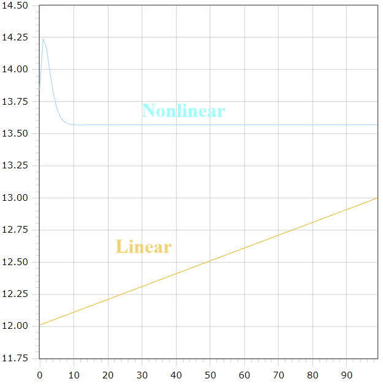

<p align="center"> Министерство образования Республики Беларусь</p>
<p align="center">Учреждение образования</p>
<p align="center">“Брестский Государственный технический университет”</p>
<p align="center">Кафедра ИИТ</p>
<br><br><br><br><br><br><br>
<p align="center">Лабораторная работа №1</p>
<p align="center">По дисциплине “Общая теория интеллектуальных систем”</p>
<p align="center">Тема: “Моделирования температуры объекта”</p>
<br><br><br><br><br>
<p align="right">Выполнил:</p>
<p align="right">Студент 2 курса</p>
<p align="right">Группы ИИ-23</p>
<p align="right">Кононов А. М.</p>
<p align="right">Проверил:</p>
<p align="right">Иванюк Д. С.</p>
<br><br><br><br><br>
<p align="center">Брест 2023</p>

<hr>

# Общее задание #
1. Написать отчет по выполненной лабораторной работе №1 в .md формате (readme.md) и с помощью запроса на внесение изменений (**pull request**) разместить его в следующем каталоге: **trunk\ii0xxyy\task_01\doc** (где **xx** - номер группы, **yy** - номер студента, например **ii02102**).
2. Исходный код написанной программы разместить в каталоге: **trunk\ii0xxyy\task_01\src**.
## Task 1. Modeling controlled object ##
Let's get some object to be controlled. We want to control its temperature, which can be described by this differential equation:

$$\Large\frac{dy(\tau)}{d\tau}=\frac{u(\tau)}{C}+\frac{Y_0-y(\tau)}{RC} $$ (1)

where $\tau$ – time; $y(\tau)$ – input temperature; $u(\tau)$ – input warm; $Y_0$ – room temperature; $C,RC$ – some constants.

After transformation, we get these linear (2) and nonlinear (3) models:

$$\Large y_{\tau+1}=ay_{\tau}+bu_{\tau}$$ (2)
$$\Large y_{\tau+1}=ay_{\tau}-by_{\tau-1}^2+cu_{\tau}+d\sin(u_{\tau-1})$$ (3)

where $\tau$ – time discrete moments ($1,2,3{\dots}n$); $a,b,c,d$ – some constants.

Task is to write program (**Julia**), which simulates this object temperature.

<hr>

# Выполнение задания #

Код программы:
```C++
#include <iostream>
#include <cmath>

const double A = 1;
const double B = 0.01;
const double C = 1;
const double D = 1;

void linear(double y, double u, int t_end) {
    for (int t = 1; t <= t_end; ++t) {
        double y_next = A * y + B * u;
        y = y_next;
        std::cout << y_next << "\n";
    }
}
void nonlinear(double y_prev, double y, double u, int t_end) {
    for (int t = 1; t <= t_end; ++t) {
        double y_next = A * y - B * pow(y_prev, 2) + C * u + D * sin(u);
        y_prev = y;
        y = y_next;
        std::cout << y_next << "\n";
    }
}


int main() {
    double initialTemperature;
    double warming;
    int endTime;

    std::cout << "Введите начальную температуру: ";
    std::cin >> initialTemperature;

    std::cout << "Введите потепление: ";
    std::cin >> warming;

    std::cout << "Введите время окончания: ";
    std::cin >> endTime;

    std::cout << "\nLinear Model:\n";
    linear(initialTemperature, warming, endTime);

    std::cout << "\nNonlinear Model:\n";
    nonlinear(0, initialTemperature, warming, endTime);

    return 0;
}
```
```

Введите начальную температуру: 14
Введите потепление: 1
Введите время окончания: 100

Linear Model:
14.01
14.02
14.03
14.04
14.05
14.06
14.07
14.08
14.09
14.1
14.11
14.12
14.13
14.14
14.15
14.16
14.17
14.18
14.19
14.2
14.21
14.22
14.23
14.24
14.25
14.26
14.27
14.28
14.29
14.3
14.31
14.32
14.33
14.34
14.35
14.36
14.37
14.38
14.39
14.4
14.41
14.42
14.43
14.44
14.45
14.46
14.47
14.48
14.49
14.5
14.51
14.52
14.53
14.54
14.55
14.56
14.57
14.58
14.59
14.6
14.61
14.62
14.63
14.64
14.65
14.66
14.67
14.68
14.69
14.7
14.71
14.72
14.73
14.74
14.75
14.76
14.77
14.78
14.79
14.8
14.81
14.82
14.83
14.84
14.85
14.86
14.87
14.88
14.89
14.9
14.91
14.92
14.93
14.94
14.95
14.96
14.97
14.98
14.99
15

Nonlinear Model:
15.8415
15.7229
15.0549
14.4243
13.9992
13.7601
13.6418
13.5899
13.5703
13.565
13.5649
13.5663
13.5677
13.5687
13.5694
13.5697
13.5699
13.57
13.5701
13.5701
13.5701
13.5701
13.5701
13.5701
13.5701
13.5701
13.5701
13.5701
13.5701
13.5701
13.5701
13.5701
13.5701
13.5701
13.5701
13.5701
13.5701
13.5701
13.5701
13.5701
13.5701
13.5701
13.5701
13.5701
13.5701
13.5701
13.5701
13.5701
13.5701
13.5701
13.5701
13.5701
13.5701
13.5701
13.5701
13.5701
13.5701
13.5701
13.5701
13.5701
13.5701
13.5701
13.5701
13.5701
13.5701
13.5701
13.5701
13.5701
13.5701
13.5701
13.5701
13.5701
13.5701
13.5701
13.5701
13.5701
13.5701
13.5701
13.5701
13.5701
13.5701
13.5701
13.5701
13.5701
13.5701
13.5701
13.5701
13.5701
13.5701
13.5701
13.5701
13.5701
13.5701
13.5701
13.5701
13.5701
13.5701
13.5701
13.5701
13.5701
```

