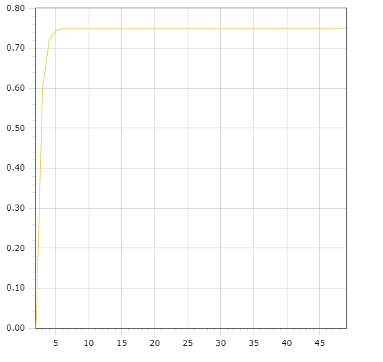

Министерство образования Республики Беларусь <br/>
Учреждение образования <br/>
«Брестский государственный технический университет» <br/>
Кафедра ИИТ <br/>

Лабораторная работа №1 <br/>
За третий семестр <br/>
По дисциплине: «Общая теория интеллектуальных систем» <br/>
Тема: «Modeling controlled object» <br/>

Выполнил: <br/>
Студент 2 курса <br/>
Группы ИИ-23 <br/>
Копач А.В. <br/>

Проверил: <br/>
Иванюк Д.С. <br/>

Брест 2023 <br/>

# Общее задание #
1. Написать отчет по выполненной лабораторной работе №1 в .md формате (readme.md) и с помощью запроса на внесение изменений (**pull request**) разместить его в следующем каталоге: **trunk\ii0xxyy\task_01\doc** (где **xx** - номер группы, **yy** - номер студента, например **ii02308**).
2. Исходный код написанной программы разместить в каталоге: **trunk\ii0xxyy\task_01\src**.

## Task 1. Modeling controlled object ##
Let's get some object to be controlled. We want to control its temperature, which can be described by this differential equation:

$$\Large\frac{dy(\tau)}{d\tau}=\frac{u(\tau)}{C}+\frac{Y_0-y(\tau)}{RC} $$ (1)

where $\tau$ – time; $y(\tau)$ – input temperature; $u(\tau)$ – input warm; $Y_0$ – room temperature; $C,RC$ – some constants.

After transformation we get these linear (2) and nonlinear (3) models:

$$\Large y_{\tau+1}=ay_{\tau}+bu_{\tau}$$ (2)
$$\Large y_{\tau+1}=ay_{\tau}-by_{\tau-1}^2+cu_{\tau}+d\sin(u_{\tau-1})$$ (3)

where $\tau$ – time discrete moments ($1,2,3{\dots}n$); $a,b,c,d$ – some constants.

Task is to write program (**C++**), which simulates this object temperature.


## Код программы ##


``` C++
#include <iostream>
#include <cmath>
#include <fstream>

using namespace std;

class functions {
private:
    double i = 2; //start time
    double u = 2; //input warm
    double t = 50; //end time
    const double a = 0.2;
    const double b = 0.3;
    const double c = 0.45;
    const double d = 0.7; //some constants
public:
    void linear(double y) {
        if (i != t) {
            ofstream file("lin.txt", ios::app);
            file << i << " " << y << endl;
            ++i;
            cout << y << endl;
            linear(a * y + b * u);
        }
        else {
            cout << "end linear\n";
        }
    }
    void nonlinear(double y, double y1) {
        if (i != t) {
            ofstream file("nonlin.txt", ios::app);
            file << i << " " << y << endl;
            cout << y << endl;
            ++i;
            nonlinear(a * y - b * y1 * y1 + c * u + d * sin(u), y);
        }
        else {
            cout << "end nonlinear" << endl;
        }
    }
};

int main() {
    double y = 0, y1 = 0;
    ofstream file1("lin.txt");
    ofstream file2("nonlin.txt");
    file1.clear();
    file2.clear();
    functions linear, nonlinear;
    cout << "linear model: \n";
    linear.linear(0);
    cout << "nonlinear model: \n";
    nonlinear.nonlinear(0, 0);
} 
```

Вывод программы:
```
linear model:
0
0.6
0.72
0.744
0.7488
0.74976
0.749952
0.74999
0.749998
0.75
0.75
0.75
0.75
0.75
0.75
0.75
0.75
0.75
0.75
0.75
0.75
0.75
0.75
0.75
0.75
0.75
0.75
0.75
0.75
0.75
0.75
0.75
0.75
0.75
0.75
0.75
0.75
0.75
0.75
0.75
0.75
0.75
0.75
0.75
0.75
0.75
0.75
0.75
end linear
nonlinear model:
0
1.53651
1.84381
1.19701
0.75602
1.25786
1.61661
1.38517
1.02951
1.1668
1.4519
1.41846
1.1878
1.17046
1.34734
1.39498
1.27091
1.2069
1.29333
1.35819
1.30634
1.24437
1.27343
1.32666
1.31536
1.27157
1.27177
1.30579
1.31244
1.28747
1.27725
1.29469
1.30604
1.29485
1.28376
1.29027
1.30015
1.2971
1.28881
1.28953
1.2961
1.29686
1.29192
1.29034
1.29386
1.29579
1.29344
1.29147
end nonlinear
```


