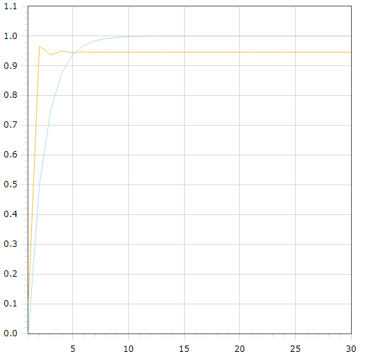

<p align="center"> Министерство образования Республики Беларусь</p>
<p align="center">Учреждение образования</p>
<p align="center">“Брестский Государственный технический университет”</p>
<p align="center">Кафедра ИИТ</p>
<br><br><br><br><br><br><br>
<p align="center">Лабораторная работа №1</p>
<p align="center">По дисциплине “Общая теория интеллектуальных систем”</p>
<p align="center">Тема: “Моделирования температуры объекта”</p>
<br><br><br><br><br>
<p align="right">Выполнил:</p>
<p align="right">Студент 2 курса</p>
<p align="right">Группы ИИ-23</p>
<p align="right">Ежевский Е. Р.</p>
<p align="right">Проверил:</p>
<p align="right">Иванюк Д. С.</p>
<br><br><br><br><br>
<p align="center">Брест 2023</p>

---

# Общее задание #
1. Написать отчет по выполненной лабораторной работе №1 в .md формате (readme.md) и с помощью запроса на внесение изменений (**pull request**) разместить его в следующем каталоге: **trunk\ii0xxyy\task_01\doc** (где **xx** - номер группы, **yy** - номер студента, например **ii02102**).
2. Исходный код написанной программы разместить в каталоге: **trunk\ii0xxyy\task_01\src**.

## Task 1. Modeling controlled object ##
Let's get some object to be controlled. We want to control its temperature, which can be described by this differential equation:

$$\Large\frac{dy(\tau)}{d\tau}=\frac{u(\tau)}{C}+\frac{Y_0-y(\tau)}{RC} $$ (1)

where $\tau$ – time; $y(\tau)$ – input temperature; $u(\tau)$ – input warm; $Y_0$ – room temperature; $C,RC$ – some constants.

After transformation we get these linear (2) and nonlinear (3) models:

$$\Large y_{\tau+1}=ay_{\tau}+bu_{\tau}$$ (2)
$$\Large y_{\tau+1}=ay_{\tau}-by_{\tau-1}^2+cu_{\tau}+d\sin(u_{\tau-1})$$ (3)

where $\tau$ – time discrete moments ($1,2,3{\dots}n$); $a,b,c,d$ – some constants.

Task is to write program (**C++**), which simulates this object temperature.

---

# Выполнение задания #

Код программы:
```C++
#include<iostream>
#include <cmath>
#include <fstream>

class model
{
private:
    int t = 1;                  //starttime
    int T = 30;                 //endtime    
    double u = 1;             //input warm    

    const double a = 0.2;
    const double b = 0.2;
    const double c = 0.2;
    const double d = 0.2;        //some constants

public:
    void linear(double y, std::ofstream& file)
    {
        if (t <= T)
        {
            file << t << " " << y << std::endl;
            std::cout << t << " " << y << std::endl;
            t++;
            linear(a * y + b * u, file);
        }
        else
        {
            std::cout << "end linear\n";
        }
    }
    void nonlinear(double y, double y1, std::ofstream& file)
    {
        if (t <= T)
        {
            file << t << " " << y << std::endl;
            std::cout << t << " " << y << std::endl;
            t++;
            y1 = y;
            nonlinear(a * y - b * pow(y1, 2) + c * u + d * sin(u), y, file);
        }
        else
        {
            std::cout << "end nonlinear" << std::endl;
        }
    }
};

int main()
{
    double y = 0;

    std::ofstream linearFile("linear.txt", std::ios::out);
    model linearFunctions;
    linearFunctions.linear(y, linearFile);
    linearFile.close();

    y = 0.1;                      //reset "y" for nonliner function
    double y1 = 0.1;

    std::ofstream nonlinearFile("nonlinear.txt", std::ios::out);
    model nonlinearFunctions;
    nonlinearFunctions.nonlinear(y, y1, nonlinearFile);
    nonlinearFile.close();

    return 0;
}
```     

Вывод программы:

	1 0
	2 0.2
	3 0.24
	4 0.248
	5 0.2496
	6 0.24992
	7 0.249984
	8 0.249997
	9 0.249999
	10 0.25
	11 0.25
	12 0.25
	13 0.25
	14 0.25
	15 0.25
	16 0.25
	17 0.25
	18 0.25
	19 0.25
	20 0.25
	21 0.25
	22 0.25
	23 0.25
	24 0.25
	25 0.25
	26 0.25
	27 0.25
	28 0.25
	29 0.25
	30 0.25
	end linear
	1 0.1
	2 0.386294
	3 0.415708
	4 0.416873
	5 0.416912
	6 0.416913
	7 0.416914
	8 0.416914
	9 0.416914
	10 0.416914
	11 0.416914
	12 0.416914
	13 0.416914
	14 0.416914
	15 0.416914
	16 0.416914
	17 0.416914
	18 0.416914
	19 0.416914
	20 0.416914
	21 0.416914
	22 0.416914
	23 0.416914
	24 0.416914
	25 0.416914
	26 0.416914
	27 0.416914
	28 0.416914
	29 0.416914
	30 0.416914
	end nonlinear

