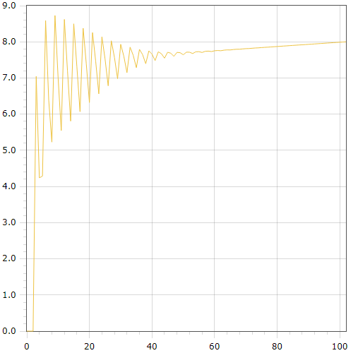

<p align="center"> Министерство образования Республики Беларусь</p>
<p align="center">Учреждение образования</p>
<p align="center">“Брестский Государственный технический университет”</p>
<p align="center">Кафедра ИИТ</p>
<br><br><br><br><br><br><br>
<p align="center">Лабораторная работа №2</p>
<p align="center">По дисциплине “Общая теория интеллектуальных систем”</p>
<p align="center">Тема: “Моделирования температуры объекта”</p>
<br><br><br><br><br>
<p align="right">Выполнил:</p>
<p align="right">Студент 2 курса</p>
<p align="right">Группы ИИ-23</p>
<p align="right">Ежевский Е. Р.</p>
<p align="right">Проверил:</p>
<p align="right">Иванюк Д. С.</p>
<br><br><br><br><br>
<p align="center">Брест 2023</p>

---

# Общее задание #
1. Написать отчет по выполненной лабораторной работе №2 в .md формате (readme.md) и с помощью запроса на внесение изменений (**pull request**) разместить его в следующем каталоге: **trunk\ii0xxyy\task_02\doc** (где **xx** - номер группы, **yy** - номер студента, например **ii02102**).
2. Исходный код написанной программы разместить в каталоге: **trunk\ii0xxyy\task_02\src**.

# Задание #
На C++ реализовать программу, моделирующую рассмотренный выше ПИД-регулятор.  В качестве объекта управления использовать математическую модель, полученную в предыдущей работе.
В отчете также привести графики для разных заданий температуры объекта, пояснить полученные результаты.

---

# Выполнение задания #

Код программы:
```C++
#include <iostream>
#include <cmath>
#include <vector>
#include <fstream>

class Function
{
public:
    double summary()
    {
        double sum = 0;
        for (int i = 0; i < 3; i++)
        {
            sum += q[i] * e[i];
        }
        return sum;
    }

    void nonlinear(int time, double goal, double a = 0.5, double b = 0.3, double c = 0.9, double d = 0.7)
    {
        for (int i = 0; i < time; i++)
        {
            e[0] = goal - y[y.size() - 3];
            e[1] = goal - y[y.size() - 2];
            e[2] = goal - y[y.size() - 1];
            u[0] = u[1] + summary();
            y.push_back(a * y[y.size() - 1] - b * y[y.size() - 2] * y[y.size() - 2] + c * u[0] + d * sin(u[1]));
            u[1] = u[0];
        }
    }

    std::vector<double> getY() const
    {
        return y;
    }

private:
    double k = 0.01;
    double t = 40;
    double td = 100;
    double t0 = 1;

    double q0 = k * (1 + td / t0);
    double q1 = -k * (1 + 2 * td / t0 - t0 / t);
    double q2 = k * td / t0;

    std::vector<double> q = { q0, q1, q2 };
    std::vector<double> e = { 0, 0, 0 };
    std::vector<double> y = { 0, 0, 0 };
    std::vector<double> u = { 1, 1 };
};

int main()
{
    double goal;
    std::ofstream out("output.txt");
    Function f;

    if (out.is_open())
    {
        std::cout << "Enter the goal: ";
        std::cin >> goal;
        f.nonlinear(100, goal);

        std::vector<double> y_values = f.getY();

        for (size_t i = 0; i < y_values.size(); i++)
        {
            double ans = y_values[i] * goal / y_values[y_values.size() - 1];
            std::cout << i << " " << ans << std::endl;
            out << i << " " << ans << std::endl;
        }

        out.close();
    }
    else
    {
        std::cerr << "Error: Cannot open the output file." << std::endl;
    }

    return 0;
}
```     

Вывод программы:
    0 0
    1 0
    2 0
    3 7.04439
    4 4.23871
    5 4.28645
    6 8.58628
    7 6.38138
    8 5.22722
    9 8.72787
    10 6.99746
    11 5.54519
    12 8.61962
    13 7.19329
    14 5.80772
    15 8.4976
    16 7.30534
    17 6.06692
    18 8.37614
    19 7.39313
    20 6.3202
    21 8.25514
    22 7.46557
    23 6.56116
    24 8.13752
    25 7.52399
    26 6.78299
    27 8.02798
    28 7.56913
    29 6.97966
    30 7.93149
    31 7.60259
    32 7.1473
    33 7.85196
    34 7.62688
    35 7.28503
    36 7.79127
    37 7.64489
    38 7.39489
    39 7.74911
    40 7.65931
    41 7.48086
    42 7.72336
    43 7.6722
    44 7.54771
    45 7.71097
    46 7.6849
    47 7.60004
    48 7.70872
    49 7.69813
    50 7.64177
    51 7.71374
    52 7.71221
    53 7.67595
    54 7.72375
    55 7.72717
    56 7.7049
    57 7.73702
    58 7.74293
    59 7.73025
    60 7.75237
    61 7.75936
    62 7.75316
    63 7.76899
    64 7.77629
    65 7.77443
    66 7.78634
    67 7.7936
    68 7.79459
    69 7.80411
    70 7.81116
    71 7.81401
    72 7.82207
    73 7.82889
    74 7.83292
    75 7.8401
    76 7.8467
    77 7.85148
    78 7.85814
    79 7.86455
    80 7.86979
    81 7.87614
    82 7.8824
    83 7.88792
    84 7.89407
    85 7.90022
    86 7.9059
    87 7.91193
    88 7.91799
    89 7.92375
    90 7.92971
    91 7.9357
    92 7.9415
    93 7.94741
    94 7.95334
    95 7.95915
    96 7.96502
    97 7.97091
    98 7.97672
    99 7.98255
    100 7.9884
    101 7.99419
    102 8

