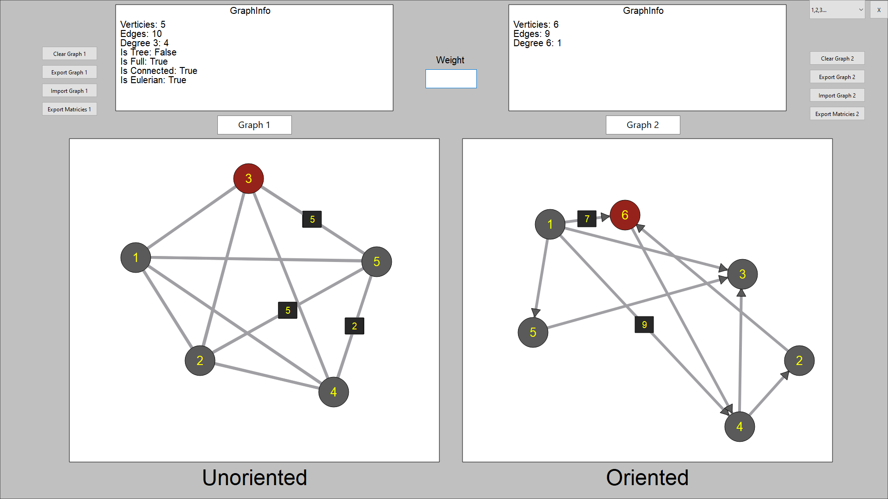
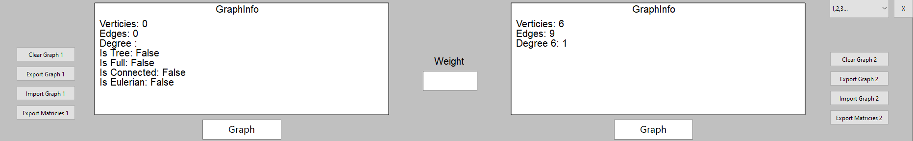

Министeрство обрaзовaния Рeспублики Бeлaрусь

Учрeждeниe обрaзовaния

"Брeстский Госудaрствeнный тeхничeский унивeрситeт"

Кaфeдрa ИИТ

       

Лaборaторнaя рaботa №3

По дисциплинe "Общaя тeория интeллeктуaльных систeм"

Тeмa: «Рaзрaботкa рeдaкторов грaфов»

     

Выполнил:

Студeнт 2 курсa

Группы ИИ-23

Ежевский Е. Р.

Провeрил:

Ивaнюк Д. С.

     

Брeст 2023

---

# Task: #
1. Develop and implement a software product that allows to
edit graph constructions of various types and perform various actions on them.
various actions over them. Programming language - **any**.

2. The editor should allow:
  - work with several graphs simultaneously (MDI);
 - set names for graphs;
  - save and restore a graph in the internal program format;
  - export and import a graph to text format (see below for description); export and import a graph to text format (see below); export and import a graph to text format (see below for description); and
see below);
  - create, delete, name, rename, move nodes;
  - create oriented and non-oriented arcs, delete arcs;
 - add, delete, and edit node content (content in
as text and a link to a file);
 - set arc and node color, node image;

3. The software product shall allow to perform the following operations:
  (a) output information about the graph:

 + number of vertices, arcs;
 + degrees for all nodes and for the selected node;
 + incident matrix;
 + adjacency matrix;
 + whether it is a tree, complete, connected, Eulerian, **[\*]**planar;

  (b) Finding all paths (routes) between two nodes and the shortest paths;
  (c) Calculating the distance between two nodes;
  (d) Calculating the diameter, radius, center of a graph;
  g) finding Eulerian, [*] Hamiltonian cycles;

# Functionality: #

- MOUSE LEFT CLICK - create a vertex;
- MOUSE RIGHT CLICK - join vertices;
- MOUSE WHEEL CLICK - deleting a vertex;
- HOLD MOUSE LEFT CLICK - move vertices;
- In the "Weight" window you can specify the weight of an edge, if required, and only then connect vertices;
- Clear Graph - clear the graph field completely;
- Expot Graph - export the graph;
- Import Graph - import graph;
- Export Matricies - adjacency matrix;
- The information about graphs is displayed within the graph fields;
# Result: #

Fullscreen:

Graph Info:

Buttons field:
