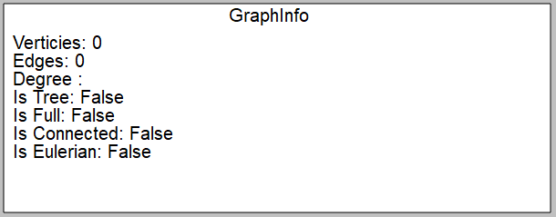

Министeрство обрaзовaния Рeспублики Бeлaрусь

Учрeждeниe обрaзовaния

"Брeстский Госудaрствeнный тeхничeский унивeрситeт"

Кaфeдрa ИИТ

       

Лaборaторнaя рaботa №3

По дисциплинe "Общaя тeория интeллeктуaльных систeм"

Тeмa: «Рaзрaботкa рeдaкторов грaфов»

     

Выполнил:

Студeнт 2 курсa

Группы ИИ-23

Ежевский Е. Р.

Провeрил:

Ивaнюк Д. С.

     

Брeст 2023

---

# Task: #
1. Разработать и реализовать программный продукт, позволяющий
редактировать графовые конструкции различных видов и производить над
ними различные действия. Язык программирования - **C++**.

2. Редактор должен позволять (задания со **[\*]** являются необязательными):
  a) одновременно работать с несколькими графами (MDI);
  b) **[\*]** выделение одновременно нескольких элементов графа, копирование
выделенного фрагмента в clipboard и восстановление из него;
  c) задавать имена графам;
  d) сохранять и восстанавливать граф во внутреннем формате программы;
  e) экспортировать и импортировать граф в текстовый формат (описание
см. ниже);
  f) создавать, удалять, именовать, переименовывать, перемещать узлы;
  g) создавать ориентированные и неориентированные дуги, удалять дуги;
  h) добавлять, удалять и редактировать содержимое узла (содержимое в
виде текста и ссылки на файл);
  i) задавать цвет дуги и узла, образ узла;
  j) **[\*]** создавать и отображать петли;
  k) **[\*]** создавать и отображать кратные дуги.

3. Программный продукт должен позволять выполнять следующие операции:
  a) выводить информацию о графе:

 + количество вершин, дуг;
 + степени для всех вершин и для выбранной вершины;
 + матрицу инцидентности;
 + матрицу смежности;
 + является ли он деревом, полным, связанным, эйлеровым, **[\*]** планарным;

  b) поиск всех путей (маршрутов) между двумя узлами и кратчайших;
  c) вычисление расстояния между двумя узлами;
  d) вычисление диаметра, радиуса, центра графа;
  e) **[\*]** вычисление векторного и декартово произведения двух графов;
  f) **[\*]** раскраска графа;
  g) нахождения эйлеровых, [*] гамильтоновых циклов;
  h) **[\*]** поиск подграфа в графе, со всеми или некоторыми неизвестными
узлами;
  i) **[\*]** поиск узла по содержимому;
  j) **[\*]** объединение, пересечение, сочетание и дополнение графов;
  k) **[\*]** приведение произвольного графа к определенному типу с
минимальными изменениями:

 + бинарное и обычное дерево;
 + полный граф;
 + планарный граф;
 + связанный граф;

4. Формат текстового представления графа:
<ГРАФ> ::= <ИМЯ ГРАФА> : UNORIENT | ORIENT ; <ОПИСАНИЕ УЗЛОВ> ;
<ОПИСАНИЕ СВЯЗЕЙ> .
<ИМЯ ГРАФА> ::= <ИДЕНТИФИКАТОР>
<ОПИСАНИЕ УЗЛОВ> ::= <ИМЯ УЗЛА> [ , <ИМЯ УЗЛА> …]
<ИМЯ УЗЛА> ::= <ИДЕНТИФИКАТОР>
<ОПИСАНИЕ СВЯЗЕЙ> ::= <ИМЯ УЗЛА> -> <ИМЯ УЗЛА> [ , <ИМЯ УЗЛА> …] ;
[<ОПИСАНИЕ СВЯЗЕЙ> …]

5. Написать отчет по выполненной лабораторной работе в .md формате (readme.md). Разместить его в следующем каталоге: **trunk\ii0xxyy\task_03\doc** (где **xx** - номер группы, **yy** - номер студента, например **ii02102**).

6. Исходный код разработанной программы разместить в каталоге: **trunk\ii0xxyy\task_03\src**.

# Functionality: #

- MOUSE LEFT CLICK - создание вершины;
- MOUSE RIGHT CLICK - соединение вершин;
- MOUSE WHEEL CLICK - удаление вершины;
- HOLD MOUSE LEFT CLICK - перемещение вершин;
- В окне  "Weight" можно указать вес ребра, если требуется, и только потом соединять вершины;
- Clear Graph - очистить полностью поле графа;
- Expot Graph - экспортировать граф;
- Import Graph - импортировать граф;
- Export Matricies - матрица смежности;
- В рамках надо полями графов выведена информация о графах;
# Result: #

Fullscreen:

Graph Info:

Buttons field:
