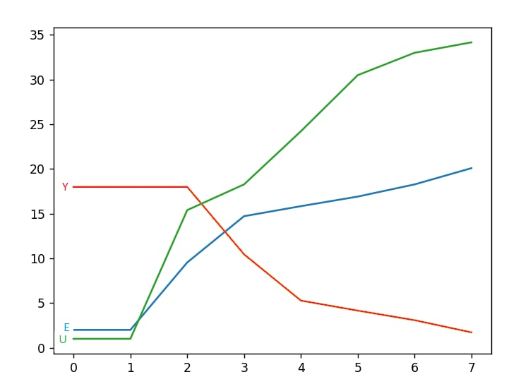

<p align="center">Министерство образования Республики Беларусь</p>
<p align="center">Учреждение образования</p>
<p align="center">"Брестский Государственный технический университет"</p>
<p align="center">Кафедра ИИТ</p>
<br>
<br>
<p align="center">Лабораторная работа №2</p>
<p align="center">По дисциплине: "Общая теория интеллектуальных систем"</p>
<p align="center">Тема: "ПИД-регуляторы"</p>
<br>
<br>
<p align="right">Выполнил:<br>Студент 2 курса<br>Группы ИИ-23<br>Скварнюк Д.Н.</p>
<p align="right">Проверил:<br>Иванюк Д. С.</p>
<br>
<p align="center">Брест 2023</p>

---

# Общее задание #
1. Написать отчет по выполненной лабораторной работе №2 в .md формате (*readme.md*) и с помощью **pull request** разместить его в следующем каталоге: **trunk\ii0xxyy\task_02\doc**.
2. Исходный код написанной программы разместить в каталоге: **trunk\ii00xxyy\task_02\src**.
---

# Выполнение задания #

Код программы:
```C++

#include <iostream>
#include <vector>
#include <cmath>

using namespace std;

void nonliner(double A, double B, double C, double D, double K, double T0, double TD, double T, double W, double YS) {
    double q0 = K * (1 + (TD / T0));
    double q1 = -K * (1 + 2 * (TD / T0) - (T0 / T));
    double q2 = K * (TD / T0);

    vector<double> y = {YS, YS};
    double U = 1.0;
    double U_pre = 1.0;
    vector<double> E = {W - YS, W - YS};
    vector<double> um = {U, U};

    while (abs(y.back() - W) > 0.1) {
        E.push_back(W - y.back());
        U = U_pre + q0 * E.back() + q1 * E[E.size() - 2] + q2 * E[E.size() - 3];
        y.push_back(A * y.back() - B * y[y.size() - 2] + C * U + D * sin(U_pre));
        U_pre = U;
        um.push_back(U);
    }

    cout << "Y" << endl;
    for (double val : y) {
        cout << val << endl;
    }
    cout << endl;

    cout << "E" << endl;
    for (double val : E) {
        cout << val << endl;
    }
    cout << endl;

    cout << "U" << endl;
    for (double val : um) {
        cout << val << endl;
    }
}

int main() {
    double A = 0.5;
    double B = 0.6;
    double C = 0.6;
    double D = 0.6;
    double K = 0.8;
    double T0 = 1.1;
    double TD = 1;
    double T = 1.1;

    double YS = 2.0;
    double W = 20;

    nonliner(A, B, C, D, K, T0, TD, T, W, YS);

    return 0;
}
```
Вывод программы:
```
Y       
2.0
2.0
9.544882590884736
14.720456262569957
15.842387402415573
16.91428333501587
18.276754241422516
20.091789874818467

E
18.0
18.0
18.0
10.455117409115264
5.279543737430043
4.157612597584427
3.0857166649841297
1.7232457585774839

U
1.0
1.0
15.399999999999997
18.276906588466943
24.2236753378288
30.497869075416055
33.00283164903632
34.17010100222095
```
