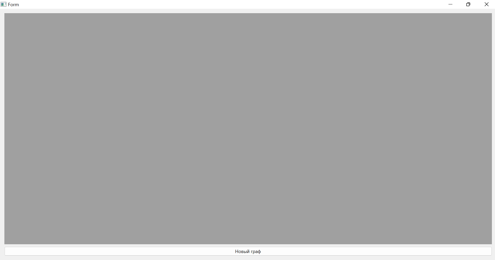
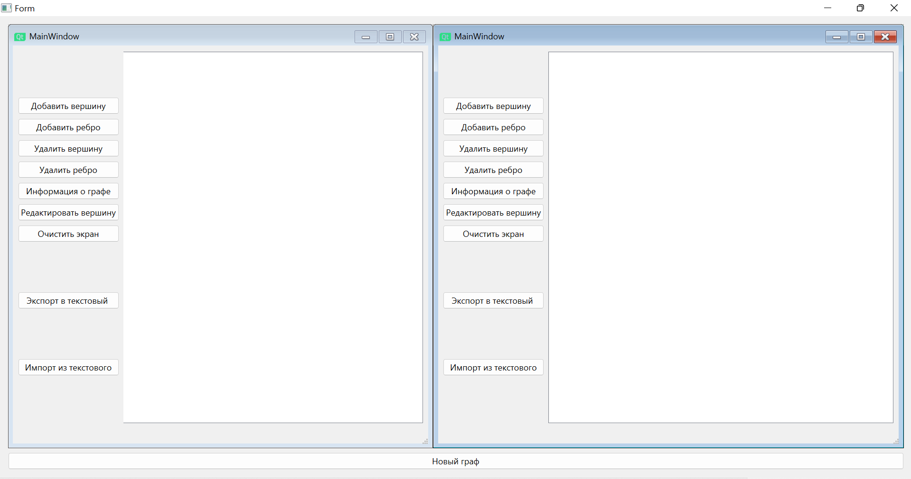
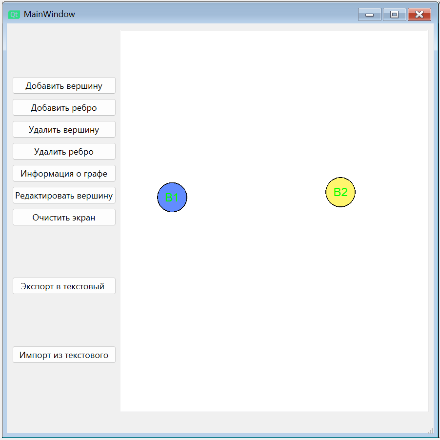
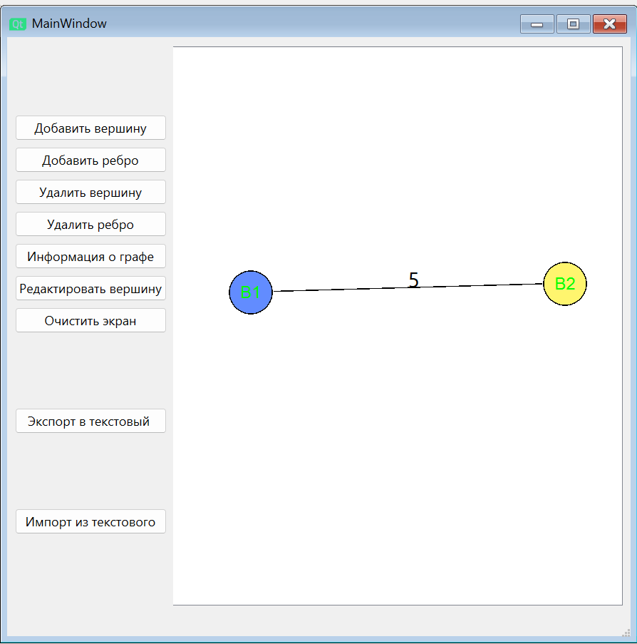
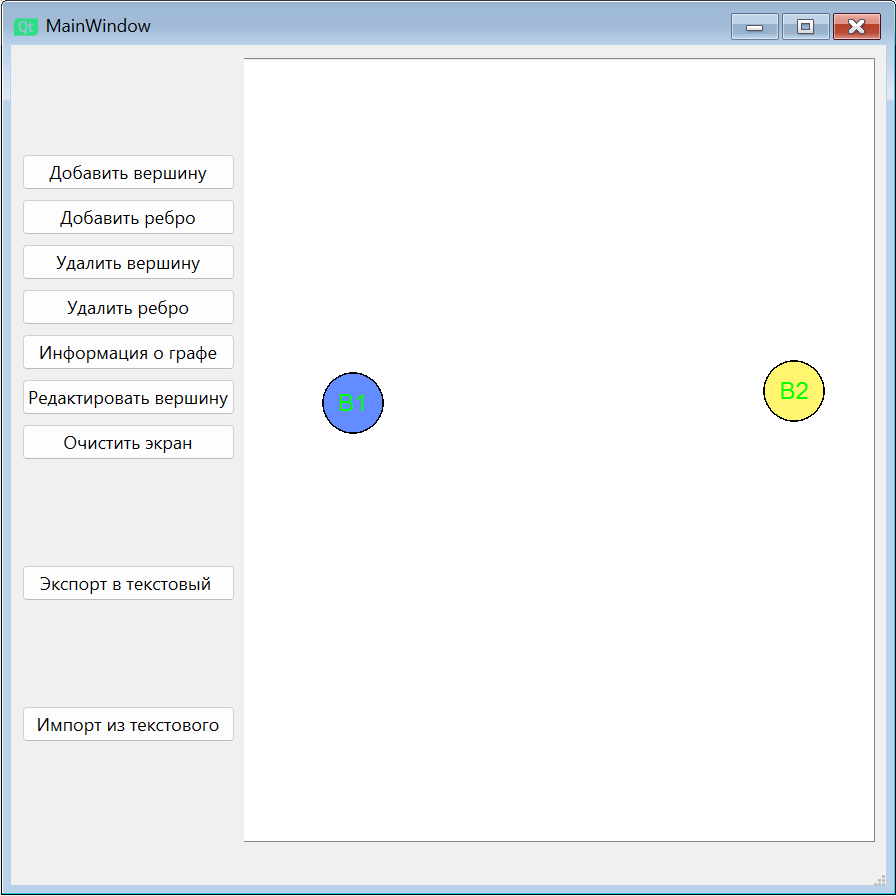
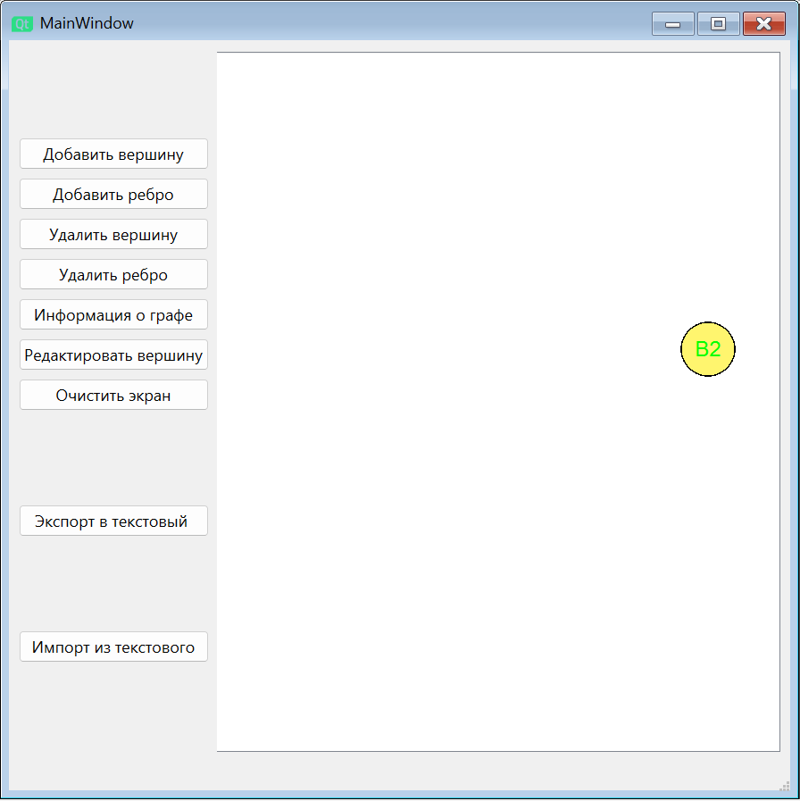
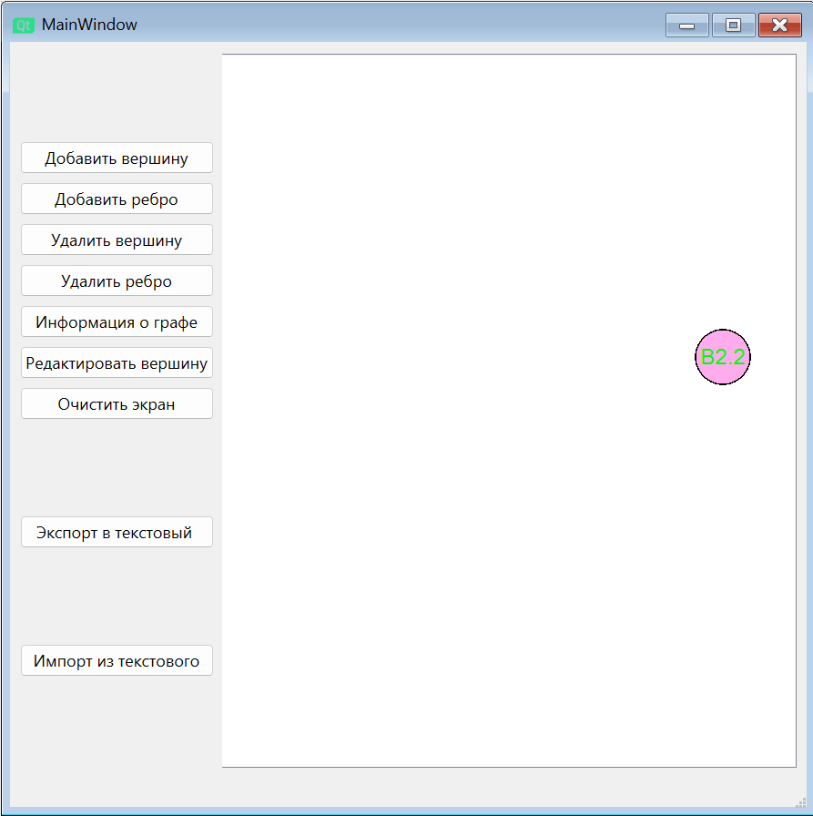
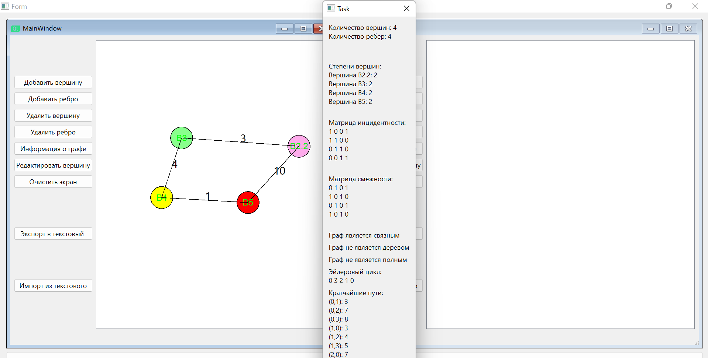
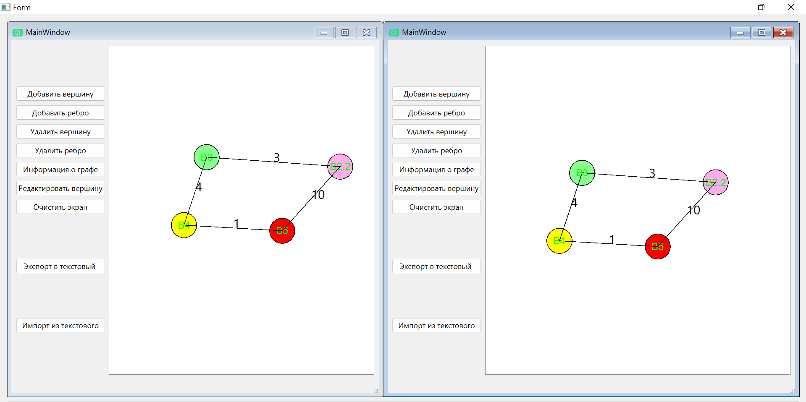

 Министерство образования Республики Беларусь

Учреждение образования

“Брестский Государственный технический университет”

Кафедра ИИТ

       

Лабораторная работа №3

По дисциплине “Общая теория интеллектуальных систем”

Тема: “Разработка редакторов графов”

     

Выполнил:

Студент 2 курса

Группы ИИ-23

Скварнюк Д. Н.

Проверил:

Иванюк Д. С.

     

Брест 2023

---
#Реализованные функции:

# Окно для создания новых графов:

# Окна для работы с графами:

# Cоздание вершин:

# Соединение ребер:

# Удаление ребер:

# Удаление вершин:

# Изменение вершин:

# Информация о графе:

# Импорт и экспорт графа:

