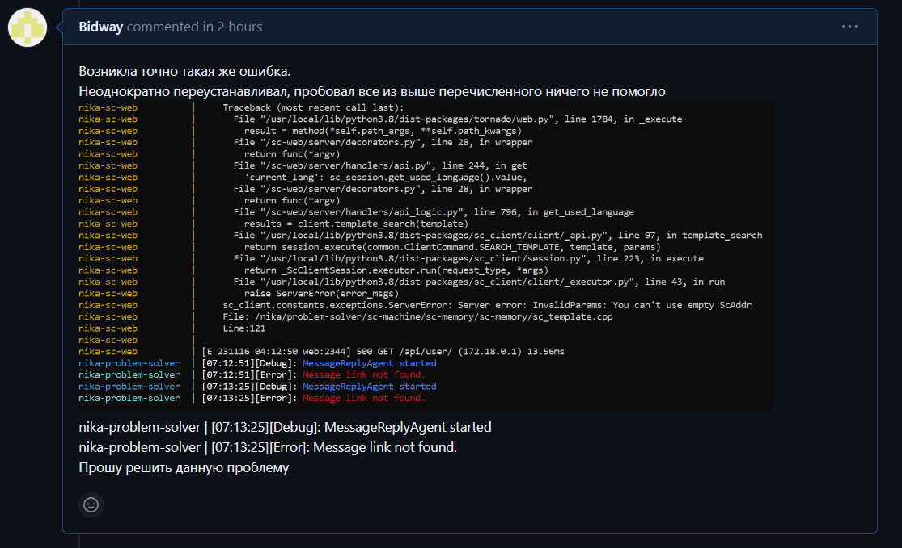

 Министерство образования Республики Беларусь

Учреждение образования

“Брестский Государственный технический университет”

Кафедра ИИТ

       

Лабораторная работа №5

По дисциплине “Общая теория интеллектуальных систем”

Тема: “Работа с проектами”

     

Выполнил:

Студент 2 курса

Группы ИИ-23

Скварнюк Д. Н.

Проверил:

Иванюк Д. С.

     

Брест 2023

# Общее задание #
1. Необходимо изучить открытые проекты по технологии OSTIS.
2. Попробовать внести свой вклад в развитие проектов.
3. О выполненной работе написать отчет и разместить его в репозитории.

# Выполнение задания #

При выполнении 4 лабораторной работы столкнулся с ошибкой в проекте (при работе программы).

