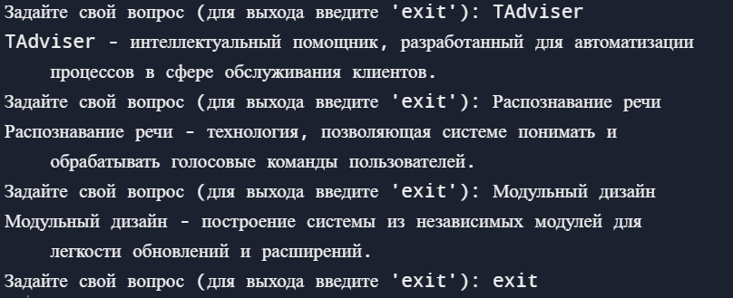

<p align="center">Министерство образования Республики Беларусь</p>
<p align="center">Учреждение образования</p>
<p align="center">“Брестский Государственный технический университет”</p>
<p align="center">Кафедра ИИТ</p>
<br><br><br><br><br><br><br>
<p align="center">Лабораторная работа №6</p>
<p align="center">По дисциплине “Общая теория интеллектуальных систем”</p>
<p align="center">Тема: “Создание базы знаний для проекта "NIKA" (Intelligent Knowledge-driven Assistant)”</p>
<br><br><br><br><br>
<p align="right">Выполнил:</p>
<p align="right">Студент 2 курса</p>
<p align="right">Группы ИИ-23</p>
<p align="right">Скварнюк Д. Н.</p>
<p align="right">Проверил:</p>
<p align="right">Иванюк Д. С.</p>
<br><br><br><br><br>
<p align="center">Брест 2023</p>

---

# Общее задание 

1. Изучить руководство.
2. Составить базу знаний для проекта T1-PLCnext-Demo.
3. Разработанную базу знаний поместить в виде запроса в репозиторий T1-PLCnext-Demo-OSTIS.
4. Написать отчет по выполненной работе в .md формате (readme.md) и с помощью pull request разместить его в следующем каталоге: trunk\ii0xxyy\task_06\docc.

# ЗАПРОС НА ВНЕСЕНИЕ БЗ: [ссылка на запрос](https://github.com/savushkin-r-d/T1-PLCnext-Demo-OSTIS/pull/4)

# БАЗА ЗНАНИЙ ДЛЯ "TAdviser":

1. Определение фактов:

    - "TAdviser - интеллектуальный помощник, разработанный для автоматизации процессов в сфере обслуживания клиентов."
    - "Распознавание речи - технология, позволяющая системе понимать и обрабатывать голосовые команды пользователей."
    - "Интеграция с POS-системой - взаимодействие с точкой продаж для обработки заказов и транзакций."
    - "Управление инвентарем - функционал системы для отслеживания и управления наличием товаров."
    - "Анализ данных - использование методов анализа данных для выявления закономерностей и трендов."
    - "Модульный дизайн - построение системы из независимых модулей для легкости обновлений и расширений."
    - "Интерфейс сотрудника - удобный интерфейс для взаимодействия персонала с системой."
    - "Интеграция с CRM - взаимодействие с системой управления взаимоотношениями с клиентами."

2. Правила вывода:

    - "После активации режима распознавания речи, система ожидает команды пользователя."
    - "Для внесения нового товара в инвентарь, используйте соответствующую команду в интерфейсе."
    - "Для обработки заказа в POS-системе, пройдите процедуру интеграции и используйте команды для создания заказа."
    - "Анализ данных может быть проведен с использованием встроенных инструментов аналитики."
    - "Модульный дизайн позволяет добавлять новые функциональности без изменения основной системы."
    - "Интерфейс сотрудника предоставляет удобный доступ к основным функциям системы."
    - "Интеграция с CRM позволяет системе эффективно взаимодействовать с клиентами."

3. Онтология:

    - Классы: Интеллектуальный помощник, Распознавание речи, POS-система, Управление инвентарем, Анализ данных, Модульный дизайн, Интерфейс сотрудника, Интеграция с CRM, Клиент, Товар, Заказ.
    - Отношения: Разработан для, Взаимодействие с, Используется для, Управление, Анализ, Построение, Предоставляет доступ к, Позволяет взаимодействовать с.
    - Интерпретация естественного языка:

# Пример кода для модуля, который позволяет системе обрабатывать вопросы пользователей, например:

```python
import difflib

class KnowledgeBase:
    def __init__(self):
        self.facts = {
            "TAdviser": "TAdviser - интеллектуальный помощник, разработанный для автоматизации процессов в сфере обслуживания клиентов.",
            "Распознавание речи": "Распознавание речи - технология, позволяющая системе понимать и обрабатывать голосовые команды пользователей.",
            "Интеграция с POS-системой": "Интеграция с POS-системой - взаимодействие с точкой продаж для обработки заказов и транзакций.",
            "Управление инвентарем": "Управление инвентарем - функционал системы для отслеживания и управления наличием товаров.",
            "Анализ данных": "Анализ данных - использование методов анализа данных для выявления закономерностей и трендов.",
            "Модульный дизайн": "Модульный дизайн - построение системы из независимых модулей для легкости обновлений и расширений.",
            "Интерфейс сотрудника": "Интерфейс сотрудника - удобный интерфейс для взаимодействия персонала с системой.",
            "Интеграция с CRM": "Интеграция с CRM - взаимодействие с системой управления взаимоотношениями с клиентами."
        }

    def get_answer(self, question):
        # Преобразуем вопрос в нижний регистр и удаляем знаки препинания
        question = question.lower().strip("?.,!")
        # Поиск соответствующего факта в базе знаний
        if question in self.facts:
            return self.facts[question]
        else:
            # Поиск наиболее похожего вопроса в базе
            closest_match = difflib.get_close_matches(question, self.facts.keys(), n=1, cutoff=0.5)
            if closest_match:
                return self.facts[closest_match[0]]
            else:
                return "Извините, я не могу найти ответ на ваш вопрос."

# Создаем экземпляр класса KnowledgeBase
knowledge_base = KnowledgeBase()

# Пример использования модуля
while True:
    user_question = input("Задайте свой вопрос (для выхода введите 'exit'): ")
    
    if user_question.lower() == "exit":
        break
    answer = knowledge_base.get_answer(user_question)
    print(answer)

# Вывод консоли
```

