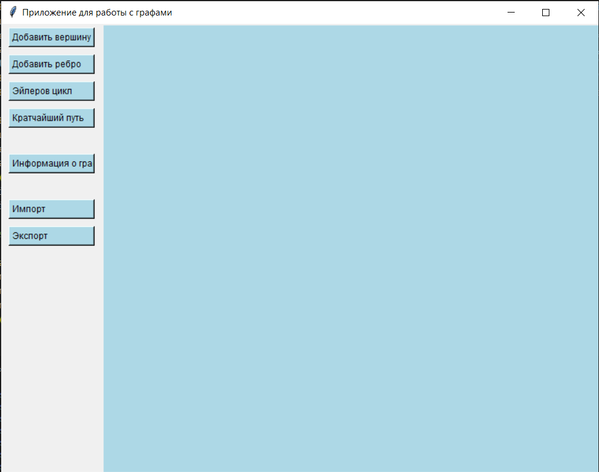
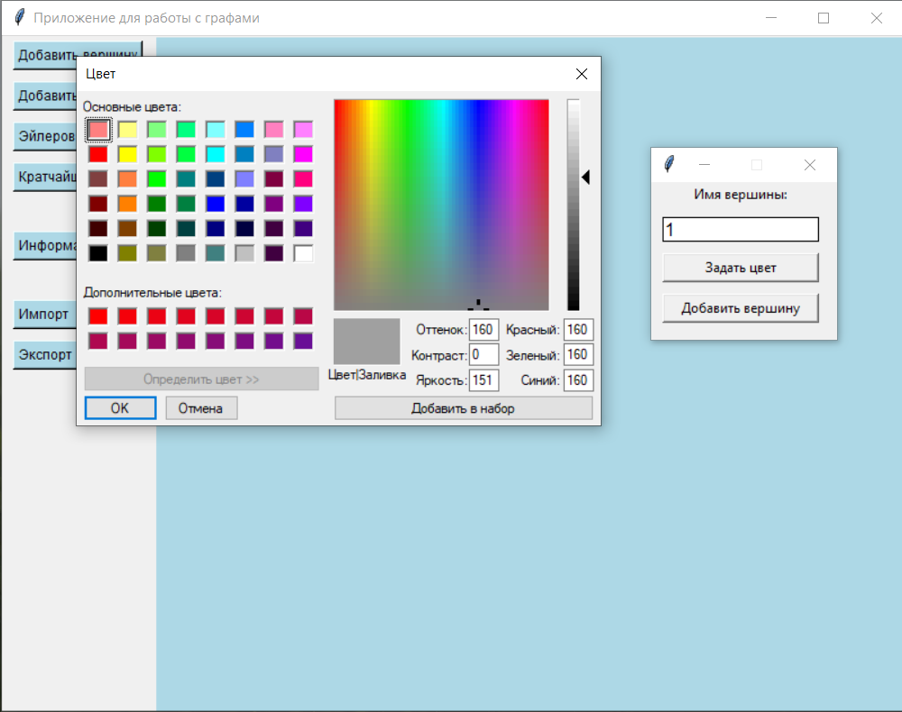
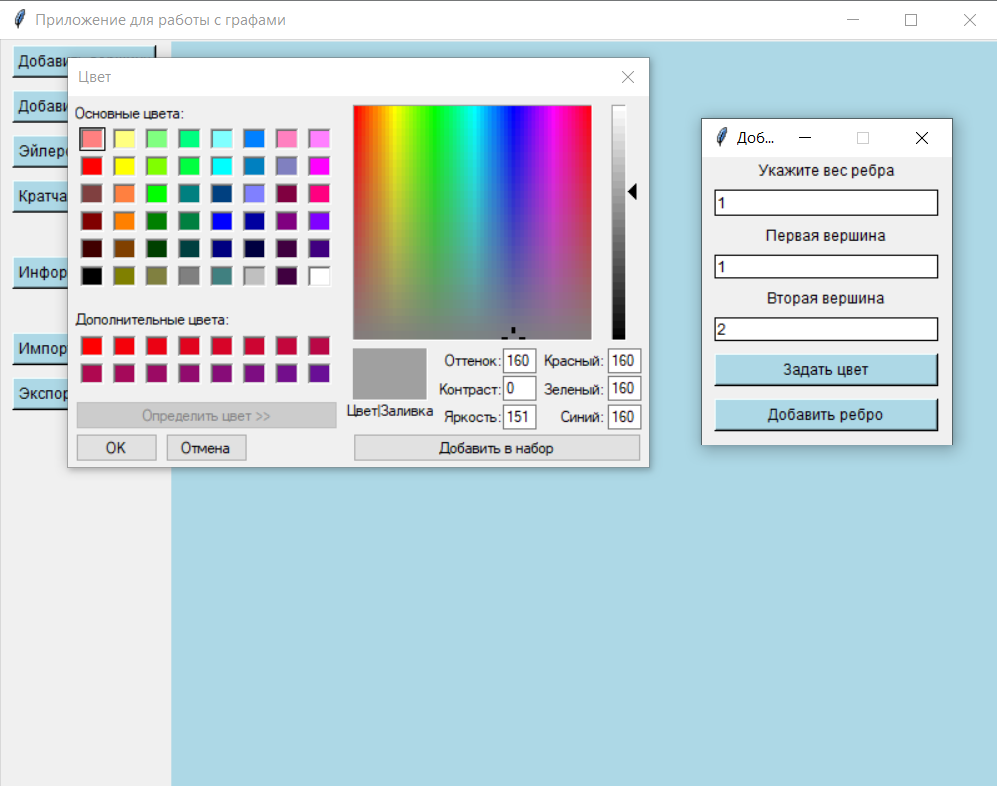
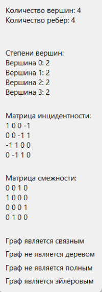
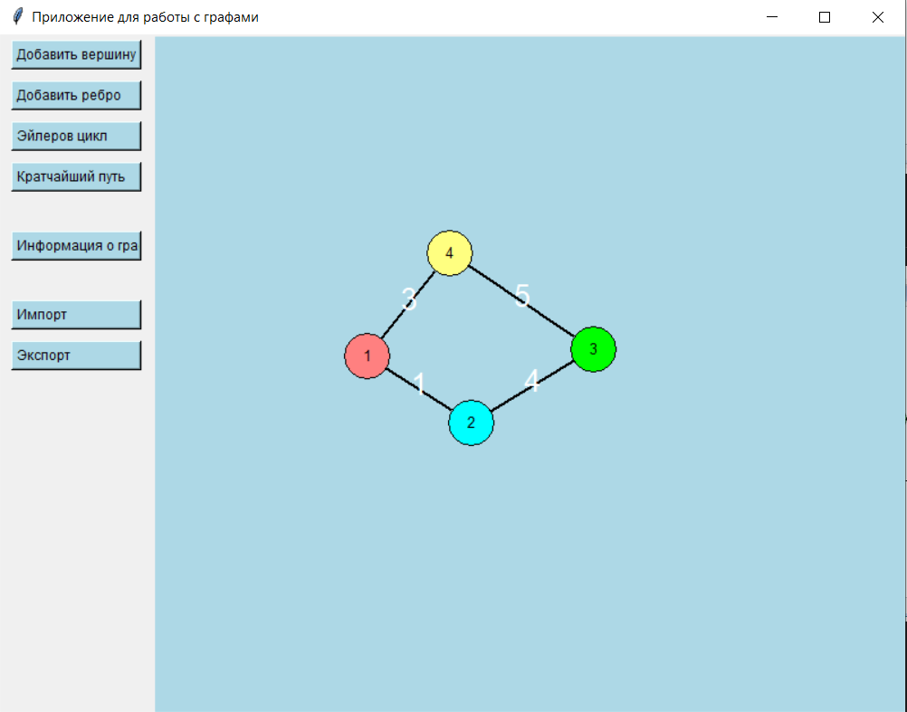

<b>
 Министерство образования Республики Беларусь

Учреждение образования

“Брестский Государственный технический университет”

Кафедра ИИТ
 </b>
       

Лабораторная работа №3

По дисциплине “Общая теория интеллектуальных систем”

Тема: “Разработка редакторов графов”

     
<b>
Выполнил:
</b>

Студент 2 курса

Группы ИИ-23

Швороб В.А.

<b>
Проверил:
</b>

Иванюк Д. С.

     

Брест 2023

---
# Задание

1. Разработать и реализовать программный продукт, позволяющий
редактировать графовые конструкции различных видов и производить над
ними различные действия. Язык программирования - **C++**.

2. Редактор должен позволять (задания со <strong>*</strong> являются необязательными):
  <ol type='a'>
    <li> одновременно работать с несколькими графами (MDI); </li>
    <li> <strong>[*]</strong> выделение одновременно нескольких элементов графа, копирование
    выделенного фрагмента в clipboard и восстановление из него;</li>
    <li> задавать имена графам;</li>
    <li> сохранять и восстанавливать граф во внутреннем формате программы;</li>
    <li> экспортировать и импортировать граф в текстовый формат (описание
    см. ниже);</li>
    <li> создавать, удалять, именовать, переименовывать, перемещать узлы;</li>
    <li> создавать ориентированные и неориентированные дуги, удалять дуги;</li>
    <li> добавлять, удалять и редактировать содержимое узла (содержимое в
    виде текста и ссылки на файл);</li>
    <li> задавать цвет дуги и узла, образ узла;</li>
    <li> <strong>[*]</strong> создавать и отображать петли;</li>
    <li> <strong>[*]</strong> создавать и отображать кратные дуги.</li>
  </ol>

  

3. Программный продукт должен позволять выполнять следующие операции:
  <ol type='a'>
    <li> выводить информацию о графе:
      <ul>
        <li> количество вершин, дуг;</li>
        <li> степени для всех вершин и для выбранной вершины;</li>
        <li> матрицу инцидентности;</li>
        <li> матрицу смежности;</li>
        <li> является ли он деревом, полным, связанным, эйлеровым, <strong>[*]</strong> планарным;</li>
      </ul>
    </li>
    <li> поиск всех путей (маршрутов) между двумя узлами и кратчайших;</li>
    <li> вычисление расстояния между двумя узлами;</li>
    <li> вычисление диаметра, радиуса, центра графа;</li>
    <li> <strong>[*]</strong> вычисление векторного и декартово произведения двух графов;</li>
    <li> <strong>[*]</strong> раскраска графа;</li>
    <li> нахождения эйлеровых, <strong>[*]</strong> гамильтоновых циклов;</li>
    <li> <strong>[*]</strong> поиск подграфа в графе, со всеми или некоторыми неизвестными
    узлами;</li>
    <li> <strong>[*]</strong> поиск узла по содержимому;</li>
    <li> <strong>[*]</strong> объединение, пересечение, сочетание и дополнение графов;</li>
    <li> <strong>[*]</strong> приведение произвольного графа к определенному типу с
      минимальными изменениями:
      <ul>
        <li> бинарное и обычное дерево;</li>
        <li> полный граф;</li>
        <li> планарный граф;</li>
        <li> связанный граф;</li>
      </ul>
    </li>
  </ol>

4. Формат текстового представления графа:
<ГРАФ> ::= <ИМЯ ГРАФА> : UNORIENT | ORIENT ; <ОПИСАНИЕ УЗЛОВ> ;
<ОПИСАНИЕ СВЯЗЕЙ> .
<ИМЯ ГРАФА> ::= <ИДЕНТИФИКАТОР>
<ОПИСАНИЕ УЗЛОВ> ::= <ИМЯ УЗЛА> [ , <ИМЯ УЗЛА> …]
<ИМЯ УЗЛА> ::= <ИДЕНТИФИКАТОР>
<ОПИСАНИЕ СВЯЗЕЙ> ::= <ИМЯ УЗЛА> -> <ИМЯ УЗЛА> [ , <ИМЯ УЗЛА> …] ;
[<ОПИСАНИЕ СВЯЗЕЙ> …]

# Приложение для работы с графами:

<b>Главнвй экран приложения</b>

# Добавление вершин:

# Добавление вершин:

# Информация о графе:

# Импорт и экспорт графа:

