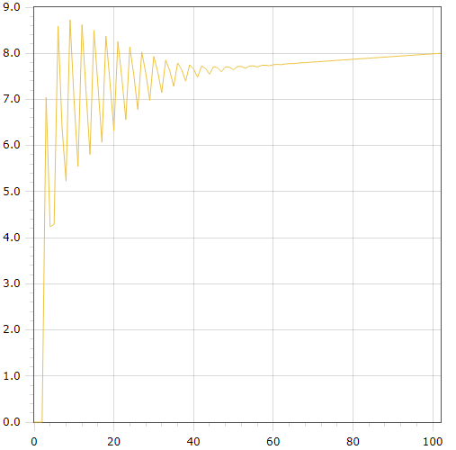

<p align="center"> Министерство образования Республики Беларусь</p>
<p align="center">Учреждение образования</p>
<p align="center">“Брестский Государственный технический университет”</p>
<p align="center">Кафедра ИИТ</p>
<br><br><br><br><br><br><br>
<p align="center">Лабораторная работа №2</p>
<p align="center">По дисциплине “Общая теория интеллектуальных систем”</p>
<p align="center">Тема: “PID-регулятор ”</p>
<br><br><br><br><br>
<p align="right">Выполнил:</p>
<p align="right">Студент 2 курса</p>
<p align="right">Группы ИИ-24</p>
<p align="right">Невдах В. Р.</p>
<p align="right">Проверил:</p>
<p align="right">Иванюк Д. С.</p>
<br><br><br><br><br>
<p align="center">Брест 2023</p>

---

# Общее задание #
1. Написать отчет по выполненной лабораторной работе №2 в .md формате (readme.md) и с помощью запроса на внесение изменений (**pull request**) разместить его в следующем каталоге: **trunk\ii0xxyy\task_02\doc** (где **xx** - номер группы, **yy** - номер студента, например **ii02102**).
2. Исходный код написанной программы разместить в каталоге: **trunk\ii0xxyy\task_02\src**.

# Задание #
На C++ реализовать программу, моделирующую рассмотренный выше ПИД-регулятор.  В качестве объекта управления использовать математическую модель, полученную в предыдущей работе.
В отчете также привести графики для разных заданий температуры объекта, пояснить полученные результаты.

---

# Выполнение задания #

Код программы:
```C++
#include <iostream>
#include <cmath>
#include <vector>
#include <fstream>

class MyFunction
{
public:
    double calculateSummary()
    {
        double sum = 0;
        for (int i = 0; i < 3; i++)
        {
            sum += q[i] * error[i];
        }
        return sum;
    }

    void nonlinearSystem(int time, double target, double a = 0.5, double b = 0.3, double c = 0.9, double d = 0.7)
    {
        for (int i = 0; i < time; i++)
        {
            error[0] = target - output[output.size() - 3];
            error[1] = target - output[output.size() - 2];
            error[2] = target - output[output.size() - 1];
            input[0] = input[1] + calculateSummary();
            output.push_back(a * output[output.size() - 1] - b * output[output.size() - 2] * output[output.size() - 2] + c * input[0] + d * sin(input[1]));
            input[1] = input[0];
        }
    }

    std::vector<double> getOutput() const
    {
        return output;
    }

private:
    double k = 0.01;
    double t = 40;
    double td = 100;
    double t0 = 1;

    double q0 = k * (1 + td / t0);
    double q1 = -k * (1 + 2 * td / t0 - t0 / t);
    double q2 = k * td / t0;

    std::vector<double> q = {q0, q1, q2};
    std::vector<double> error = {0, 0, 0};
    std::vector<double> output = {0, 0, 0};
    std::vector<double> input = {1, 1};
};

int main()
{
    double target;
    std::ofstream out("output.txt");
    MyFunction myFunction;

    if (out.is_open())
    {
        std::cout << "Enter the target: ";
        std::cin >> target;
        myFunction.nonlinearSystem(100, target);

        std::vector<double> outputValues = myFunction.getOutput();

        for (size_t i = 0; i < outputValues.size(); i++)
        {
            double scaledValue = outputValues[i] * target / outputValues[outputValues.size() - 1];
            std::cout << i << " " << scaledValue << std::endl;
            out << i << " " << scaledValue << std::endl;
        }

        out.close();
    }
    else
    {
        std::cerr << "Error: Cannot open the output file." << std::endl;
    }

    return 0;
}

```     

Вывод программы:

        0 0
        1 0
        2 0
        3 7.04439
        4 4.23871
        5 4.28645
        6 8.58628
        7 6.38138
        8 5.22722
        9 8.72787
        10 6.99746
        11 5.54519
        12 8.61962
        13 7.19329
        14 5.80772
        15 8.4976
        16 7.30534
        17 6.06692
        18 8.37614
        19 7.39313
        20 6.3202
        21 8.25514
        22 7.46557
        23 6.56116
        24 8.13752
        25 7.52399
        26 6.78299
        27 8.02798
        28 7.56913
        29 6.97966
        30 7.93149
        31 7.60259
        32 7.1473
        33 7.85196
        34 7.62688
        35 7.28503
        36 7.79127
        37 7.64489
        38 7.39489
        39 7.74911
        40 7.65931
        41 7.48086
        42 7.72336
        43 7.6722
        44 7.54771
        45 7.71097
        46 7.6849
        47 7.60004
        48 7.70872
        49 7.69813
        50 7.64177
        51 7.71374
        52 7.71221
        53 7.67595
        54 7.72375
        55 7.72717
        56 7.7049
        57 7.73702
        58 7.74293
        59 7.73025
        60 7.75237
        61 7.75936
        62 7.75316
        63 7.76899
        64 7.77629
        65 7.77443
        66 7.78634
        67 7.7936
        68 7.79459
        69 7.80411
        70 7.81116
        71 7.81401
        72 7.82207
        73 7.82889
        74 7.83292
        75 7.8401
        76 7.8467
        77 7.85148
        78 7.85814
        79 7.86455
        80 7.86979
        81 7.87614
        82 7.8824
        83 7.88792
        84 7.89407
        85 7.90022
        86 7.9059
        87 7.91193
        88 7.91799
        89 7.92375
        90 7.92971
        91 7.9357
        92 7.9415
        93 7.94741
        94 7.95334
        95 7.95915
        96 7.96502
        97 7.97091
        98 7.97672
        99 7.98255
        100 7.9884
        101 7.99419
        102 8

