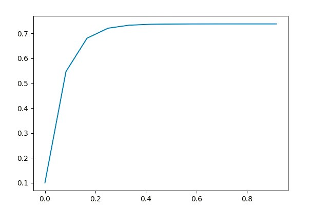
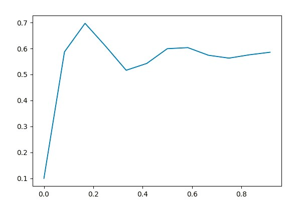

<p style="text-align: center;">Министерство образования Республики Беларусь</p>
<p style="text-align: center;">Учреждение образования</p>
<p style="text-align: center;">“Брестский Государственный технический университет”</p>
<p style="text-align: center;">Кафедра ИИТ</p>
<div style="margin-bottom: 10em;"></div>
<p style="text-align: center;">Лабораторная работа №1</p>
<p style="text-align: center;">По дисциплине “Общая теория интеллектуальных систем”</p>
<p style="text-align: center;">Тема: “Моделирования температуры объекта”</p>
<div style="margin-bottom: 10em;"></div>
<p style="text-align: right;">Выполнил:</p>
<p style="text-align: right;">Студент 2 курса</p>
<p style="text-align: right;">Группы ИИ-24</p>
<p style="text-align: right;">Штыхно Д.В.</p>
<p style="text-align: right;">Проверил:</p>
<p style="text-align: right;">Иванюк Д. С.</p>
<div style="margin-bottom: 10em;"></div>
<p style="text-align: center;">Брест 2023</p>

---

# Общее задание #
1. Написать отчет по выполненной лабораторной работе №1 в .md формате (readme.md) и с помощью запроса на внесение изменений (**pull request**) разместить его в следующем каталоге: trunk\ii0xxyy\task_01\doc (где xx - номер группы, yy - номер студента, например **ii02302**).
2. Исходный код написанной программы разместить в каталоге: **trunk\ii0xxyy\task_01\src**.

## Task 1. Modeling controlled object ##
Let's get some object to be controlled. We want to control its temperature, which can be described by this differential equation:

$$\Large\frac{dy(\tau)}{d\tau}=\frac{u(\tau)}{C}+\frac{Y_0-y(\tau)}{RC} $$ (1)

where $\tau$ – time; $y(\tau)$ – input temperature; $u(\tau)$ – input warm; $Y_0$ – room temperature; $C,RC$ – some constants.

After transformation we get these linear (2) and nonlinear (3) models:

$$\Large y_{\tau+1}=ay_{\tau}+bu_{\tau}$$ (2)
$$\Large y_{\tau+1}=ay_{\tau}-by_{\tau-1}^2+cu_{\tau}+d\sin(u_{\tau-1})$$ (3)

where $\tau$ – time discrete moments ($1,2,3{\dots}n$); $a,b,c,d$ – some constants.

Task is to write program (**C++**), which simulates this object temperature.

---

# Выполнение задания #

Код программы:
```C++
#include <iostream>
#include <cmath>

class globalki {
public:
    double a = 0.31;
    double b = 0.48;
    double c = 0.14;
    double d = 0.48;
    double u = 1.1;
    double y = 0.1;
};

globalki globals;

void linearmod(int t, int n, double y) {
    if (n < t) {
        std::cout << y << std::endl;
        linearmod(t, n + 1, globals.a * y + globals.b * globals.u);
    }
    std::cout << y << std::endl;
}

void unlinearmodel(double y, double y_prev, double u, double u_prev, int i, int t) {
    if (i == 1) {
        std::cout << y << std::endl;
        unlinearmodel(globals.a * y - globals.b * pow(y_prev, 2) + globals.c * 1 + globals.d * sin(1), y, globals.u, globals.u, i + 1, t);
    }
    else if (i < t) {
        std::cout << y << std::endl;
        unlinearmodel(globals.a * y - globals.b * pow(y_prev, 2) + globals.c * u + globals.d * sin(u_prev), y, globals.u, globals.u, i + 1, t);
    }
    std::cout << y << std::endl;
}

int main() {
    std::cout << "linear model" << std::endl;
    linearmod(10, 0, globals.y);

    std::cout << "unlinear model" << std::endl;
    unlinearmodel(globals.y, 0, globals.u, 0, 1, 10);

    return 0;
}

    Вывод:
    Линейная модель
    0.1
    0.559
    0.70129
    0.7454
    0.759074
    0.763313
    0.764627
    0.765034
    0.765161
    0.7652
    *********************
    Нелинейная модель
    0.1
    0.574906
    0.7552
    0.657244
    0.511768
    0.533082
    0.62132
    0.637984
    0.594256
    0.570628
```
 Графики:
 
 линейный график :
 
 
 
 нелинейный график:
 
 
