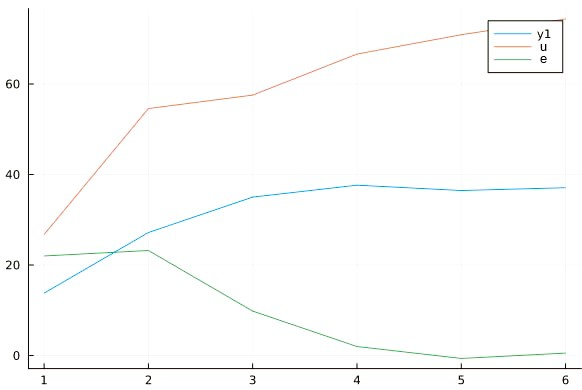

<p align="center"> Министерство образования Республики Беларусь</p>
<p align="center">Учреждение образования</p>
<p align="center">“Брестский Государственный технический университет”</p>
<p align="center">Кафедра ИИТ</p>
<br><br><br><br><br><br><br>
<p align="center">Лабораторная работа №2</p>
<p align="center">По дисциплине “Общая теория интеллектуальных систем”</p>
<p align="center">Тема: “ПИД-регуляторы”</p>
<br><br><br><br><br>
<p align="right">Выполнил:</p>
<p align="right">Студент 2 курса</p>
<p align="right">Группы ИИ-24</p>
<p align="right">Штыхно Д. В.</p>
<p align="right">Проверил:</p>
<p align="right">Иванюк Д. С.</p>
<br><br><br><br><br>
<p align="center">Брест 2023</p>

---

# Общее задание #
1. Написать отчет по выполненной лабораторной работе №1 в .md формате (readme.md) и с помощью запроса на внесение изменений (**pull request**) разместить его в следующем каталоге: **trunk\ii0xxyy\task_02\doc** (где **xx** - номер группы, **yy** - номер студента, например **ii02302**).
2. Исходный код написанной программы разместить в каталоге: **trunk\ii0xxyy\task_02\src**.

# Задание #
На С++ реализовать программу, моделирующую рассмотренный выше ПИД-регулятор.  В качестве объекта управления использовать математическую модель, полученную в предыдущей работе.
В отчете также привести графики для разных заданий температуры объекта, пояснить полученные результаты.

---
# Код программы: #
```c++   
#include <iostream>
#include <vector>
#include <cmath>

using namespace std;

int main() {
    double A = 0.5, B = 0.5, C = 0.5, D = 0.5;
    double K = 1, To = 1, Td = 1, T = 1;

    double q1 = K * (Td / To + 1);
    double q2 = -K * (-To / T + 1 + 2 * Td / To);
    double q3 = K * (Td / To);

    cout << "Enter start temperature: ";
    double start_y;
    cin >> start_y;

    vector<double> y = {start_y, start_y};

    double uk = 0.0, uk1 = 0.0;

    cout << "Enter desired temperature: ";
    double w;
    cin >> w;

    vector<double> e = {w - start_y, w - start_y};

    cout << y.back() << endl;

    while (abs(w - y.back()) > 0.1) {
        e.push_back(w - y.back());

        double delu = q1 * e.back() + q2 * e[e.size() - 2] + q3 * e[e.size() - 3];
        uk = uk1 + delu;

        y.push_back(A * y.back() - B * y[y.size() - 2] + C * uk + D * sin(uk1));
        uk1 = uk;

        cout << y.back() << endl;
    }

    return 0;
}
```

Вывод:
```
Enter start temperature: 0
Enter desired temperature: 580
0
290
435.465
507.733
543.858
561.571
570.601
574.957
577.42
579.696
579.262
579.873
579.49
580.182
579.478
580.231
579.613
580.195
579.721
580.068
```



