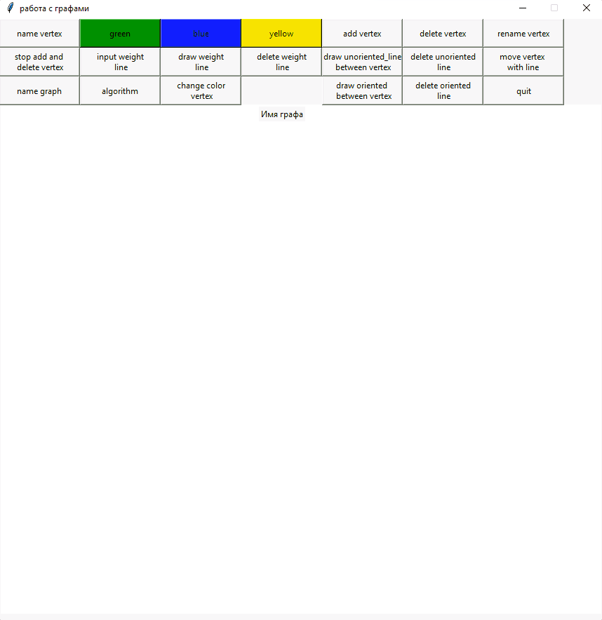
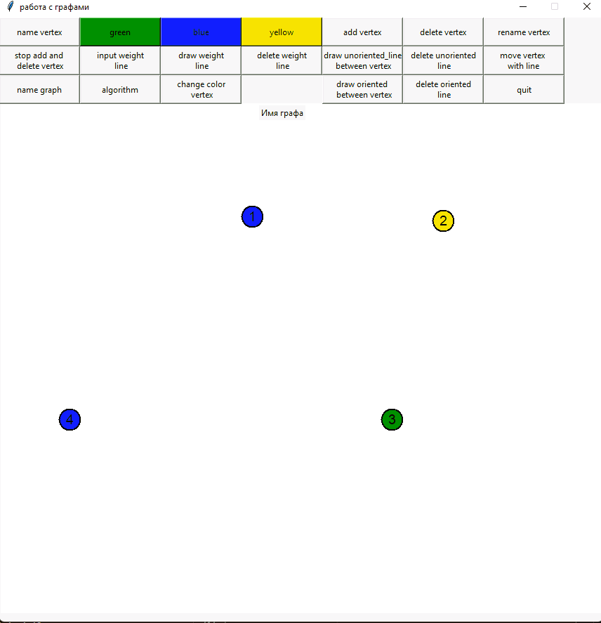
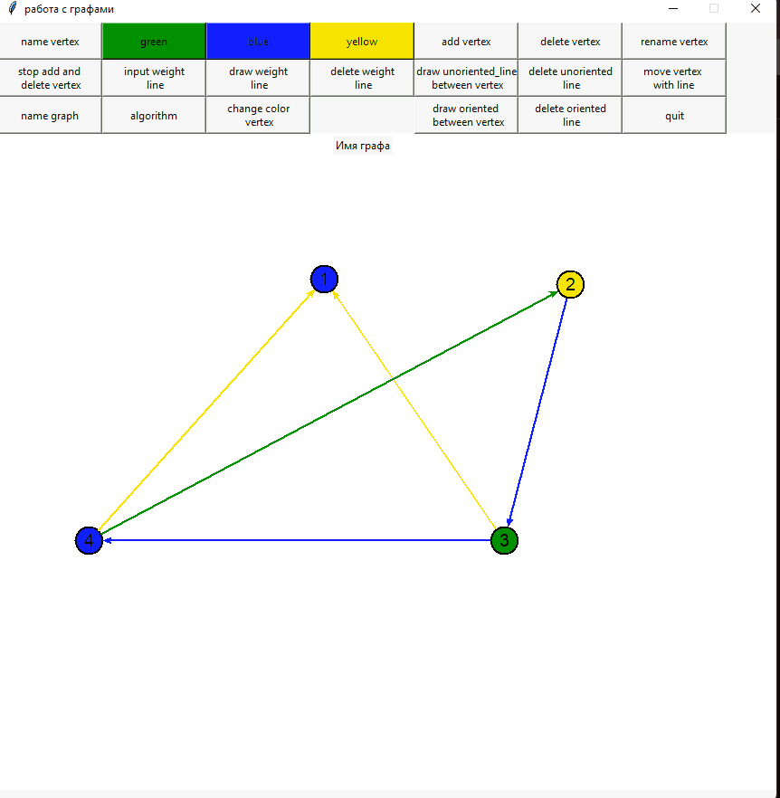
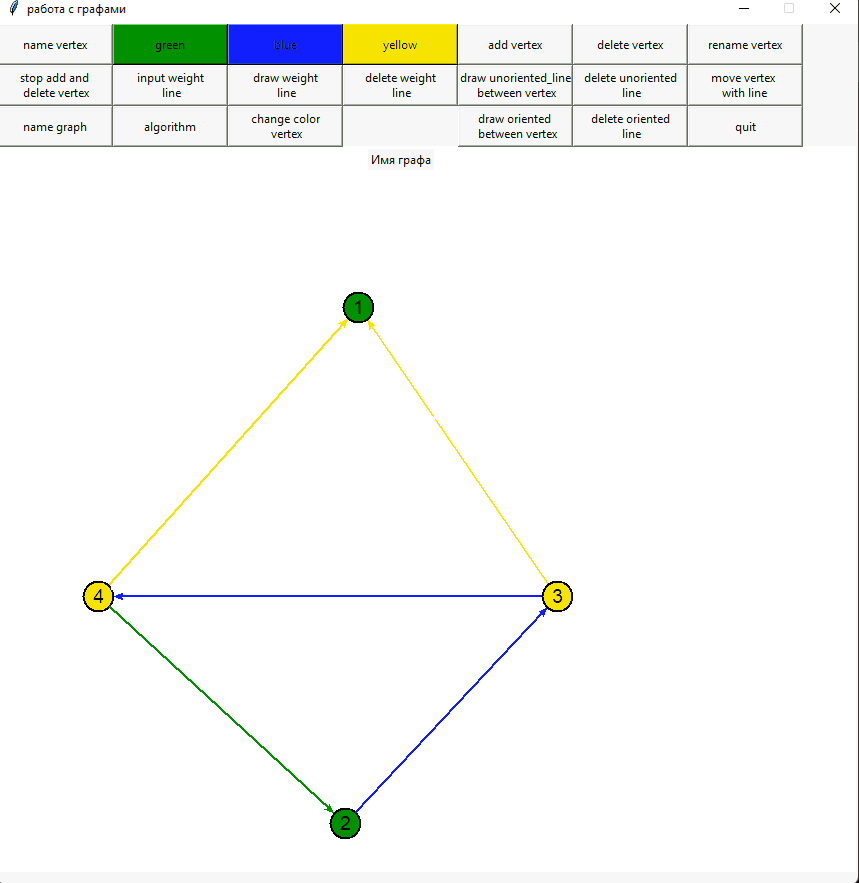
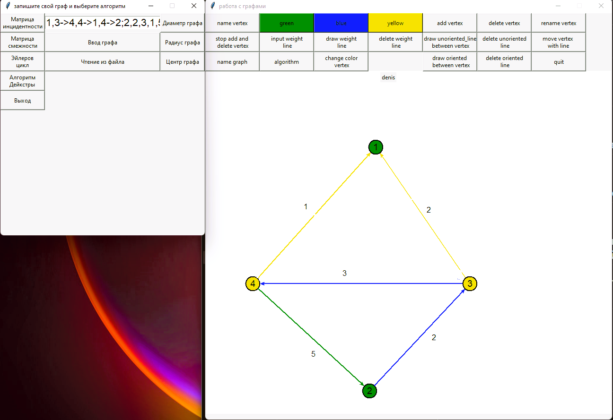

<p align="center"> Министерство образования Республики Беларусь</p>
<p align="center">Учреждение образования</p>
<p align="center">“Брестский Государственный технический университет”</p>
<p align="center">Кафедра ИИТ</p>
<br><br><br><br><br><br><br>
<p align="center">Лабораторная работа №3</p>
<p align="center">По дисциплине “Общая теория интеллектуальных систем”</p>
<p align="center">Тема: “Разработка редактора графов”</p>
<br><br><br><br><br>
<p align="right">Выполнил:</p>
<p align="right">Студент 2 курса</p>
<p align="right">Группы ИИ-24</p>
<p align="right">Штыхно Д. В.</p>
<p align="right">Проверил:</p>
<p align="right">Иванюк Д. С.</p>
<br><br><br><br><br>
<p align="center">Брест 2023</p>


---
# Задание: #
1. Разработать и реализовать программный продукт позволяющий
редактировать графовые конструкции различных видов и производить над
ними различные действия. Язык программирования - любой.

2. Редактор должен позволять (задания со **[\*]** являются необязательными):   
  a) задавать имена графам;  
  b) сохранять и восстанавливать граф во внутреннем формате программы;  
  c) экспортировать и импортировать граф в текстовый формат (описание
см. ниже);  
  d) создавать, удалять, именовать, переименовывать, перемещать узлы;  
  e) создавать ориентированные и неориентированные дуги, удалять дуги;  
  f) добавлять, удалять и редактировать содержимое узла (содержимое в
виде текста и ссылки на файл);  
  g) задавать цвет дуги и узла, образ узла;  

3. Программный продукт должен позволять выполнять следующие операции:  
    a) выводить информацию о графе:

    + количество вершин, дуг;
    + степени для всех вершин и для выбранной вершины;
    + матрицу инцидентности;
    + матрицу смежности;
    + является ли он деревом, полным, связанным, эйлеровым, **[\*]** планарным;

    b) поиск всех путей (маршрутов) между двумя узлами и кратчайших;    
    c) вычисление диаметра, радиуса, центра графа;  
    d) нахождения эйлеровых циклов
4. Формат текстового представления графа:
<ГРАФ> ::= <ИМЯ ГРАФА> : UNORIENT | ORIENT ; <ОПИСАНИЕ УЗЛОВ> ;
<ОПИСАНИЕ СВЯЗЕЙ> .
<ИМЯ ГРАФА> ::= <ИДЕНТИФИКАТОР>
<ОПИСАНИЕ УЗЛОВ> ::= <ИМЯ УЗЛА> [ , <ИМЯ УЗЛА> …]
<ИМЯ УЗЛА> ::= <ИДЕНТИФИКАТОР>
<ОПИСАНИЕ СВЯЗЕЙ> ::= <ИМЯ УЗЛА> -> <ИМЯ УЗЛА> [ , <ИМЯ УЗЛА> …] ;
[<ОПИСАНИЕ СВЯЗЕЙ> …]

5. Написать отчет по выполненной лабораторной работе в .md формате (readme.md). Разместить его в следующем каталоге: **trunk\ii0xxyy\task_03\doc** (где **xx** - номер группы, **yy** - номер студента, например **ii02302**). 

6. Исходный код разработанной программы разместить в каталоге: **trunk\ii0xxyy\task_03\src**.

---
<br>

# Необходимые библиотеки: #
```bash
pip3 install tkinter networkx
```

---
<br>

# Описание работы программы: #
## Окно программы


## Создаем вершины


## Соединяем вершины ребрами


## Изменяем цвета вершин, ребер и передвигаем их


## Можем сохранить граф во внутреннем формате или экспортировать в текстовый файл
## в формате daniil:ORIENT;1,2,3,4;2->3,3->1,3->4,4->1,4->2;2,2,3,1,5


## Алгоритмы
