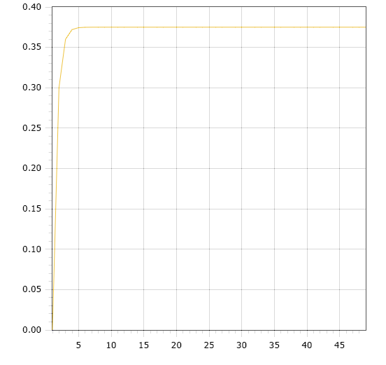
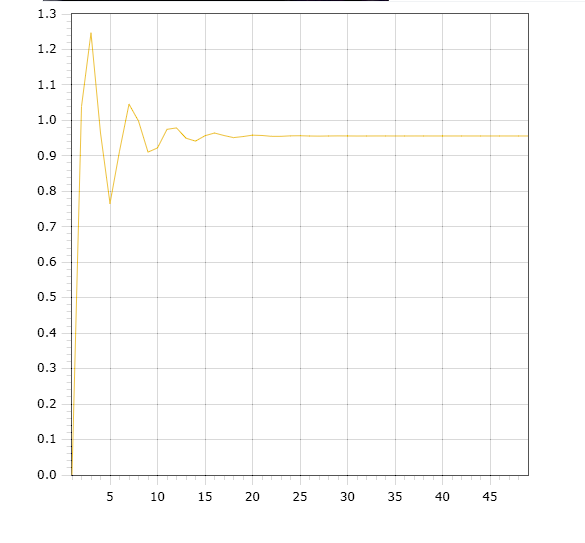

<p style="text-align: center;">Министерство образования Республики Беларусь</p>
<p style="text-align: center;">Учреждение образования</p>
<p style="text-align: center;">“Брестский Государственный технический университет”</p>
<p style="text-align: center;">Кафедра ИИТ</p>
<div style="margin-bottom: 10em;"></div>
<p style="text-align: center;">Лабораторная работа №1</p>
<p style="text-align: center;">По дисциплине “Общая теория интеллектуальных систем”</p>
<p style="text-align: center;">Тема: “Моделирования температуры объекта”</p>
<div style="margin-bottom: 10em;"></div>
<p style="text-align: right;">Выполнил:</p>
<p style="text-align: right;">Студент 2 курса</p>
<p style="text-align: right;">Группы ИИ-23</p>
<p style="text-align: right;"><Бусень А.Д.</p>
<p style="text-align: right;">Проверил:</p>
<p style="text-align: right;">Иванюк Д. С.</p>
<div style="margin-bottom: 10em;"></div>
<p style="text-align: center;">Брест 2023</p>

---

# Общее задание #
1. Написать отчет по выполненной лабораторной работе №1 в .md формате (readme.md) и с помощью запроса на внесение изменений (**pull request**) разместить его в следующем каталоге: trunk\ii0xxyy\task_01\doc (где xx - номер группы, yy - номер студента, например **ii02301**).
2. Исходный код написанной программы разместить в каталоге: **trunk\ii0xxyy\task_01\src**.

## Task 1. Modeling controlled object ##
Let's get some object to be controlled. We want to control its temperature, which can be described by this differential equation:

$$\Large\frac{dy(\tau)}{d\tau}=\frac{u(\tau)}{C}+\frac{Y_0-y(\tau)}{RC} $$ (1)

where $\tau$ – time; $y(\tau)$ – input temperature; $u(\tau)$ – input warm; $Y_0$ – room temperature; $C,RC$ – some constants.

After transformation we get these linear (2) and nonlinear (3) models:

$$\Large y_{\tau+1}=ay_{\tau}+bu_{\tau}$$ (2)
$$\Large y_{\tau+1}=ay_{\tau}-by_{\tau-1}^2+cu_{\tau}+d\sin(u_{\tau-1})$$ (3)

where $\tau$ – time discrete moments ($1,2,3{\dots}n$); $a,b,c,d$ – some constants.

Task is to write program (**C++**), which simulates this object temperature.

---

# Выполнение задания #

Код программы:
```C++
#include <iostream>
#include <fstream>
#include <cmath>

using namespace std;

class functions {
private:
    double t1 = 1; //начальное время
    double u = 1; //кол-во теплоты
    double t2 = 50; //конечное время
    const double a = 0.2;
    const double b = 0.3;
    const double c = 0.45;
    const double d = 0.7; //исходные данные по номеру варианта
public:
    void nelineynaya(double y, double y1) {
        if (t1 != t2) {
            ofstream file("nonlineyn.txt", ios::app);
            file << t1 << " " << y << endl;
            cout << y << endl;
            ++t1;
            nelineynaya(a * y - b * y1 * y1 + c * u + d * sin(u), y);
        }
        else {
            cout << "end nelineynaya model" << endl;
        }
    }
    void lineynaya(double y) {
        if (t1 != t2) {
            ofstream file("lineyn.txt", ios::app);
            file << t1 << " " << y << endl;
            ++t1;
            cout << y << endl;
            lineynaya(a * y + b * u);
        }
        else {
            cout << "end lineynaya model\n";
        }
    }
};

int main() {
    double y = 0;
    double y1 = 0;
    ofstream file1("lin.txt");
    ofstream file2("nonlin.txt");
    file1.clear();
    file2.clear();
    functions linear;
    functions nonlinear;
    cout << "lineynaya model: \n";
    linear.lineynaya(y);
    cout << "nelineynaya model: \n";
    nonlinear.nelineynaya(y, y1);
}


    Вывод:
    lineynaya model:
0
0.3
0.36
0.372
0.3744
0.37488
0.374976
0.374995
0.374999
0.375
0.375
0.375
0.375
0.375
0.375
0.375
0.375
0.375
0.375
0.375
0.375
0.375
0.375
0.375
0.375
0.375
0.375
0.375
0.375
0.375
0.375
0.375
0.375
0.375
0.375
0.375
0.375
0.375
0.375
0.375
0.375
0.375
0.375
0.375
0.375
0.375
0.375
0.375
0.375
end lineynaya model
nelineynaya model:
0
1.03903
1.24684
0.964522
0.765554
0.91305
1.04582
0.998095
0.910528
0.922277
0.974767
0.978804
0.94974
0.94156
0.95674
0.964417
0.957308
0.951461
0.954391
0.958324
0.957436
0.955001
0.955025
0.956426
0.956693
0.955943
0.95564
0.95601
0.956257
0.956095
0.95592
0.955978
0.95609
0.956079
0.956013
0.956006
0.956043
0.956054
0.956035
0.956025
0.956034
0.956041
0.956038
0.956033
0.956034
0.956037
0.956037
0.956035
0.956035
end nelineynaya model
```
 Графики:
 
 линейный график :
 
 
 
 нелинейный график:
 
 
