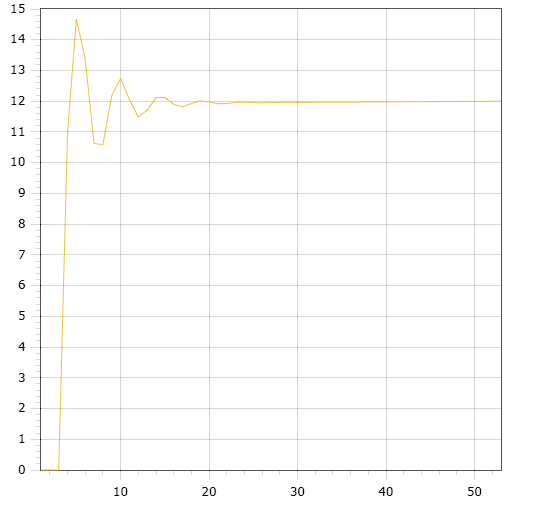

<p align="center"> Министерство образования Республики Беларусь</p>
<p align="center">Учреждение образования</p>
<p align="center">“Брестский Государственный технический университет”</p>
<p align="center">Кафедра ИИТ</p>
<br><br><br><br><br><br><br>
<p align="center">Лабораторная работа №2</p>
<p align="center">По дисциплине “Общая теория интеллектуальных систем”</p>
<p align="center">Тема: “Моделирования температуры объекта”</p>
<br><br><br><br><br>
<p align="right">Выполнил:</p>
<p align="right">Студент 2 курса</p>
<p align="right">Группы ИИ-23</p>
<p align="right">Бусень А.Д.</p>
<p align="right">Проверил:</p>
<p align="right">Иванюк Д. С.</p>
<br><br><br><br><br>
<p align="center">Брест 2023</p>

---

# Общее задание #
1. Написать отчет по выполненной лабораторной работе №2 в .md формате (readme.md) и с помощью запроса на внесение изменений (**pull request**) разместить его в следующем каталоге: **trunk\ii0xxyy\task_02\doc** (где **xx** - номер группы, **yy** - номер студента, например **ii02102**).
2. Исходный код написанной программы разместить в каталоге: **trunk\ii0xxyy\task_02\src**.

# Задание #
На C++ реализовать программу, моделирующую рассмотренный выше ПИД-регулятор.  В качестве объекта управления использовать математическую модель, полученную в предыдущей работе.
В отчете также привести графики для разных заданий температуры объекта, пояснить полученные результаты.

---

# Выполнение задания #

Код программы:
```C++
#include <iostream>
#include <cmath>
#include <vector>

using namespace std;

const double k = 0.001;//коэф. передачи
const double t = 50;//постоянная интегрирования
const double td = 100;//постоянная дифференцирования
const double t0 = 1;//шаг
const double a = 0.4;
const double b = 0.4;
const double c = 0.4;
const double d = 0.4;

void nelineyn(double znach) {
    double q0 = k * (1 + td / t0);
    double q1 = -k * (1 + 2 * td / t0 - t0 / t);
    double q2 = k * td / t0;
    vector<double> y = { 0, 0, 0 };
    vector<double> u = { 1, 1 };
    for (int i = 0; i < t; i++) {
        double e0 = znach - y[y.size() - 1];
        double e1 = znach - y[y.size() - 2];
        double e2 = znach - y[y.size() - 3];
        double intsum = q0 * e0 + q1 * e1 + q2 * e2;
        u[0] = u[1] + intsum;
        u[1] = u[0];
        y.push_back(a * y[y.size() - 1] - b * y[y.size() - 2] * y[y.size() - 2] + c * u[0] + d * sin(u[1]));
    }
    for (double i : y) {
        double res = i * znach / y[y.size() - 1];
        cout << res << endl;
    }
}

int main() {
    setlocale(LC_ALL, "RUS");
    double znach;
    cout << "Желаемое начальное значение: ";
    cin >> znach;
    nelineyn(znach);
    return 0;
}

```     

Вывод программы:
```
    0
    0
    0
    10.9728
    14.6679
    13.3724
    10.6213
    10.5892
    12.1846
    12.7416
    12.0546
    11.4859
    11.7111
    12.1138
    12.1254
    11.8986
    11.8171
    11.924
    12.0091
    11.9783
    11.9205
    11.921
    11.9567
    11.9706
    11.9566
    11.9458
    11.9524
    11.9629
    11.9647
    11.9612
    11.9611
    11.9651
    11.9686
    11.9695
    11.9698
    11.9714
    11.9738
    11.9758
    11.9771
    11.9784
    11.9802
    11.982
    11.9837
    11.9852
    11.9868
    11.9885
    11.9902
    11.9918
    11.9934
    11.9951
    11.9967
    11.9984
    12
```  

