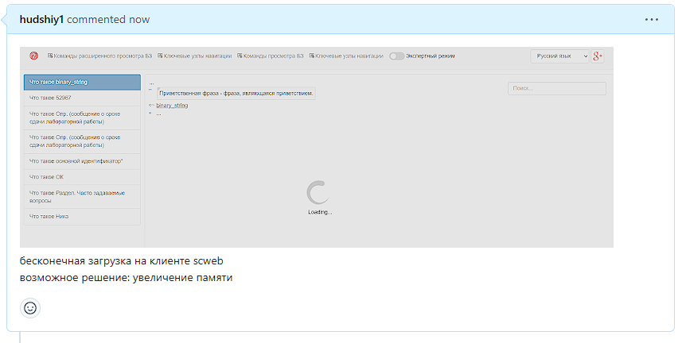
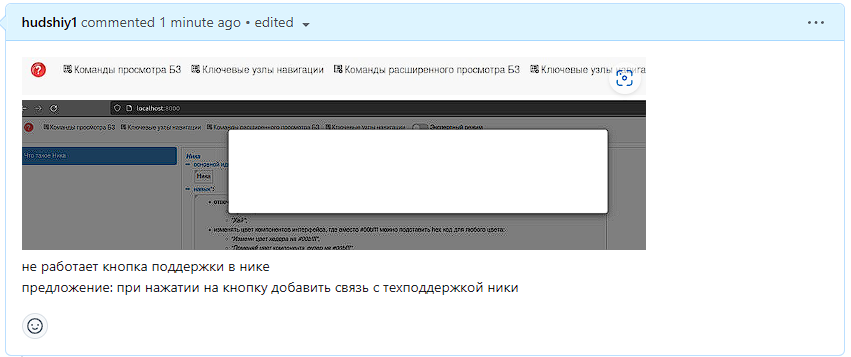

 Министерство образования Республики Беларусь

Учреждение образования

“Брестский Государственный технический университет”

Кафедра ИИТ

       

Лабораторная работа №5

По дисциплине “Общая теория интеллектуальных систем”

Тема: “Работа с проектами(на примере nika)”

     

Выполнил:

Студент 2 курса

Группы ИИ-23

Бусень А. Д.

Проверил:

Иванюк Д. С.

     

Брест 2023

---
**Задание**
 Изучить следующие открытые проекты:

1.1. The OSTIS Technology project;

1.2. The OSTIS Applications;

Внести свой вклад в проект (в виде оформления вопросов (issues)):

- предложить исправления в ошибках в документации (синтаксические, орфографические и т.п.);
- предложить исправления в исходном коде;
- предложить новую функциональность.
- Написать отчет по выполненной работе в .md формате (readme.md) и с помощью pull request разместить его в следующем каталоге: trunk\ii0xxyy\task_05\doc.
---

# Ход работы #
- нашел недочет в работе программы информационной базы данных, указав её https://github.com/ostis-apps/nika/issues/331
  
Также предложил возможное решение проблемы.

- также нашел нефункционирующую кнопку, указав её https://github.com/ostis-apps/nika/issues/332

И также предложил для неё новую функциональность.

