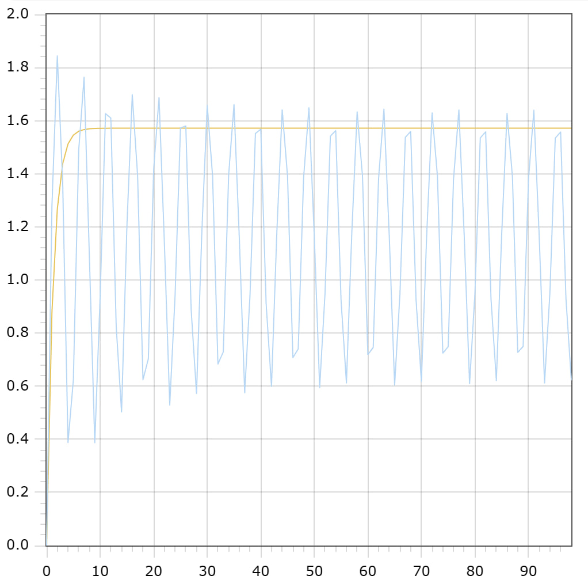

<p align="center"> Министерство образования Республики Беларусь</p>
<p align="center">Учреждение образования</p>
<p align="center">“Брестский Государственный технический университет”</p>
<p align="center">Кафедра ИИТ</p>
<br><br><br><br><br><br><br>
<p align="center">Лабораторная работа №1</p>
<p align="center">По дисциплине “Общая теория интеллектуальных систем”</p>
<p align="center">Тема: “Моделирования температуры объекта”</p>
<br><br><br><br><br>
<p align="right">Выполнил:</p>
<p align="right">Студент 2 курса</p>
<p align="right">Группы ИИ-23</p>
<p align="right">Вышинский А. С.</p>
<p align="right">Проверил:</p>
<p align="right">Иванюк Д. С.</p>
<br><br><br><br><br>
<p align="center">Брест 2023</p>

---

# Общее задание #
1. Написать отчет по выполненной лабораторной работе №1 в .md формате (readme.md) и с помощью запроса на внесение изменений (**pull request**) разместить его в следующем каталоге: **trunk\ii0xxyy\task_01\doc** (где **xx** - номер группы, **yy** - номер студента, например **ii02102**).
2. Исходный код написанной программы разместить в каталоге: **trunk\ii0xxyy\task_01\src**.

## Task 1. Modeling controlled object ##
Let's get some object to be controlled. We want to control its temperature, which can be described by this differential equation:

$$\Large\frac{dy(\tau)}{d\tau}=\frac{u(\tau)}{C}+\frac{Y_0-y(\tau)}{RC} $$ (1)

where $\tau$ – time; $y(\tau)$ – input temperature; $u(\tau)$ – input warm; $Y_0$ – room temperature; $C,RC$ – some constants.

After transformation we get these linear (2) and nonlinear (3) models:

$$\Large y_{\tau+1}=ay_{\tau}+bu_{\tau}$$ (2)
$$\Large y_{\tau+1}=ay_{\tau}-by_{\tau-1}^2+cu_{\tau}+d\sin(u_{\tau-1})$$ (3)

where $\tau$ – time discrete moments ($1,2,3{\dots}n$); $a,b,c,d$ – some constants.

Task is to write program (**C++**), which simulates this object temperature.

---

# Выполнение задания #

Код программы:
```C++
#include <iostream>
#include <cmath>
#include <fstream>

using namespace std;


const double u = 2; //input warm
const double t = 100; //end time
const double a = 0.44;
const double b = 0.44;
const double c = 0.44;
const double d = 0.44;//some constants


void linmodel(double y, double i) {

    if (i != t) {
        ofstream file("lin.txt", ios::app);
        file << i << " " << y << endl;
        ++i;
        cout << y << endl;
        linmodel(a * y + b * u, i);
    }
    else {
        cout << "completion linmodel\n\n";
    }
}
void nonlinmodel(double y, double y1, double i) {

    if (i != t) {
        ofstream file("nonlin.txt", ios::app);
        file << i << " " << y << endl;
        cout << y << endl;
        ++i;
        nonlinmodel(a * y - b * y1 * y1 + c * u + d * sin(u), y, i);
    }
    else {
        cout << "completion nonlinmodel\n" << endl;
    }
}


int main() {
    double i = 1; //start time
    double y = 0, y1 = 0;
    ofstream file1("lin.txt");
    ofstream file2("nonlin.txt");
    file1.clear();
    file2.clear();
    cout << "linear model: \n";
    linmodel(0, i);
    cout << "nonlinear model: \n";
    nonlinmodel(0, 0, i);
}
```     

Вывод программы:

    linear model:
	0
	0.88
	1.2672
	1.43757
	1.51253
	1.54551
	1.56003
	1.56641
	1.56922
	1.57046
	1.571
	1.57124
	1.57135
	1.57139
	1.57141
	1.57142
	1.57143
	1.57143
	1.57143
	1.57143
	1.57143
	1.57143
	1.57143
	1.57143
	1.57143
	1.57143
	1.57143
	1.57143
	1.57143
	1.57143
	1.57143
	1.57143
	1.57143
	1.57143
	1.57143
	1.57143
	1.57143
	1.57143
	1.57143
	1.57143
	1.57143
	1.57143
	1.57143
	1.57143
	1.57143
	1.57143
	1.57143
	1.57143
	1.57143
	1.57143
	1.57143
	1.57143
	1.57143
	1.57143
	1.57143
	1.57143
	1.57143
	1.57143
	1.57143
	1.57143
	1.57143
	1.57143
	1.57143
	1.57143
	1.57143
	1.57143
	1.57143
	1.57143
	1.57143
	1.57143
	1.57143
	1.57143
	1.57143
	1.57143
	1.57143
	1.57143
	1.57143
	1.57143
	1.57143
	1.57143
	1.57143
	1.57143
	1.57143
	1.57143
	1.57143
	1.57143
	1.57143
	1.57143
	1.57143
	1.57143
	1.57143
	1.57143
	1.57143
	1.57143
	1.57143
	1.57143
	1.57143
	1.57143
	1.57143
	completion linmodel
	
	nonlinear model:
	0
	1.28009
	1.84333
	1.37016
	0.387898
	0.624739
	1.48877
	1.76342
	1.08076
	0.387382
	0.936599
	1.62617
	1.60963
	0.824784
	0.502999
	1.20209
	1.69769
	1.39126
	0.624103
	0.703027
	1.41804
	1.68656
	1.13741
	0.528977
	0.943615
	1.57216
	1.58006
	0.887773
	0.572208
	1.18508
	1.65746
	1.39143
	0.683563
	0.728984
	1.39525
	1.66018
	1.15401
	0.575133
	0.947183
	1.55131
	1.56792
	0.911089
	0.599288
	1.17854
	1.64062
	1.39082
	0.707727
	0.740359
	1.38546
	1.64852
	1.16086
	0.59512
	0.949007
	1.54182
	1.56222
	0.921497
	0.611713
	1.17562
	1.63272
	1.39037
	0.718919
	0.745834
	1.38085
	1.64291
	1.16401
	0.604633
	0.949969
	1.53722
	1.55939
	0.926482
	0.61779
	1.17424
	1.62882
	1.39009
	0.724382
	0.748589
	1.37859
	1.6401
	1.16551
	0.609347
	0.9505
	1.53494
	1.55795
	0.928933
	0.620856
	1.17358
	1.62686
	1.3899
	0.727103
	0.750016
	1.37748
	1.63867
	1.16623
	0.611725
	0.95081
	1.5338
	1.55718
	0.930138
	0.62243
	completion nonlinmodel

