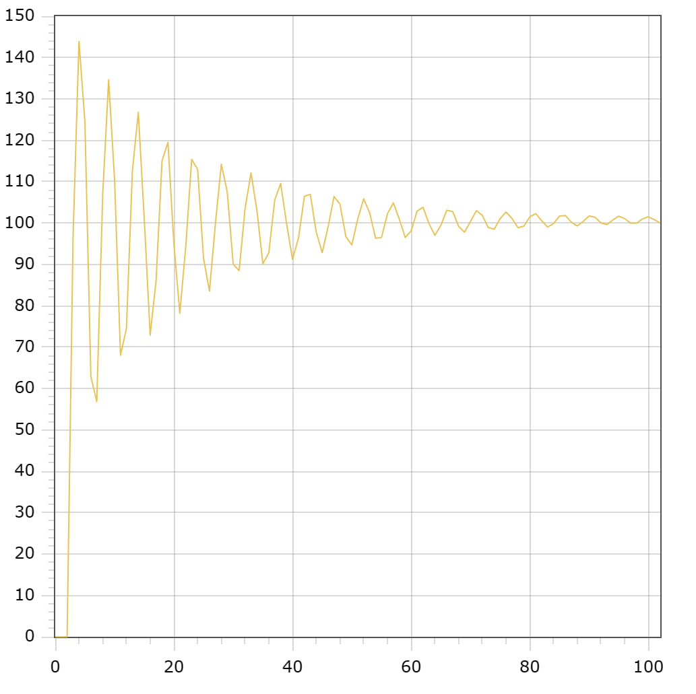

<p align="center"> Министерство образования Республики Беларусь</p>
<p align="center">Учреждение образования</p>
<p align="center">“Брестский Государственный технический университет”</p>
<p align="center">Кафедра ИИТ</p>
<br><br><br><br><br><br><br>
<p align="center">Лабораторная работа №1</p>
<p align="center">По дисциплине “Общая теория интеллектуальных систем”</p>
<p align="center">Тема: “Моделирования температуры объекта”</p>
<br><br><br><br><br>
<p align="right">Выполнил:</p>
<p align="right">Студент 2 курса</p>
<p align="right">Группы ИИ-23</p>
<p align="right">Вышинский А. С.</p>
<p align="right">Проверил:</p>
<p align="right">Иванюк Д. С.</p>
<br><br><br><br><br>
<p align="center">Брест 2023</p>

---

# Общее задание #
1. Написать отчет по выполненной лабораторной работе №1 в .md формате (readme.md) и с помощью запроса на внесение изменений (**pull request**) разместить его в следующем каталоге: **trunk\ii0xxyy\task_02\doc** (где **xx** - номер группы, **yy** - номер студента, например **ii02102**).
2. Исходный код написанной программы разместить в каталоге: **trunk\ii0xxyy\task_02\src**.

# Задание #
На C++ реализовать программу, моделирующую рассмотренный выше ПИД-регулятор.  В качестве объекта управления использовать математическую модель, полученную в предыдущей работе.
В отчете также привести графики для разных заданий температуры объекта, пояснить полученные результаты.

---

# Выполнение задания #

Код программы:
```C++
#include <iostream>
#include <cmath>
#include <vector>
#include <fstream>

using namespace std;

const double K = 0.0001;
const double T = 100;
const double TD = 100;
const double T0 = 1;

const double q0 = K * (1 + TD / T0);
const double q1 = -K * (1 + 2 * TD / T0 - T0 / T);
const double q2 = K * TD / T0;


class func {
private:
    vector<double> q = { q0, q1, q2 };
    vector<double> e = { 0, 0, 0 };
    vector<double> y = { 0, 0, 0 };
    vector<double> u = { 1, 1 };

public:
    double summ() {
        double summ = 0;
        for (int i = 0; i < 3; i++) {
            summ += q[i] * e[i];
        }
        return summ;
    }

    void nonlinear(int time, double setp, double a = 0.5, double b = 0.3, double c = 0.9, double d = 0.7) {
        for (int i = 0; i < time; i++) {
            e[0] = setp - y[y.size() - 1];
            e[1] = setp - y[y.size() - 2];
            e[2] = setp - y[y.size() - 3];
            u[0] = u[1] + summ();
            y.push_back(a * y[y.size() - 1] - b * y[y.size() - 2] * y[y.size() - 2] + c * u[0] + d * sin(u[1]));
            u[1] = u[0];
        }
    }

    vector<double> getY() const {
        return y;
    }
};

int main() {
    double setp;
    ofstream out("output.txt");
    func f;

    if (out.is_open()) {
        cout << "Enter the setpoint: ";
        cin >> setp;
        f.nonlinear(100, setp);
        vector<double> y_values = f.getY();

        for (int i = 0; i < y_values.size(); i++) {
            double scaledValue = y_values[i] * setp / y_values[y_values.size() - 1];
            cout << i << " " << scaledValue << endl;
            out << i << " " << scaledValue << endl;
        }

        out.close();
    }
    else {
        cerr << "Error: Cannot open the output file." << endl;
    }

    return 0;
}
```     

Вывод программы:

                            Enter the setpoint: 100
                            0 0
                            1 0
                            2 0
                            3 96.5026
                            4 143.885
                            5 124.538
                            6 62.9344
                            7 56.8208
                            8 106.897
                            9 134.615
                            10 110.513
                            11 68.0335
                            12 74.5182
                            13 112.509
                            14 126.761
                            15 101.095
                            16 72.9346
                            17 86.1117
                            18 115.033
                            19 119.499
                            20 94.9692
                            21 78.2193
                            22 94.2476
                            23 115.374
                            24 112.976
                            25 91.4767
                            26 83.5323
                            27 99.8682
                            28 114.21
                            29 107.444
                            30 90.0539
                            31 88.4863
                            32 103.508
                            33 112.113
                            34 103.066
                            35 90.1451
                            36 92.8077
                            37 105.578
                            38 109.566
                            39 99.8798
                            40 91.2301
                            41 96.3483
                            42 106.44
                            43 106.952
                            44 97.8095
                            45 92.8644
                            46 99.0653
                            47 106.422
                            48 104.546
                            49 96.6968
                            50 94.7014
                            51 100.995
                            52 105.821
                            53 102.522
                            54 96.3388
                            55 96.4944
                            56 102.226
                            57 104.887
                            58 100.959
                            59 96.5229
                            60 98.0861
                            61 102.879
                            62 103.823
                            63 99.8668
                            64 97.0521
                            65 99.392
                            66 103.085
                            67 102.78
                            68 99.2048
                            69 97.7608
                            70 100.383
                            71 102.975
                            72 101.858
                            73 98.9012
                            74 98.5211
                            75 101.07
                            76 102.665
                            77 101.112
                            78 98.8717
                            79 99.2432
                            80 101.49
                            81 102.254
                            82 100.562
                            83 99.032
                            84 99.8709
                            85 101.69
                            86 101.818
                            87 100.204
                            88 99.3065
                            89 100.376
                            90 101.727
                            91 101.412
                            92 100.013
                            93 99.6333
                            94 100.752
                            95 101.652
                            96 101.069
                            97 99.9564
                            98 99.9656
                            99 101.006
                            100 101.512
                            101 100.806
                            102 100
    

