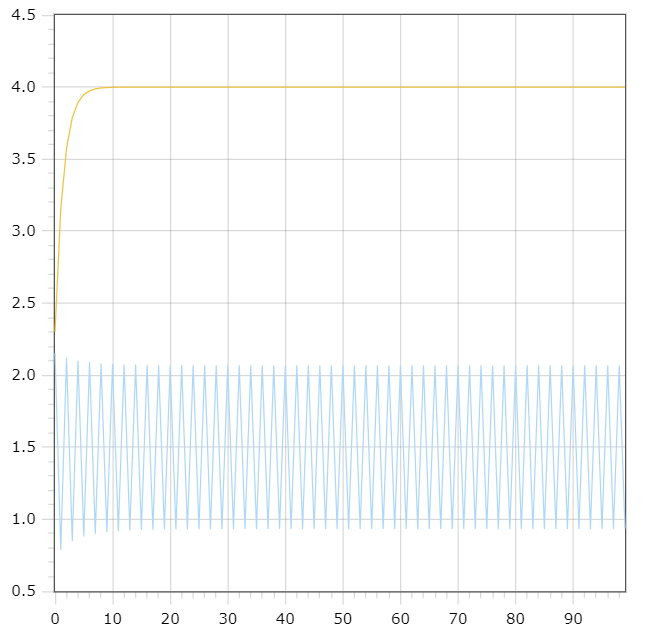

<p align="center"> Министерство образования Республики Беларусь</p>
<p align="center">Учреждение образования</p>
<p align="center">“Брестский Государственный технический университет”</p>
<p align="center">Кафедра ИИТ</p>
<br><br><br><br><br><br><br>
<p align="center">Лабораторная работа №1</p>
<p align="center">По дисциплине “Общая теория интеллектуальных систем”</p>
<p align="center">Тема: “Моделирования температуры объекта”</p>
<br><br><br><br><br>
<p align="right">Выполнил:</p>
<p align="right">Студент 2 курса</p>
<p align="right">Группы ИИ-23</p>
<p align="right">Глухарев Д.Е.</p>
<p align="right">Проверил:</p>
<p align="right">Иванюк Д. С.</p>
<br><br><br><br><br>
<p align="center">Брест 2023</p>

---

# Общее задание 
1. Написать отчет по выполненной лабораторной работе №1 в .md формате (readme.md) и с помощью запроса на внесение изменений (**pull request**) разместить его в следующем каталоге: **trunk\ii0xxyy\task_01\doc** (где **xx** - номер группы, **yy** - номер студента, например **ii02102**).
2. Исходный код написанной программы разместить в каталоге: **trunk\ii0xxyy\task_01\src**.

## Task 1. Modeling controlled object 
Let's get some object to be controlled. We want to control its temperature, which can be described by this differential equation:

$$\Large\frac{dy(\tau)}{d\tau}=\frac{u(\tau)}{C}+\frac{Y_0-y(\tau)}{RC} $$ (1)

where $\tau$ – time; $y(\tau)$ – input temperature; $u(\tau)$ – input warm; $Y_0$ – room temperature; $C,RC$ – some constants.

After transformation we get these linear (2) and nonlinear (3) models:

$$\Large y_{\tau+1}=ay_{\tau}+bu_{\tau}$$ (2)
$$\Large y_{\tau+1}=ay_{\tau}-by_{\tau-1}^2+cu_{\tau}+d\sin(u_{\tau-1})$$(3) 

where $\tau$ – time discrete moments ($1,2,3{\dots}n$); $a,b,c,d$ – some constants.

Task is to write program (**C++**), which simulates this object temperature.

---

# Выполнение задания 

Код программы:
```C++
#include <cmath>
#include <iostream>

double a = 0.5, b = 0.5, c = 0.66, d = 0.8, u = 4.0;

double func2(double prev, double a, double b, double u) {
	double next = a * prev + b * u;
	return next;
}

double func3(double prev, double a, double b, double c, double d, double u) {
	double next = a * prev - prev * prev * b + u * c + d * sin(u);
	return next;
}

int main()
{
	double y1 = 0.6, prev1 = y1, prev2 = y1;
	int t;
	std::cout << "Enter t: ";
	std::cin >> t;
	for (int i = 0; i < t; i++) {
		std::cout << i << ";" << func2(prev1, a, b, u) << ";" << func3(prev2, a, b, c, d, u) << std::endl;
		prev1 = func2(prev1, a, b, u);
		prev2 = func3(prev2, a, b, c, d, u);
	}
	return 0;
}
```     

Вывод программы:

		0; 2.3; 2.15456
            1; 3.15; 0.790777
            2; 3.575; 2.11728
            3; 3.7875; 0.851757
            4; 3.89375; 2.09769
            5; 3.94687; 0.883249
            6; 3.97344; 2.08612
            7; 3.98672; 0.901673
            8; 3.99336; 2.07889
            9; 3.99668; 0.913115
            10; 3.99834; 2.07423
            11; 3.99917; 0.920464
            12; 3.99958; 2.07116
            13; 3.99979; 0.925282
            14; 3.9999; 2.06913
            15; 3.99995; 0.92848
            16; 3.99997; 2.06776
            17; 3.99999; 0.930622
            18; 3.99999; 2.06684
            19; 4; 0.932063
            20; 4; 2.06622
            21; 4; 0.933038
            22; 4; 2.0658
            23; 4; 0.933698
            24; 4; 2.06551
            25; 4; 0.934145
            26; 4; 2.06532
            27; 4; 0.934449
            28; 4; 2.06518
            29; 4; 0.934656
            30; 4; 2.06509
            31; 4; 0.934797
            32; 4; 2.06503
            33; 4; 0.934893
            34; 4; 2.06499
            35; 4; 0.934958
            36; 4; 2.06496
            37; 4; 0.935002
            38; 4; 2.06494
            39; 4; 0.935032
            40; 4; 2.06493
            41; 4; 0.935053
            42; 4; 2.06492
            43; 4; 0.935067
            44; 4; 2.06492
            45; 4; 0.935076
            46; 4; 2.06491
            47; 4; 0.935083
            48; 4; 2.06491
            49; 4; 0.935087
            50; 4; 2.06491
            51; 4; 0.93509
            52; 4; 2.06491
            53; 4; 0.935092
            54; 4; 2.06491
            55; 4; 0.935093
            56; 4; 2.0649
            57; 4; 0.935094
            58; 4; 2.0649
            59; 4; 0.935095
            60; 4; 2.0649
            61; 4; 0.935096
            62; 4; 2.0649
            63; 4; 0.935096
            64; 4; 2.0649
            65; 4; 0.935096
            66; 4; 2.0649
            67; 4; 0.935096
            68; 4; 2.0649
            69; 4; 0.935096
            70; 4; 2.0649
            71; 4; 0.935096
            72; 4; 2.0649
            73; 4; 0.935096
            74; 4; 2.0649
            75; 4; 0.935096
            76; 4; 2.0649
            77; 4; 0.935096
            78; 4; 2.0649
            79; 4; 0.935096
            80; 4; 2.0649
            81; 4; 0.935096
            82; 4; 2.0649
            83; 4; 0.935096
            84; 4; 2.0649
            85; 4; 0.935096
            86; 4; 2.0649
            87; 4; 0.935096
            88; 4; 2.0649
            89; 4; 0.935096
            90; 4; 2.0649
            91; 4; 0.935096
            92; 4; 2.0649
            93; 4; 0.935096
            94; 4; 2.0649
            95; 4; 0.935096
            96; 4; 2.0649
            97; 4; 0.935096
            98; 4; 2.0649
            99; 4; 0.935096

