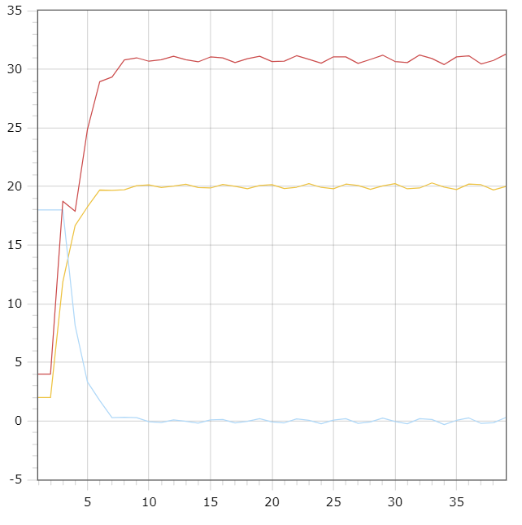

<p align="center"> Министерство образования Республики Беларусь</p>
<p align="center">Учреждение образования</p>
<p align="center">“Брестский Государственный технический университет”</p>
<p align="center">Кафедра ИИТ</p>
<br><br><br><br><br><br><br>
<p align="center">Лабораторная работа №2</p>
<p align="center">По дисциплине “Общая теория интеллектуальных систем”</p>
<p align="center">Тема: “Моделирования температуры объекта”</p>
<br><br><br><br><br>
<p align="right">Выполнил:</p>
<p align="right">Студент 2 курса</p>
<p align="right">Группы ИИ-23</p>
<p align="right">Глухарев Д.Е.</p>
<p align="right">Проверил:</p>
<p align="right">Иванюк Д. С.</p>
<br><br><br><br><br>
<p align="center">Брест 2023</p>

---

# Общее задание #
1. Написать отчет по выполненной лабораторной работе №1 в .md формате (readme.md) и с помощью запроса на внесение изменений (**pull request**) разместить его в следующем каталоге: **trunk\ii0xxyy\task_02\doc** (где **xx** - номер группы, **yy** - номер студента, например **ii02102**).
2. Исходный код написанной программы разместить в каталоге: **trunk\ii0xxyy\task_02\src**.

# Задание #
На C++ реализовать программу, моделирующую рассмотренный выше ПИД-регулятор.  В качестве объекта управления использовать математическую модель, полученную в предыдущей работе.
В отчете также привести графики для разных заданий температуры объекта, пояснить полученные результаты.

---

# Выполнение задания #

Код программы:
```C++
#include <iostream>
#include <vector>
#include <cmath>

using namespace std;

class Unliner {
public:
    Unliner(double w) : w(w) {}

    void calculate() {
        const short int y_start = 2;
        y = { y_start, y_start };
        double u = 4.0;
        e = { w - y_start, w - y_start };
        u_pr = { u, u };

        while (abs(w - y.back()) > 0.01)
        {
            e.push_back(w - y.back());
            u = u_pr.back() + q0 * e.back() + q1 * e[e.size() - 2] + q2 * e[e.size() - 3];
            y.push_back(A * y.back() - B * y[y.size() - 2] + C * u + D * sin(u_pr.back()));
            u_pr.push_back(u);
        }
    }

    void print() {
        cout << "y\te\tu_pr\n";
        for (size_t i = 0; i < y.size(); i++)
            cout << i + 1 << ";" << y[i] << ";" << e[i] << ";" << u_pr[i] << endl;
    }

private:
    double A = 0.5, B = 0.5, C = 0.66, D = 0.68;
    double K = 0.78, T0 = 1.05, TD = 1.08, T = 1.0, w;
    double q0 = K * (1 + (TD / T0)),
        q1 = -K * (1 + 2 * (TD / T0) - (T0 / T)),
        q2 = K * (TD / T0);
    vector<double> y;
    vector<double> e;
    vector<double> u_pr;
};

int main() {
    Unliner unliner(20);
    unliner.calculate();
    unliner.print();
}
```     

Вывод программы:

    1;2;18;4
    2;2;18;4
    3;11.8551;18;18.742
    4;16.6622;8.14491;17.8904
    5;18.2554;3.33777;24.8614
    6;19.7088;1.74459;28.9309
    7;19.6749;0.291241;29.3383
    8;19.7142;0.325126;30.7964
    9;20.0672;0.285806;30.9733
    10;20.1343;-0.0672312;30.6803
    11;19.9068;-0.134296;30.8024
    12;20.0248;0.0931869;31.1062
    13;20.1885;-0.0248015;30.8133
    14;19.9113;-0.188461;30.6287
    15;19.8688;0.0886947;31.0442
    16;20.1664;0.131161;30.9616
    17;20.0227;-0.166426;30.5641
    18;19.8065;-0.0227092;30.894
    19;20.0803;0.193523;31.1022
    20;20.1587;-0.0803047;30.6539
    21;19.8211;-0.158671;30.6839
    22;19.9363;0.178905;31.1509
    23;20.2368;0.0636877;30.8443
    24;19.9213;-0.236761;30.5135
    25;19.8081;0.0787271;31.0598
    26;20.1996;0.191924;31.0503
    27;20.0808;-0.199565;30.4972
    28;19.7518;-0.0808176;30.8358
    29;20.0514;0.248225;31.195
    30;20.2365;-0.0514125;30.6602
    31;19.7995;-0.236485;30.5656
    32;19.8703;0.200539;31.2119
    33;20.3005;0.129668;30.9134
    34;19.9488;-0.300499;30.3958
    35;19.7385;0.0512101;31.0513
    36;20.2073;0.261467;31.1438
    37;20.147;-0.207279;30.4475
    38;19.7041;-0.146955;30.7493
    39;20.0037;0.295933;31.2813

