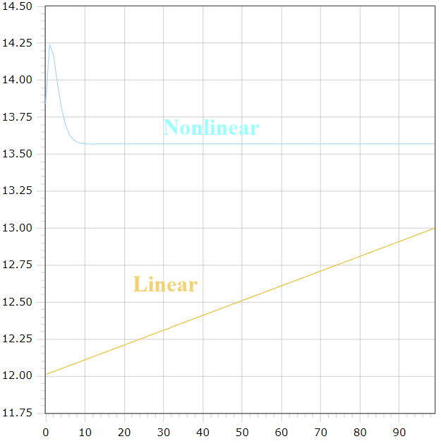

<p align="center"> Министерство образования Республики Беларусь</p>
<p align="center">Учреждение образования</p>
<p align="center">“Брестский Государственный технический университет”</p>
<p align="center">Кафедра ИИТ</p>
<br><br><br><br><br><br><br>
<p align="center">Лабораторная работа №1</p>
<p align="center">По дисциплине “Общая теория интеллектуальных систем”</p>
<p align="center">Тема: “Моделирования температуры объекта”</p>
<br><br><br><br><br>
<p align="right">Выполнил:</p>
<p align="right">Студент 2 курса</p>
<p align="right">Группы ИИ-23</p>
<p align="right">Колеснев А. В.</p>
<p align="right">Проверил:</p>
<p align="right">Иванюк Д. С.</p>
<br><br><br><br><br>
<p align="center">Брест 2023</p>

<hr>

# Общее задание #
1. Написать отчет по выполненной лабораторной работе №1 в .md формате (readme.md) и с помощью запроса на внесение изменений (**pull request**) разместить его в следующем каталоге: **trunk\ii0xxyy\task_01\doc** (где **xx** - номер группы, **yy** - номер студента, например **ii02102**).
2. Исходный код написанной программы разместить в каталоге: **trunk\ii0xxyy\task_01\src**.
## Task 1. Modeling controlled object ##
Let's get some object to be controlled. We want to control its temperature, which can be described by this differential equation:

$$\Large\frac{dy(\tau)}{d\tau}=\frac{u(\tau)}{C}+\frac{Y_0-y(\tau)}{RC} $$ (1)

where $\tau$ – time; $y(\tau)$ – input temperature; $u(\tau)$ – input warm; $Y_0$ – room temperature; $C,RC$ – some constants.

After transformation, we get these linear (2) and nonlinear (3) models:

$$\Large y_{\tau+1}=ay_{\tau}+bu_{\tau}$$ (2)
$$\Large y_{\tau+1}=ay_{\tau}-by_{\tau-1}^2+cu_{\tau}+d\sin(u_{\tau-1})$$ (3)

where $\tau$ – time discrete moments ($1,2,3{\dots}n$); $a,b,c,d$ – some constants.

Task is to write program (**Julia**), which simulates this object temperature.

<hr>

# Выполнение задания #

Код программы:
```C++
#include <iostream>
#include <cmath>

// linear model
void linear(float y, float a, float b, float u, int t_end);

// nonlinear model
void nonlinear(float y_prev, float y, float u, float a, float b, float c, float d, int t_end);

int main() {
    int t_end;
    float y, u, y0 = 0;
    // some constants
    float a = 1, b = 0.01, c = 1, d = 1;
    std::cout << "Enter temperature: ";
    std::cin >> y;
    std::cout << "\nEnter warm: ";
    std::cin >> u;
    std::cout  << "\nEnter end time: ";
    std::cin >> t_end;
    std::cout << "\nLinear:\n";
    linear(y, a, b, u, t_end);
    std::cout << "\nNonlinear:\n";
    nonlinear(y0, y, u, a, b, c, d, t_end);
    return 0;
}

void linear(float y, float a, float b, float u, int t_end) {
    int t = 1;
    float y_next;
    while(t <= t_end) {
        y_next = a * y + b * u;
        y = y_next;
        std::cout << y_next << "\n";
        t++;
    }
}

void nonlinear(float y_prev, float y, float u, float a, float b, float c, float d, int t_end) {
    int t = 1;
    float y_next;
    while(t <= t_end) {
        y_next = a * y - b * pow(y_prev, 2) + c * u + d * sin((double)u);
        y_prev = y;
        y = y_next;
        t++;
        std::cout << y_next << "\n";
    }о
}
```     
```
Вывод программы:
Enter temperature: 12

Enter warm: 1

Enter end time: 100

Linear:
12.01
12.02
12.03
12.04
12.05
12.06
12.07
12.08
12.09
12.1
12.11
12.12
12.13
12.14
12.15
12.16
12.17
12.18
12.19
12.2
12.21
12.22
12.23
12.24
12.25
12.26
12.27
12.28
12.29
12.3
12.31
12.32
12.33
12.34
12.35
12.36
12.37
12.38
12.39
12.4
12.41
12.42
12.43
12.44
12.45
12.46
12.47
12.48
12.49
12.5
12.51
12.52
12.53
12.54
12.55
12.56
12.57
12.58
12.59
12.6
12.61
12.62
12.63
12.64
12.65
12.66
12.67
12.68
12.69
12.7
12.71
12.72
12.73
12.74
12.75
12.76
12.77
12.78
12.79
12.8
12.81
12.82
12.83
12.84
12.85
12.86
12.87
12.88
12.89
12.9
12.91
12.92
12.93
12.94
12.95
12.96
12.97
12.98
12.99
13

Nonlinear:
13.8415
14.2429
14.1685
13.9814
13.8154
13.7021
13.6349
13.5989
13.5813
13.5734
13.5704
13.5695
13.5694
13.5696
13.5697
13.5699
13.57
13.57
13.5701
13.5701
13.5701
13.5701
13.5701
13.5701
13.5701
13.5701
13.5701
13.5701
13.5701
13.5701
13.5701
13.5701
13.5701
13.5701
13.5701
13.5701
13.5701
13.5701
13.5701
13.5701
13.5701
13.5701
13.5701
13.5701
13.5701
13.5701
13.5701
13.5701
13.5701
13.5701
13.5701
13.5701
13.5701
13.5701
13.5701
13.5701
13.5701
13.5701
13.5701
13.5701
13.5701
13.5701
13.5701
13.5701
13.5701
13.5701
13.5701
13.5701
13.5701
13.5701
13.5701
13.5701
13.5701
13.5701
13.5701
13.5701
13.5701
13.5701
13.5701
13.5701
13.5701
13.5701
13.5701
13.5701
13.5701
13.5701
13.5701
13.5701
13.5701
13.5701
13.5701
13.5701
13.5701
13.5701
13.5701
13.5701
13.5701
13.5701
13.5701
13.5701
```
