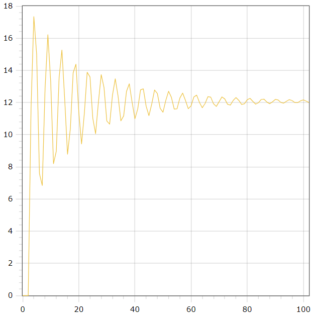

<p align="center"> Министерство образования Республики Беларусь</p>
<p align="center">Учреждение образования</p>
<p align="center">“Брестский Государственный технический университет”</p>
<p align="center">Кафедра ИИТ</p>
<br><br><br><br><br><br><br>
<p align="center">Лабораторная работа №2</p>
<p align="center">По дисциплине “Общая теория интеллектуальных систем”</p>
<p align="center">Тема: “ПИД-регуляторы”</p>
<br><br><br><br><br>
<p align="right">Выполнил:</p>
<p align="right">Студент 2 курса</p>
<p align="right">Группы ИИ-23</p>
<p align="right">Колеснев А. В.</p>
<p align="right">Проверил:</p>
<p align="right">Иванюк Д. С.</p>
<br><br><br><br><br>
<p align="center">Брест 2023</p>

---

# Общее задание #
1. Написать отчет по выполненной лабораторной работе №2 в .md формате (readme.md) и с помощью запроса на внесение изменений (**pull request**) разместить его в следующем каталоге: **trunk\ii0xxyy\task_02\doc** (где **xx** - номер группы, **yy** - номер студента, например **ii02102**).
2. Исходный код написанной программы разместить в каталоге: **trunk\ii0xxyy\task_02\src**.

# Задание #
На C++ реализовать программу, моделирующую рассмотренный выше ПИД-регулятор.  В качестве объекта управления использовать математическую модель, полученную в предыдущей работе.
В отчете также привести графики для разных заданий температуры объекта, пояснить полученные результаты.

---

# Выполнение задания #

Код программы:
```C++
// main.cpp
#include <iostream>
#include "fstream"
#include "ControlSystem.h"
#include "Exceptions/FileOpenException.h"

int main() {
    try {
        double setValue;
        std::string fileNameOut = "output.txt";
        std::ofstream out(fileNameOut);
        ControlSystem controlSystem;
        
        if (!out.is_open()) {
            throw FileOpenException(fileNameOut);
        }
        
        std::cout << "Enter the set value: ";
        std::cin >> setValue;
        controlSystem.nonlinear(100, setValue);
        std::vector<double> yValues = controlSystem.getY();
        
        std::size_t size = yValues.size();
        for (int i = 0; i < size; i++) {
            double scaledValue = yValues[i] * setValue / yValues[size - 1];
            out << i << " " << scaledValue << std::endl;
        }
        
        out.close();
    } catch (const std::exception& e) {
        std::cerr << "Exception caught: " << e.what() << std::endl;
    }
    
    
    return 0;
}
```     
```C++
// ControlSystem.h
#pragma once
#include <vector>

class ControlSystem {
public:
    ControlSystem();
    double sum();
    void nonlinear(int time, double setValue, double a = 0.5, double b = 0.3, double c = 0.9, double d = 0.7);
    [[nodiscard]] std::vector<double> getY() const;

private:
    double k;
    double t;
    double t_d;
    double t_0;

    double q_0;
    double q_1;
    double q_2;

    std::vector<double> q;
    std::vector<double> e;
    std::vector<double> y;
    std::vector<double> u;
};
```

```C++
// ControlSystem.cpp
#include "ControlSystem.h"
#include <vector>
#include "math.h"

ControlSystem::ControlSystem() : k(0.0001), t(100), t_d(100), t_0(1), q_0(k * (1 + t_d / t_0)), q_1(-k * (1 + 2 * t_d / t_0 - t_0 / t)),
q_2(k * t_d / t_0), q({q_0, q_1, q_2}), e({0, 0, 0}), y({0, 0, 0}), u({1, 1}) {}

double ControlSystem::sum() {
    double sum = 0;
    for (int i = 0; i < 3; i++) {
        sum += q[i] * e[i];
    }
    return sum;
}

void ControlSystem::nonlinear(int time, double setValue, double a, double b, double c, double d) {
    for (int i = 0; i < time; i++) {
        e[0] = setValue - y[y.size() - 1];
        e[1] = setValue - y[y.size() - 2];
        e[2] = setValue - y[y.size() - 3];
        u[0] = u[1] + sum();
        y.push_back(a * y[y.size() - 1] - b * y[y.size() - 2] * y[y.size() - 2] + c * u[0] + d * sin(u[1]));
        u[1] = u[0];
    }
}

std::vector<double> ControlSystem::getY() const {
    return y;
}
```

```C++
// Exceptions/FileOpenException.h
#ifndef SRC_FILEOPENEXCEPTION_H
#define SRC_FILEOPENEXCEPTION_H


#include <stdexcept>
#include <string>

class FileOpenException : public std::runtime_error {
public:
    FileOpenException(const std::string& filename);
    
    const char* what() const noexcept override;
    const std::string& getFilename() const noexcept;

private:
    std::string filename;
};


#endif
```

```C++
// Exceptions/FileOpenException.cpp
#include "FileOpenException.h"
FileOpenException::FileOpenException(const std::string& filename)
: runtime_error("Cannot open the " + filename + " file."), filename(filename) {}

const char* FileOpenException::what() const noexcept {
    return runtime_error::what();
}

const std::string& FileOpenException::getFilename() const noexcept {
    return filename;
}
```

Вывод программы:
```
    0 0
1 0
2 0
3 11.6286
4 17.3373
5 15.0049
6 7.58179
7 6.84518
8 12.8771
9 16.2148
10 13.3119
11 8.19689
12 8.97634
13 13.5478
14 15.2627
15 12.1757
16 8.78857
17 10.3703
18 13.8454
19 14.3828
20 11.4379
21 9.42559
22 11.3456
23 13.8796
24 13.5939
25 11.0187
26 10.0642
27 12.0161
28 13.7329
29 12.9265
30 10.849
31 10.6573
32 12.447
33 13.4752
34 12.4002
35 10.8607
36 11.172
37 12.6885
38 13.1653
39 12.0186
40 10.9903
41 11.5909
42 12.7851
43 12.8496
44 11.7717
45 11.1839
46 11.9097
47 12.7773
48 12.561
49 11.6393
50 11.3997
51 12.1334
52 12.701
53 12.3194
54 11.5964
55 11.6085
56 12.2736
57 12.5868
58 12.1339
59 11.6167
60 11.7919
61 12.3454
62 12.4587
63 12.0047
64 11.6766
65 11.9404
66 12.3651
67 12.3344
68 11.9262
69 11.7564
70 12.0514
71 12.3484
72 12.2253
73 11.8894
74 11.8412
75 12.1266
76 12.3093
77 12.1375
78 11.8839
79 11.9206
80 12.1708
81 12.2594
82 12.0729
83 11.8997
84 11.9884
85 12.19
86 12.2075
87 12.0302
88 11.9279
89 12.0419
90 12.191
91 12.1595
92 12.0066
93 11.9614
94 12.0804
95 12.1797
96 12.1191
97 11.9979
98 11.9951
99 12.1053
100 12.1616
101 12.0878
102 12

```

