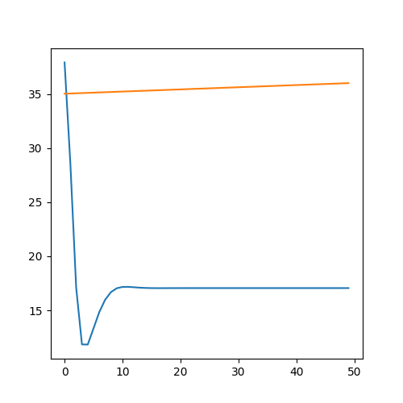

<p align="center"> Министерство образования Республики Беларусь</p>
<p align="center">Учреждение образования</p>
<p align="center">“Брестский Государственный технический университет”</p>
<p align="center">Кафедра ИИТ</p>
<br><br><br><br><br><br><br>
<p align="center">Лабораторная работа №1</p>
<p align="center">По дисциплине “Общая теория интеллектуальных систем”</p>
<p align="center">Тема: “Моделирования температуры объекта”</p>
<br><br><br><br><br>
<p align="right">Выполнил:</p>
<p align="right">Студент 2 курса</p>
<p align="right">Группы ИИ-23</p>
<p align="right">Кононов А.М.</p>
<p align="right">Проверил:</p>
<p align="right">Иванюк Д. С.</p>
<br><br><br><br><br>
<p align="center">Брест 2023</p>

<hr>

# Общее задание #
1. Написать отчет по выполненной лабораторной работе №1 в .md формате (readme.md) и с помощью запроса на внесение изменений (**pull request**) разместить его в следующем каталоге: **trunk\ii0xxyy\task_01\doc** (где **xx** - номер группы, **yy** - номер студента, например **ii02102**).
2. Исходный код написанной программы разместить в каталоге: **trunk\ii0xxyy\task_01\src**.
## Task 1. Modeling controlled object ##
Let's get some object to be controlled. We want to control its temperature, which can be described by this differential equation:

$$\Large\frac{dy(\tau)}{d\tau}=\frac{u(\tau)}{C}+\frac{Y_0-y(\tau)}{RC} $$ (1)

where $\tau$ – time; $y(\tau)$ – input temperature; $u(\tau)$ – input warm; $Y_0$ – room temperature; $C,RC$ – some constants.

After transformation, we get these linear (2) and nonlinear (3) models:

$$\Large y_{\tau+1}=ay_{\tau}+bu_{\tau}$$ (2)
$$\Large y_{\tau+1}=ay_{\tau}-by_{\tau-1}^2+cu_{\tau}+d\sin(u_{\tau-1})$$ (3)

where $\tau$ – time discrete moments ($1,2,3{\dots}n$); $a,b,c,d$ – some constants.

Task is to write program (**Julia**), which simulates this object temperature.

<hr>

# Выполнение задания #

Код программы:
```C++
#include <iostream>
#include <cmath>

const double A = 1;
const double B = 0.01;
const double C = 1;
const double D = 1;

void linear(double y, double u, int t_end) {
    for (int t = 1; t <= t_end; ++t) {
        double y_next = A * y + B * u;
        y = y_next;
        std::cout << y_next << "\n";
    }
}
void nonlinear(double y_prev, double y, double u, int t_end) {
    for (int t = 1; t <= t_end; ++t) {
        double y_next = A * y - B * pow(y_prev, 2) + C * u + D * sin(u);
        y_prev = y;
        y = y_next;
        std::cout << y_next << "\n";
    }
}


int main() {
    double initialTemperature;
    double warming;
    int endTime;

    std::cout << "Введите начальную температуру: ";
    std::cin >> initialTemperature;

    std::cout << "Введите потепление: ";
    std::cin >> warming;

    std::cout << "Введите время окончания: ";
    std::cin >> endTime;

    std::cout << "\nLinear Model:\n";
    linear(initialTemperature, warming, endTime);

    std::cout << "\nNonlinear Model:\n";
    nonlinear(0, initialTemperature, warming, endTime);

    return 0;
}


```     
```
Введите начальную температуру: 35
Введите потепление: 2
Введите время окончания: 50

Linear Model:
35.02
35.04
35.06
35.08
35.1
35.12
35.14
35.16
35.18
35.2
35.22
35.24
35.26
35.28
35.3
35.32
35.34
35.36
35.38
35.4
35.42
35.44
35.46
35.48
35.5
35.52
35.54
35.56
35.58
35.6
35.62
35.64
35.66
35.68
35.7
35.72
35.74
35.76
35.78
35.8
35.82
35.84
35.86
35.88
35.9
35.92
35.94
35.96
35.98
36

Nonlinear Model:
37.9093
28.5686
17.1067
11.8544
11.8373
13.3413
14.8494
15.9788
16.683
17.0391
17.1652
17.1712
17.134
17.0948
17.0684
17.0553
17.0513
17.0518
17.0536
17.0553
17.0563
17.0568
17.0569
17.0569
17.0568
17.0567
17.0567
17.0567
17.0567
17.0567
17.0567
17.0567
17.0567
17.0567
17.0567
17.0567
17.0567
17.0567
17.0567
17.0567
17.0567
17.0567
17.0567
17.0567
17.0567
17.0567
17.0567
17.0567
17.0567
17.0567
```


