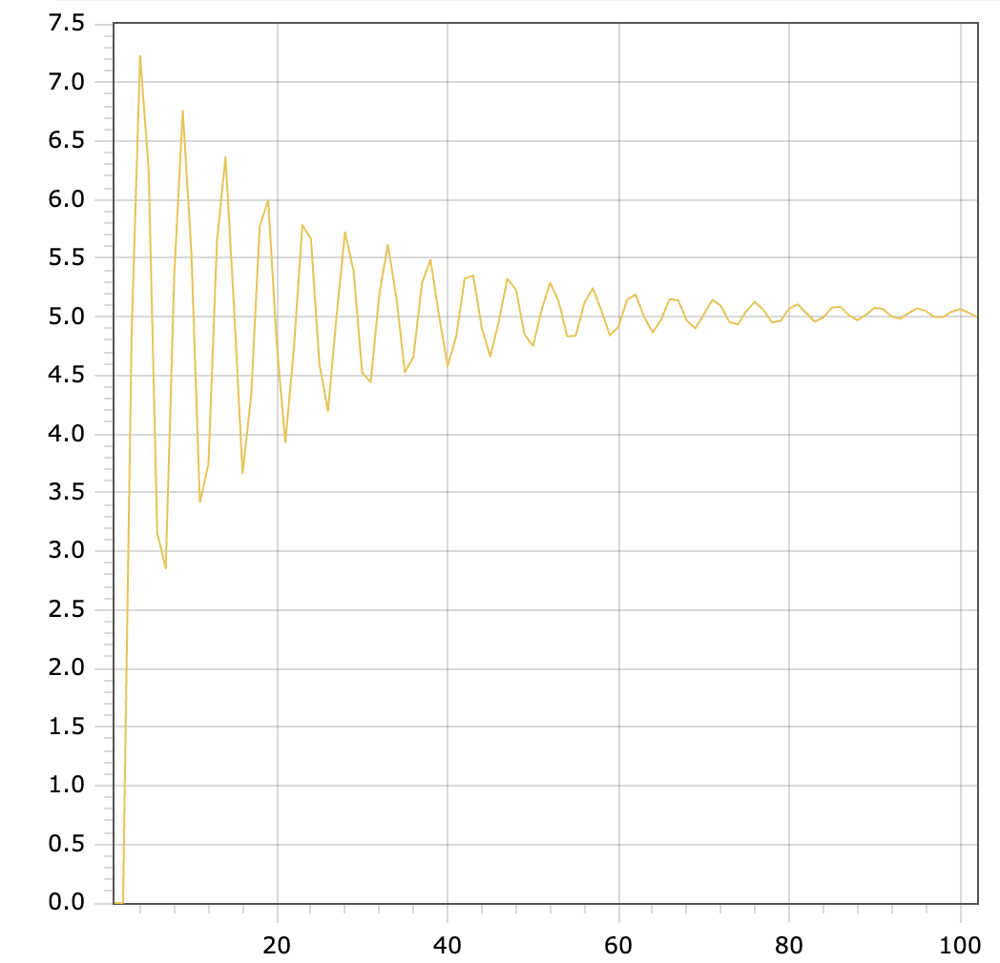

<p align="center"> Министерство образования Республики Беларусь</p>
<p align="center">Учреждение образования</p>
<p align="center">“Брестский Государственный технический университет”</p>
<p align="center">Кафедра ИИТ</p>
<br><br><br><br><br><br><br>
<p align="center">Лабораторная работа №2</p>
<p align="center">По дисциплине “Общая теория интеллектуальных систем”</p>
<p align="center">Тема: “Моделирования температуры объекта”</p>
<br><br><br><br><br>
<p align="right">Выполнил:</p>
<p align="right">Студент 2 курса</p>
<p align="right">Группы ИИ-23</p>
<p align="right">Кононов А.М.</p>
<p align="right">Проверил:</p>
<p align="right">Иванюк Д. С.</p>
<br><br><br><br><br>
<p align="center">Брест 2023</p>

---

# Общее задание #
1. Написать отчет по выполненной лабораторной работе №1 в .md формате (readme.md) и с помощью запроса на внесение изменений (**pull request**) разместить его в следующем каталоге: **trunk\ii0xxyy\task_02\doc** (где **xx** - номер группы, **yy** - номер студента, например **ii02102**).
2. Исходный код написанной программы разместить в каталоге: **trunk\ii0xxyy\task_02\src**.

# Задание #
На C++ реализовать программу, моделирующую рассмотренный выше ПИД-регулятор.  В качестве объекта управления использовать математическую модель, полученную в предыдущей работе.
В отчете также привести графики для разных заданий температуры объекта, пояснить полученные результаты.

---

# Выполнение задания #

Код программы:
```C++
#include <iostream>
#include <fstream>
#include <vector>
#include <cmath>

double calculateSum(const std::vector<double> &q, const std::vector<double> &e) {
    double sum = 0;
    for (size_t i = 0; i < 3; i++) {
        sum += q[i] * e[i];
    }
    return sum;
}

void simulateSystem(std::vector<double> &y, std::vector<double> &u, int time, double setpoint,
                    double a = 0.5, double b = 0.3, double c = 0.9, double d = 0.7) {
    std::vector<double> q = {
            0.0001 * (1 + 100 / 1),
            -0.0001 * (1 + 2 * 100 / 1 - 1 / 100),
            0.0001 * 100 / 1
    };
    std::vector<double> e(3, 0);

    for (int i = 0; i < time; i++) {
        e[0] = setpoint - y.back();
        e[1] = setpoint - y[y.size() - 2];
        e[2] = setpoint - y[y.size() - 3];

        double sum = calculateSum(q, e);
        u[0] = u[1] + sum;
        y.push_back(a * y.back() - b * y[y.size() - 2] * y[y.size() - 2] + c * u[0] + d * sin(u[1]));
        u[1] = u[0];
    }
}

int main() {
    double setpoint;
    std::ofstream out("output.txt");
    std::vector<double> y = {0, 0, 0};
    std::vector<double> u = {1, 1};

    if (out.is_open()) {
        std::cout << "Enter the setpoint: ";
        std::cin >> setpoint;

        simulateSystem(y, u, 100, setpoint);

        for (size_t i = 0; i < y.size(); i++) {
            double scaledValue = y[i] * setpoint / y.back();
            std::cout << i << " " << scaledValue << std::endl;
            out << i << " " << scaledValue << std::endl;
        }

        out.close();
    } else {
        std::cerr << "Error: Cannot open the output file." << std::endl;
    }

    return 0;
}


```     

Вывод программы:

    0 0
    1 0
    2 0
    3 4.84768
    4 7.22746
    5 6.25511
    6 3.16059
    7 2.85352
    8 5.36795
    9 6.75927
    10 5.54916
    11 3.41705
    12 3.74189
    13 5.64731
    14 6.36207
    15 5.07543
    16 3.66376
    17 4.32285
    18 5.77104
    19 5.99501
    20 4.7679
    21 3.92934
    22 4.72918
    23 5.78492
    24 5.66599
    25 4.59323
    26 4.19548
    27 5.00837
    28 5.72344
    29 5.38774
    30 4.52258
    31 4.44254
    32 5.18759
    33 5.61577
    34 5.16837
    35 4.52751
    36 4.65681
    37 5.28786
    38 5.48646
    39 5.00943
    40 4.58148
    41 4.83106
    42 5.32777
    43 5.35482
    44 4.90662
    45 4.662
    46 4.96349
    47 5.32424
    48 5.23454
    49 4.85154
    50 4.75168
    51 5.05632
    52 5.29226
    53 5.13396
    54 4.83363
    55 4.83835
    56 5.11437
    57 5.24455
    58 5.05676
    59 4.84202
    60 4.91439
    61 5.14397
    62 5.19117
    63 5.00302
    64 4.86681
    65 4.9759
    66 5.15191
    67 5.13943
    68 4.97035
    69 4.89979
    70 5.02174
    71 5.14478
    72 5.09405
    73 4.95498
    74 4.93478
    75 5.05272
    76 5.12841
    77 5.05755
    78 4.95259
    79 4.9675
    80 5.07082
    81 5.10759
    82 5.03066
    83 4.95899
    84 4.99541
    85 5.07861
    86 5.08596
    87 5.0129
    88 4.97051
    89 5.01733
    90 5.07882
    91 5.066
    92 5.00299
    93 4.98421
    94 5.03308
    95 5.07402
    96 5.04918
    97 4.99926
    98 4.99795
    99 5.04318
    100 5.06639
    101 5.03617
    102 5

