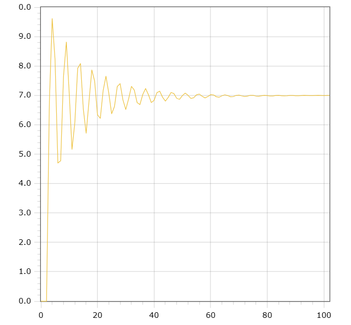

<p align="center"> Министерство образования Республики Беларусь</p>
<p align="center">Учреждение образования</p>
<p align="center">“Брестский Государственный технический университет”</p>
<p align="center">Кафедра ИИТ</p>
<br><br><br><br><br><br><br>
<p align="center">Лабораторная работа №2</p>
<p align="center">По дисциплине “Общая теория интеллектуальных систем”</p>
<p align="center">Тема: “Моделирования температуры объекта”</p>
<br><br><br><br><br>
<p align="right">Выполнил:</p>
<p align="right">Студент 2 курса</p>
<p align="right">Группы ИИ-23</p>
<p align="right">Лапин В. А.</p>
<p align="right">Проверил:</p>
<p align="right">Иванюк Д. С.</p>
<br><br><br><br><br>
<p align="center">Брест 2023</p>

---

# Общее задание #
1. Написать отчет по выполненной лабораторной работе №2 в .md формате (readme.md) и с помощью запроса на внесение изменений (**pull request**) разместить его в следующем каталоге: **trunk\ii0xxyy\task_02\doc** (где **xx** - номер группы, **yy** - номер студента, например **ii02102**).
2. Исходный код написанной программы разместить в каталоге: **trunk\ii0xxyy\task_02\src**.

# Задание #
На C++ реализовать программу, моделирующую рассмотренный выше ПИД-регулятор.  В качестве объекта управления использовать математическую модель, полученную в предыдущей работе.
В отчете также привести графики для разных заданий температуры объекта, пояснить полученные результаты.

---

# Выполнение задания #

Код программы:
```C++
#include <iostream>
#include <cmath>
#include <vector>

using namespace std;

const double A = 0.5;
const double B = 0.5;
const double C = 0.5;
const double D = 0.5;
const double K = 0.001;
const double T = 50;
const double TD = 100;
const double To = 1;
void unlinear(double value) {

    int t = 100;

    double q0 = K * (1 + TD / To);

    double q1 = -K * (1 + 2 * TD / To - To / T);

    double q2 = K * TD / To;

    vector<double> y = { 0, 0, 0 };
    vector<double> u = { 1, 1 };

    for (int i = 0; i < t; i++) {
        double e0 = value - y[y.size() - 1];
        double e1 = value - y[y.size() - 2];
        double e2 = value - y[y.size() - 3];
        double sum = q0 * e0 + q1 * e1 + q2 * e2;
        u[0] = u[1] + sum;
        u[1] = u[0];
        y.push_back(A * y[y.size() - 1] - B * y[y.size() - 2] * y[y.size() - 2] + C * u[0] + D * sin(u[1]));
    }

    for (int i = 0; i < y.size(); i++) {
        double res = y[i] * value / y[y.size() - 1];
        cout << res << endl;
    }
}

int main() {
    setlocale(LC_ALL, "RU");
    double value;
    cout << "Желаемое значение: ";
    cin >> value;

    unlinear(value);

    return 0;
}
```     

Результат программы:

    0
    0
    0
    6.7672
    9.61219
    8.23009
    4.69772
    4.77521
    7.64718
    8.81416
    7.10335
    5.1641
    6.06675
    7.91872
    8.0804
    6.5307
    5.71277
    6.78984
    7.8636
    7.48439
    6.33736
    6.22013
    7.16209
    7.65145
    7.0738
    6.37495
    6.61475
    7.30253
    7.40007
    6.84373
    6.51929
    6.87939
    7.30217
    7.18083
    6.75488
    6.68586
    7.02856
    7.23176
    7.02487
    6.75663
    6.82878
    7.09087
    7.14109
    6.93493
    6.80376
    6.93063
    7.09745
    7.05978
    6.89816
    6.86395
    6.99126
    7.07513
    7.001
    6.89655
    6.9184
    7.01906
    7.04341
    6.96666
    6.91348
    6.95898
    7.02501
    7.01415
    6.95248
    6.93665
    6.98451
    7.01916
    6.99282
    6.95202
    6.95856
    6.99758
    7.00907
    6.98054
    6.9591
    6.97569
    7.00207
    6.99944
    6.97595
    6.96901
    6.98729
    7.00175
    6.99259
    6.97674
    6.97875
    6.99412
    6.99955
    6.98909
    6.98059
    6.98684
    6.99759
    6.99735
    6.98853
    6.98569
    6.99289
    6.9991
    6.9961
    6.99009
    6.99085
    6.99711
    6.99978
    6.9961
    6.99289
    6.99544
    7
 
