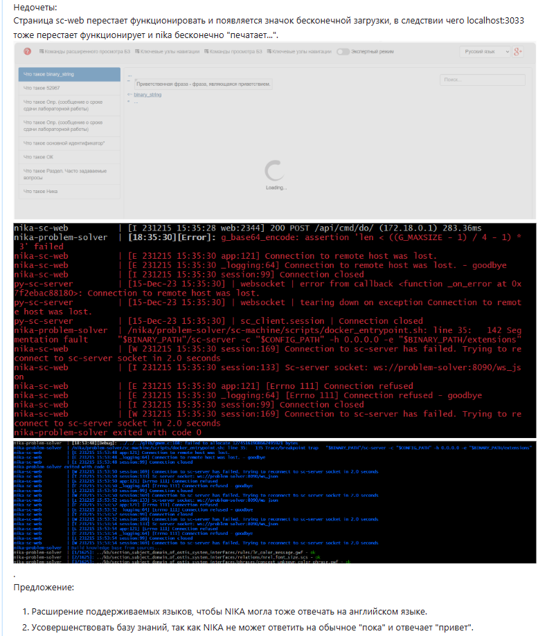
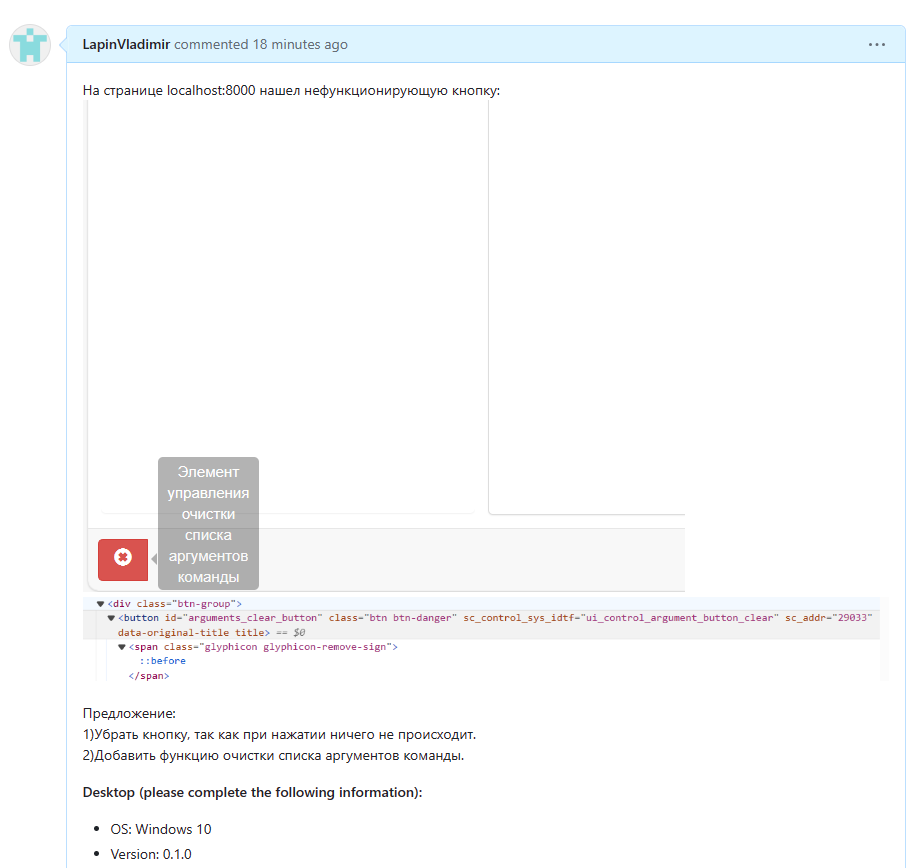

 Министерство образования Республики Беларусь

Учреждение образования

“Брестский Государственный технический университет”

Кафедра ИИТ

       

Лабораторная работа №5

По дисциплине “Общая теория интеллектуальных систем”

Тема: “Работа с проектами”

     

Выполнил:

Студент 2 курса

Группы ИИ-23

Лапин В. А.

Проверил:

Иванюк Д. С.

     

Брест 2023

---
 
---

# Ход работы #
- нашел недочет в работе программы, указав её [тут](https://github.com/ostis-apps/nika/issues/326).
  
Также предложил новую функциональность для программы.

- также нашел нефункционирующую кнопку, указав её [тут](https://github.com/ostis-apps/nika/issues/327)

И также предложил для неё новую функциональность.

