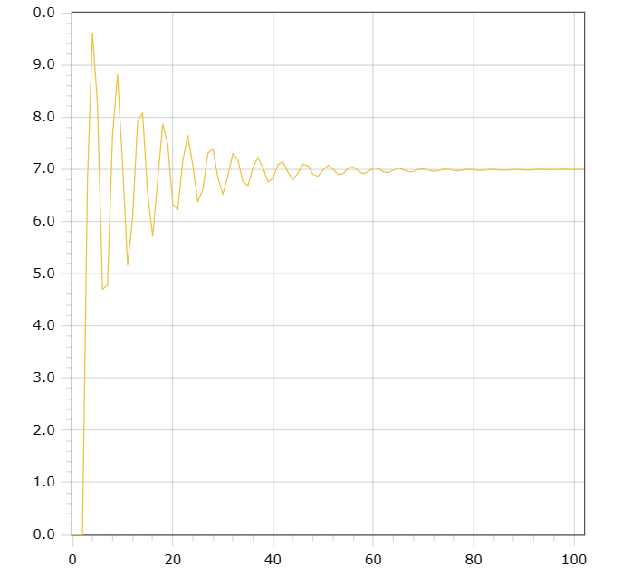

<p align="center"> Министерство образования Республики Беларусь</p>
<p align="center">Учреждение образования</p>
<p align="center">“Брестский Государственный технический университет”</p>
<p align="center">Кафедра ИИТ</p>
<br><br><br><br><br><br><br>
<p align="center">Лабораторная работа №2</p>
<p align="center">По дисциплине “Общая теория интеллектуальных систем”</p>
<p align="center">Тема: “Моделирования температуры объекта”</p>
<br><br><br><br><br>
<p align="right">Выполнил:</p>
<p align="right">Студент 2 курса</p>
<p align="right">Группы ИИ-23</p>
<p align="right">Привезеенцев М.А.</p>
<p align="right">Проверил:</p>
<p align="right">Иванюк Д. С.</p>
<br><br><br><br><br>
<p align="center">Брест 2023</p>

---

# Общее задание #
1. Написать отчет по выполненной лабораторной работе №2 в .md формате (readme.md) и с помощью запроса на внесение изменений (**pull request**) разместить его в следующем каталоге: **trunk\ii0xxyy\task_02\doc** (где **xx** - номер группы, **yy** - номер студента, например **ii02102**).
2. Исходный код написанной программы разместить в каталоге: **trunk\ii0xxyy\task_02\src**.

# Задание #
На C++ реализовать программу, моделирующую рассмотренный выше ПИД-регулятор.  В качестве объекта управления использовать математическую модель, полученную в предыдущей работе.
В отчете также привести графики для разных заданий температуры объекта, пояснить полученные результаты.

---

# Выполнение задания #

Код программы:
```C++
#include <iostream>
#include <cmath>

const double a = 0.5;
const double b = 1;
const double c = 0.15;
const double d = 0.3;
const double u = 1.2;

void linearModel(double& y) {
    y = a * y + b * u;
    std::cout << y << std::endl;
}

void nonLinearModel(double& y, double& prevY, bool& secondIteration) {
    if (secondIteration) {
        prevY = y;
        y = a * y + c * u + d * std::sin(u); 
        std::cout << y << std::endl;
        secondIteration = false;
    } else {
        double temp;
        temp = a * y - b * std::pow(prevY, 2) + c * u + d * std::sin(u);
        prevY = y;
        y = temp;
        std::cout << y << std::endl;
    }
}

int main() {
    double linearY, nonLinearY, prevY;
    bool secondIteration = true;
    
    std::cout << "Введите температуру: ";
    std::cin >> linearY;
    
    nonLinearY = linearY;
    int numSteps = 10;
    
    std::cout << "Линейная модель" << std::endl;
    std::cout << linearY << std::endl;
    for (int i = 0; i < numSteps; i++) {
        linearModel(linearY);
    }
    
    std::cout << std::endl << "Нелинейная модель" << std::endl;
    std::cout << nonLinearY << std::endl;
    for (int i = 0; i < numSteps; i++) {
        nonLinearModel(nonLinearY, prevY, secondIteration);
    }
    
    return 0;
}
```     

Результат программы:

    0
    0
    0
    6.7672
    9.61219
    8.23009
    4.69772
    4.77521
    7.64718
    8.81416
    7.10335
    5.1641
    6.06675
    7.91872
    8.0804
    6.5307
    5.71277
    6.78984
    7.8636
    7.48439
    6.33736
    6.22013
    7.16209
    7.65145
    7.0738
    6.37495
    6.61475
    7.30253
    7.40007
    6.84373
    6.51929
    6.87939
    7.30217
    7.18083
    6.75488
    6.68586
    7.02856
    7.23176
    7.02487
    6.75663
    6.82878
    7.09087
    7.14109
    6.93493
    6.80376
    6.93063
    7.09745
    7.05978
    6.89816
    6.86395
    6.99126
    7.07513
    7.001
    6.89655
    6.9184
    7.01906
    7.04341
    6.96666
    6.91348
    6.95898
    7.02501
    7.01415
    6.95248
    6.93665
    6.98451
    7.01916
    6.99282
    6.95202
    6.95856
    6.99758
    7.00907
    6.98054
    6.9591
    6.97569
    7.00207
    6.99944
    6.97595
    6.96901
    6.98729
    7.00175
    6.99259
    6.97674
    6.97875
    6.99412
    6.99955
    6.98909
    6.98059
    6.98684
    6.99759
    6.99735
    6.98853
    6.98569
    6.99289
    6.9991
    6.9961
    6.99009
    6.99085
    6.99711
    6.99978
    6.9961
    6.99289
    6.99544
    7
 
