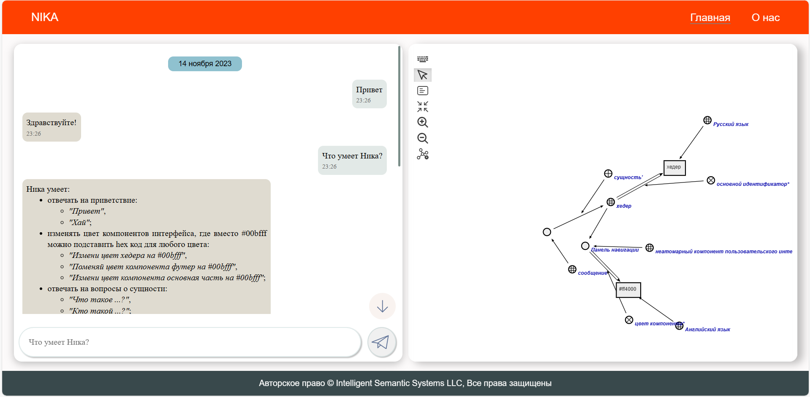
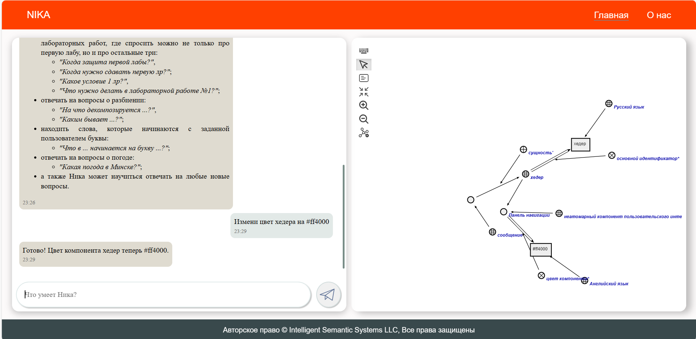

<p align="center"> Министерство образования Республики Беларусь</p>
<p align="center">Учреждение образования</p>
<p align="center">“Брестский Государственный технический университет”</p>
<p align="center">Кафедра ИИТ</p>
<br><br><br><br><br><br><br>
<p align="center">Лабораторная работа №4</p>
<p align="center">По дисциплине “Общая теория интеллектуальных систем”</p>
<p align="center">Тема: “Работа с проектом "NIKA" (Intelligent Knowledge-driven Assistant)”</p>
<br><br><br><br><br>
<p align="right">Выполнил:</p>
<p align="right">Студент 2 курса</p>
<p align="right">Группы ИИ-23</p>
<p align="right">Привезенцев М. А.</p>
<p align="right">Проверил:</p>
<p align="right">Иванюк Д. С.</p>
<br><br><br><br><br>
<p align="center">Брест 2023</p>

---

# Общее задание #
1. Изучить [руководство](https://github.com/ostis-apps/nika) по использованию NIKA.

2. Запустить проект на локальной машине (домашнем ПК, ноутбуке, рабочей машине в аудитории и т.д.). Продемонстрировать возможности проекта преподавателю.

3. Написать отчет по выполненной работе в readme.md формате и с помощью pull request разместить его в следующем каталоге: trunk\ii0xxyy\task_04\doc.

# Результат #

sc-web - ```localhost:8000```:


dialogue web UI - ```localhost:3033```:




Docker Desktop:

Вывод: изучил руководство по использованию "Nika" запустив данный проект на ноутбуке и составил отчёт по общему заданию предоставив все необходимые результаты.
