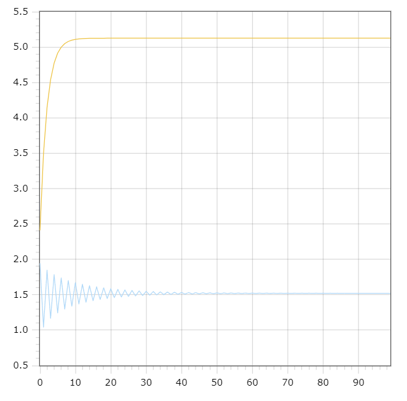

<p style="text-align: center;">Министерство образования Республики Беларусь</p>
<p style="text-align: center;">Учреждение образования</p>
<p style="text-align: center;">“Брестский Государственный технический университет”</p>
<p style="text-align: center;">Кафедра ИИТ</p>
<div style="margin-bottom: 10em;"></div>
<p style="text-align: center;">Лабораторная работа №1</p>
<p style="text-align: center;">По дисциплине “Общая теория интеллектуальных систем”</p>
<p style="text-align: center;">Тема: “Моделирования температуры объекта”</p>
<div style="margin-bottom: 10em;"></div>
<p style="text-align: right;">Выполнил:</p>
<p style="text-align: right;">Студент 2 курса</p>
<p style="text-align: right;">Группы ИИ-23</p>
<p style="text-align: right;">Макаревич Н. Р.</p>
<p style="text-align: right;">Проверил:</p>
<p style="text-align: right;">Иванюк Д. С.</p>
<div style="margin-bottom: 10em;"></div>
<p style="text-align: center;">Брест 2023</p>

---

# Общее задание #
1. Написать отчет по выполненной лабораторной работе №1 в .md формате (readme.md) и с помощью запроса на внесение изменений (**pull request**) разместить его в следующем каталоге: trunk\ii0xxyy\task_01\doc (где xx - номер группы, yy - номер студента, например **ii02102**).
2. Исходный код написанной программы разместить в каталоге: **trunk\ii0xxyy\task_01\src**.

## Task 1. Modeling controlled object ##
Let's get some object to be controlled. We want to control its temperature, which can be described by this differential equation:

$$\Large\frac{dy(\tau)}{d\tau}=\frac{u(\tau)}{C}+\frac{Y_0-y(\tau)}{RC} $$ (1)

where $\tau$ – time; $y(\tau)$ – input temperature; $u(\tau)$ – input warm; $Y_0$ – room temperature; $C,RC$ – some constants.

After transformation we get these linear (2) and nonlinear (3) models:

$$\Large y_{\tau+1}=ay_{\tau}+bu_{\tau}$$ (2)
$$\Large y_{\tau+1}=ay_{\tau}-by_{\tau-1}^2+cu_{\tau}+d\sin(u_{\tau-1})$$ (3)

where $\tau$ – time discrete moments ($1,2,3{\dots}n$); $a,b,c,d$ – some constants.
---

# Выполнение задания #

Код программы:
```cpp#include <iostream>
#include <cmath>

using namespace std;

class Function {
private:
	double a = 0.6, b = 0.5, c = 0.65, d = 1.1, u = 4.1;
public:
	double func2(double prev) {
		double next = a * prev + b * u;
		return next;
	}

	double func3(double prev) {
		double next = a * prev - prev * prev * b + u * c + d * sin(u);
		return next;
	}
};


int main()
{
	double y1 = 0.6, prev1 = y1, prev2 = y1;
	int t;
	cout << "Enter t: ";
	cin >> t;
	Function f;
	for (int i = 0; i < t; i++) {
		cout << i << ";" << f.func2(prev1) << ";" << f.func3(prev2)<< endl;
		prev1 = f.func2(prev1);
		prev2 = f.func3(prev2);
	}
	return 0;
}
    Вывод:
    Enter t: 100
0;2.41;1.9449
1;3.496;1.04052
2;4.1476;1.84786
3;4.53856;1.16631
4;4.77314;1.78454
5;4.91388;1.24333
6;4.99833;1.73796
7;5.049;1.29742
8;5.0794;1.7017
9;5.09764;1.33802
10;5.10858;1.67255
11;5.11515;1.36971
12;5.11909;1.64867
13;5.12145;1.39504
14;5.12287;1.62885
15;5.12372;1.41563
16;5.12423;1.61227
17;5.12454;1.43255
18;5.12472;1.59833
19;5.12483;1.44657
20;5.1249;1.58656
21;5.12494;1.45825
22;5.12496;1.5766
23;5.12498;1.46802
24;5.12499;1.56816
25;5.12499;1.47622
26;5.125;1.56101
27;5.125;1.48312
28;5.125;1.55494
29;5.125;1.48894
30;5.125;1.54979
31;5.125;1.49385
32;5.125;1.54542
33;5.125;1.49799
34;5.125;1.5417
35;5.125;1.50149
36;5.125;1.53855
37;5.125;1.50446
38;5.125;1.53587
39;5.125;1.50697
40;5.125;1.5336
41;5.125;1.50909
42;5.125;1.53167
43;5.125;1.51089
44;5.125;1.53004
45;5.125;1.51241
46;5.125;1.52865
47;5.125;1.5137
48;5.125;1.52747
49;5.125;1.51479
50;5.125;1.52647
51;5.125;1.51572
52;5.125;1.52562
53;5.125;1.51651
54;5.125;1.5249
55;5.125;1.51717
56;5.125;1.52429
57;5.125;1.51774
58;5.125;1.52377
59;5.125;1.51822
60;5.125;1.52334
61;5.125;1.51862
62;5.125;1.52296
63;5.125;1.51896
64;5.125;1.52265
65;5.125;1.51926
66;5.125;1.52238
67;5.125;1.5195
68;5.125;1.52215
69;5.125;1.51971
70;5.125;1.52196
71;5.125;1.51989
72;5.125;1.5218
73;5.125;1.52004
74;5.125;1.52166
75;5.125;1.52017
76;5.125;1.52154
77;5.125;1.52028
78;5.125;1.52144
79;5.125;1.52037
80;5.125;1.52135
81;5.125;1.52045
82;5.125;1.52128
83;5.125;1.52051
84;5.125;1.52122
85;5.125;1.52057
86;5.125;1.52117
87;5.125;1.52062
88;5.125;1.52113
89;5.125;1.52066
90;5.125;1.52109
91;5.125;1.52069
92;5.125;1.52106
93;5.125;1.52072
94;5.125;1.52103
95;5.125;1.52075
96;5.125;1.52101
97;5.125;1.52077
98;5.125;1.52099
99;5.125;1.52078
```
 Линейный график и нелинейный графики:
 
 
