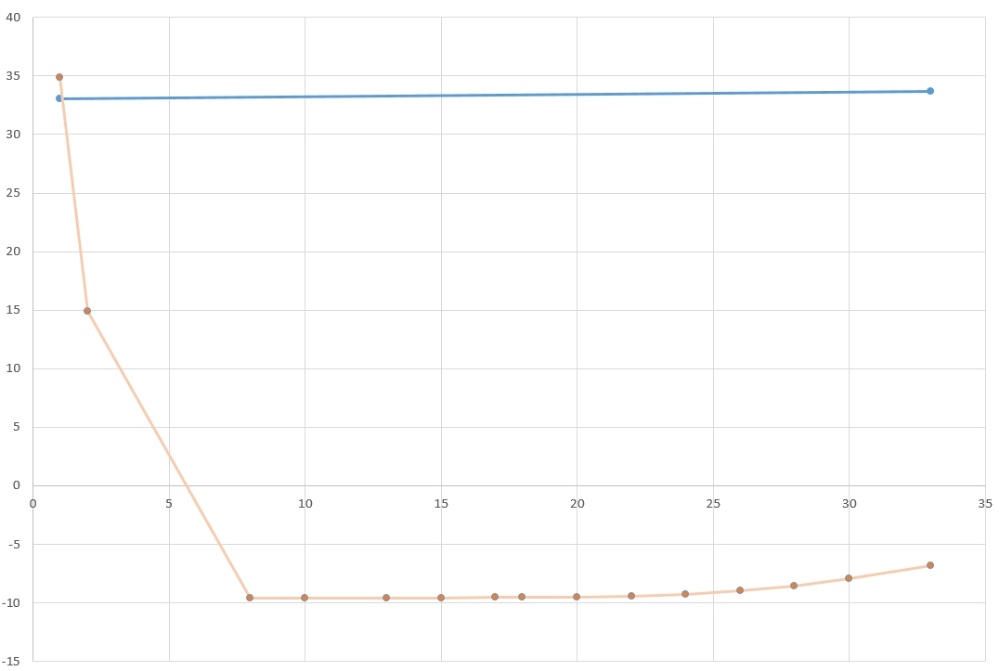

<p align="right"> Министерство образования Республики Беларусь</p>
<p align="right">Учреждение образования</p>
<p align="right">“Брестский Государственный технический университет”</p>
<p align="right">Кафедра ИИТ</p>
<br><br><br><br><br><br><br>
<p align="right">Лабораторная работа №1</p>
<p align="right">По дисциплине “Общая теория интеллектуальных систем”</p>
<p align="right">Тема: “Моделирования температуры объекта”</p>
<br><br><br><br><br>
<p align="right">Выполнил:</p>
<p align="right">Студент 2 курса</p>
<p align="right">Группы ИИ-23</p>
<p align="right">Макаревич К.А.</p>
<p align="right">Проверил:</p>
<p align="right">Иванюк Д. С.</p>
<br><br><br><br><br>
<p align="right">Брест 2023</p>

---

# Общее задание #
1. Написать отчет по выполненной лабораторной работе №1 в .md формате (readme.md) и с помощью запроса на внесение изменений (**pull request**) разместить его в следующем каталоге: **trunk\ii0xxyy\task_01\doc** (где **xx** - номер группы, **yy** - номер студента, например **ii02102**).
2. Исходный код написанной программы разместить в каталоге: **trunk\ii0xxyy\task_01\src**.

## Task 1. Modeling controlled object ##
Let's get some object to be controlled. We want to control its temperature, which can be described by this differential equation:

$$\Large\frac{dy(\tau)}{d\tau}=\frac{u(\tau)}{C}+\frac{Y_0-y(\tau)}{RC} $$ (1)

where $\tau$ – time; $y(\tau)$ – input temperature; $u(\tau)$ – input warm; $Y_0$ – room temperature; $C,RC$ – some constants.

After transformation we get these linear (2) and nonlinear (3) models:

$$\Large y_{\tau+1}=ay_{\tau}+bu_{\tau}$$ (2)
$$\Large y_{\tau+1}=ay_{\tau}-by_{\tau-1}^2+cu_{\tau}+d\sin(u_{\tau-1})$$ (3)

where $\tau$ – time discrete moments ($1,2,3{\dots}n$); $a,b,c,d$ – some constants.

Task is to write program (**C++**), which simulates this object temperature.

---

# Выполнение задания #

Код программы:
```C++
 #include <iostream>
#include <cmath>

const float COEFFICIENT_A = 1;
const float COEFFICIENT_B = 0.02;
const float COEFFICIENT_C = 1;
const float COEFFICIENT_D = 1;

// Calculate the temperature using a linear model
void linearmod(float y, float j, int tend) {
    for (int t = 1; t <= tend; ++t) {
        float y_sld = COEFFICIENT_A * y + COEFFICIENT_B * j;
        y = y_sld;
        std::cout << y_sld << "\n";
    }
}

// Calculate the temperature using a nonlinear model
void nonlinearmod(float y_pred, float y, float j, int tend) {
    for (int t = 1; t <= tend; ++t) {
        float y_sld = COEFFICIENT_A * y - COEFFICIENT_B * pow(y_pred, 2) + COEFFICIENT_C * j + COEFFICIENT_D * sin(j);
        y_pred = y;
        y = y_sld;
        std::cout << y_sld << "\n";
    }
}

// Ending alert output
void ans() {
    std::cout << "\nModeling ended.\n";
}

int main() {
    float initialTemperature;
    float warm;
    int Tend;

    //Setting starting temp
    std::cout << "Enter starting temperature: ";
    std::cin >> initialTemperature;

    //Checking if it's acceptable
    while (initialTemperature < 0 || initialTemperature > 100) {
    std::cout << "Starting temperature must be from 0 to 100. Please try again: ";
    std::cin >> initialTemperature;
    }

    //Setting warming
    std::cout << "Enter warming: ";
    std::cin >> warm;

    //Setting end time
    std::cout << "Enter end time: ";
    std::cin >> Tend;
    
    //Output of linear modeling
    std::cout << "\nResults of linear modeling:\n";
    linearmod(initialTemperature, warm, Tend);

    //Output of linear modeling
    std::cout << "\nResult of nonlinear modeling:\n";
    nonlinearmod(0, initialTemperature, warm, Tend);

    // Finishing task
    ans();
    
    return 0;
}
```вывод
Enter starting temperature: 33
Enter warming: 1
Enter end time: 33

Results of linear modeling:
33.02
33.04
33.06
33.08
33.1
33.12
33.14
33.16
33.18
33.2
33.22
33.24
33.26
33.28
33.3
33.32
33.34
33.36
33.38
33.4
33.42
33.44
33.46
33.48
33.5
33.52
33.54
33.56
33.58
33.6
33.62
33.64
33.66

Result of nonlinear modeling:
34.8415
14.9029
-7.53415
-10.1346
-9.42843
-9.64117
-9.57761
-9.59518
-9.58832
-9.5882
-9.58545
-9.58265
-9.57879
-9.57387
-9.56746
-9.55917
-9.54843
-9.53451
-9.51649
-9.49315
-9.46295
-9.42388
-9.37336
-9.30808
-9.11514
-8.97524
-8.79548
-8.56511
-8.27085
-7.8966
-7.42327
-6.82892

Modeling ended.
```

