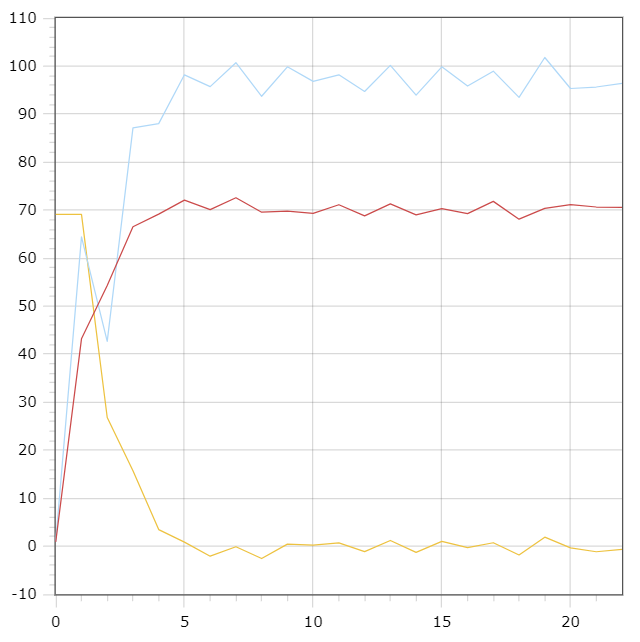

<p align="center"> Министерство образования Республики Беларусь</p>
<p align="center">Учреждение образования</p>
<p align="center">“Брестский Государственный технический университет”</p>
<p align="center">Кафедра ИИТ</p>
<br><br><br><br><br><br><br>
<p align="center">Лабораторная работа №2</p>
<p align="center">По дисциплине “Общая теория интеллектуальных систем”</p>
<p align="center">Тема: “ПИД-регуляторы”</p>
<br><br><br><br><br>
<p align="right">Выполнил:</p>
<p align="right">Студент 2 курса</p>
<p align="right">Группы ИИ-23</p>
<p align="right">Макаревич Н. Р.</p>
<p align="right">Проверил:</p>
<p align="right">Иванюк Д. С.</p>
<br><br><br><br><br>
<p align="center">Брест 2023</p>

---

# Общее задание #
1. Написать отчет по выполненной лабораторной работе №1 в .md формате (readme.md) и с помощью запроса на внесение изменений (**pull request**) разместить его в следующем каталоге: **trunk\ii0xxyy\task_02\doc** (где **xx** - номер группы, **yy** - номер студента, например **ii02102**).
2. Исходный код написанной программы разместить в каталоге: **trunk\ii0xxyy\task_02\src**.

# Задание #
На С++ реализовать программу, моделирующую рассмотренный выше ПИД-регулятор.  В качестве объекта управления использовать математическую модель, полученную в предыдущей работе.
В отчете также привести графики для разных заданий температуры объекта, пояснить полученные результаты.

---
# Код программы: #
```cpp
#include <iostream>
#include <cmath>
#include <fstream>

using namespace std;

class Function {
private:
	double a = 0.6;
	double b = 0.5;
	double c = 0.65;
	double d = 1.1;
	double u = 4.1;

	double k = 1;
	double t = 1.1;
	double td = 1;
	double t0 = 1;
	double w = 70;

	double y0;
	double y1;

	double e0;
	double e1;
	double e2;

	double u0;
	double u1;

	double q0 = k * (1 + td / t0);
	double q1 = -k * (1 + 2 * td / t0 - t0 / t);
	double q2 = k * td / t0;

	void shift(double& a, double& b, double& c, double next) {
		a = b;
		b = c;
		c = next;
	}

	void shift(double& a, double& b, double next) {
		a = b;
		b = next;
	}

public:
	void func(double cur, double prev) {
		ofstream yfout;
		yfout.open("y.txt");
		ofstream ufout;
		ufout.open("u.txt");
		ofstream efout;
		efout.open("e.txt");
		int i = 0;
		y0 = prev;
		y1 = cur;
		e0 = 0;
		e1 = w - prev;
		e2 = w - cur;
		u0 = 1;
		u1 = 1;
		while (abs(w - y1) > 0.01) {
			efout << i << " " << e2 << endl;
			shift(e0, e1, e2, w - y1);
			u = u1 + q0 * e2 + q1 * e1 + q2 * e0;
			double next = a * y1 - b * y0 + c * u + d * sin(u1);
			yfout << i << " " << y1 << endl;
			shift(y0, y1, next);
			ufout << i << " " << u1 << endl;;
			shift(u0, u1, u);
			i++;
		}
		yfout.close();
		ufout.close();
		efout.close();
	}
};

int main()
{
	double cur = 0.9;
	double prev = 0.3;
	Function func;
	func.func(cur, prev);
	return 0;
}
    
```

Вывод:
```
0 0.9
1 43.1874
2 54.2923
3 66.5401
4 69.1534
5 72.0748
6 70.1056
7 72.5638
8 69.559
9 69.7779
10 69.3037
11 71.1153
12 68.8023
13 71.2883
14 68.9926
15 70.3007
16 69.2754
17 71.8159
18 68.1129
19 70.3463
20 71.1498
21 70.642
22 70.5537
```


