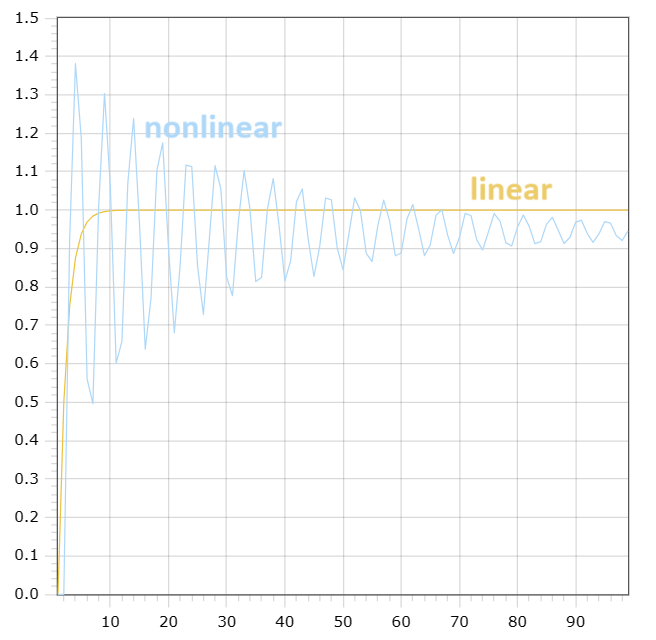

<p style="text-align: center;">Министерство образования Республики Беларусь</p>
<p style="text-align: center;">Учреждение образования</p>
<p style="text-align: center;">“Брестский Государственный технический университет”</p>
<p style="text-align: center;">Кафедра ИИТ</p>
<div style="margin-bottom: 10em;"></div>
<p style="text-align: center;">Лабораторная работа №1</p>
<p style="text-align: center;">По дисциплине “Общая теория интеллектуальных систем”</p>
<p style="text-align: center;">Тема: “Моделирования температуры объекта”</p>
<div style="margin-bottom: 10em;"></div>
<p style="text-align: right;">Выполнил:</p>
<p style="text-align: right;">Студент 2 курса</p>
<p style="text-align: right;">Группы ИИ-23</p>
<p style="text-align: right;">Медведь П.В.</p>
<p style="text-align: right;">Проверил:</p>
<p style="text-align: right;">Иванюк Д. С.</p>
<div style="margin-bottom: 10em;"></div>
<p style="text-align: center;">Брест 2023</p>

---

# Общее задание #
1. Написать отчет по выполненной лабораторной работе №1 в .md формате (readme.md) и с помощью запроса на внесение изменений (**pull request**) разместить его в следующем каталоге: trunk\ii0xxyy\task_01\doc (где xx - номер группы, yy - номер студента, например **ii02102**).
2. Исходный код написанной программы разместить в каталоге: **trunk\ii0xxyy\task_01\src**.

## Task 1. Modeling controlled object ##
Let's get some object to be controlled. We want to control its temperature, which can be described by this differential equation:

$$\Large\frac{dy(\tau)}{d\tau}=\frac{u(\tau)}{C}+\frac{Y_0-y(\tau)}{RC} $$ (1)

where $\tau$ – time; $y(\tau)$ – input temperature; $u(\tau)$ – input warm; $Y_0$ – room temperature; $C,RC$ – some constants.

After transformation we get these linear (2) and nonlinear (3) models:

$$\Large y_{\tau+1}=ay_{\tau}+bu_{\tau}$$ (2)
$$\Large y_{\tau+1}=ay_{\tau}-by_{\tau-1}^2+cu_{\tau}+d\sin(u_{\tau-1})$$ (3)

where $\tau$ – time discrete moments ($1,2,3{\dots}n$); $a,b,c,d$ – some constants.

---

# Выполнение задания #

Код программы:
```cpp#include <iostream>
#include <iostream>
#include <cmath>
#include <fstream>

using namespace std;

void customLinear(double alpha, double beta, double y, double u, double i, double t) {
	if (i != t) {
		ofstream outputFile("custom_lin.txt", ios::app);
		outputFile << i << " " << y << endl;
		cout << y << endl;
		customLinear(alpha, beta, alpha * y + beta * u, u, i + 1, t);
	}
	else {
		cout << "end custom linear\n";
	}
}

void customNonlinear(double alpha, double beta, double gamma, double delta, double y, double y1, double u, double i, double t) {
	if (i == 1) {
		ofstream outputFile("custom_nonlin.txt", ios::app);
		outputFile << i << " " << y << endl;
		cout << y << endl;
		customNonlinear(alpha, beta, gamma, delta, alpha * y - beta * y1 * y1 + gamma * 0 + delta * sin(0), y, u, i + 1, t);
	}
	else if (i != t) {
		ofstream outputFile("custom_nonlin.txt", ios::app);
		outputFile << i << " " << y << endl;
		cout << y << endl;
		customNonlinear(alpha, beta, gamma, delta, alpha * y - beta * y1 * y1 + gamma * u + delta * sin(u), y, u, i + 1, t);
	}
	else {
		cout << "end custom nonlinear" << endl;
	}
}

int main() {
	ofstream linearOutputFile("custom_lin.txt");
	ofstream nonlinearOutputFile("custom_nonlin.txt");
	linearOutputFile.clear();
	nonlinearOutputFile.clear();
	double i = 1; //start time
	double y = 0; //input temperature
	double u = 1; //input warm
	double t = 100; //end time
	const double alpha = 0.5;
	const double beta = 0.5;
	const double gamma = 0.5;
	const double delta = 0.5; //some constants
	cout << "custom linear model: \n";
	customLinear(alpha, beta, y, u, i, t);
	cout << "custom nonlinear model: \n";
	customNonlinear(alpha, beta, gamma, delta, y, y, u, i, t);
}
Вывод:
custom linear model:
0
0.5
0.75
0.875
0.9375
0.96875
0.984375
0.992188
0.996094
0.998047
0.999023
0.999512
0.999756
0.999878
0.999939
0.999969
0.999985
0.999992
0.999996
0.999998
0.999999
1
1
1
1
1
1
1
1
1
1
1
1
1
1
1
1
1
1
1
1
1
1
1
1
1
1
1
1
1
1
1
1
1
1
1
1
1
1
1
1
1
1
1
1
1
1
1
1
1
1
1
1
1
1
1
1
1
1
1
1
1
1
1
1
1
1
1
1
1
1
1
1
1
1
1
1
1
1
end custom linear
custom nonlinear model:
0
0
0.920735
1.3811
1.18741
0.560718
0.496123
1.01159
1.30346
1.06081
0.601629
0.658896
1.0692
1.23827
0.968269
0.638219
0.771072
1.10261
1.17476
0.900243
0.680822
0.855927
1.11694
1.1129
0.853408
0.728166
0.920666
1.11596
1.0549
0.825507
0.777082
0.968546
1.10308
1.00324
0.81396
0.824475
1.00171
1.08171
0.959881
0.815629
0.867864
1.02204
1.05516
0.926032
0.827067
0.905501
1.03147
1.0265
0.902025
0.844895
0.936358
1.03199
0.998348
0.887407
0.86609
0.960035
1.0257
0.97275
0.881083
0.888155
0.976659
1.01466
0.951131
0.881538
0.909179
0.98677
1.00082
0.934286
0.887061
0.927821
0.991207
0.985913
0.922447
0.895946
0.943255
0.991003
0.971372
0.915378
0.906642
0.955098
0.987284
0.958271
0.912506
0.917847
0.963325
0.981177
0.947326
0.913045
0.928544
0.968182
0.97373
0.938912
0.916117
0.938016
0.970109
0.965853
0.933106
0.920853
0.945818
end custom nonlinear
```
 Линейный график и нелинейный графики:
 
 
