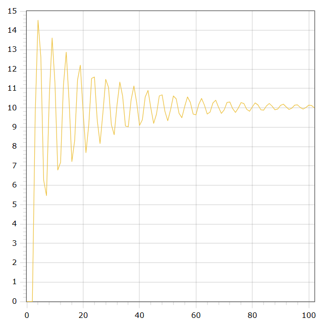

<p align="center"> Министерство образования Республики Беларусь</p>
<p align="center">Учреждение образования</p>
<p align="center">“Брестский Государственный технический университет”</p>
<p align="center">Кафедра ИИТ</p>
<br><br><br><br><br><br><br>
<p align="center">Лабораторная работа №1</p>
<p align="center">По дисциплине “Общая теория интеллектуальных систем”</p>
<p align="center">Тема: “Моделирования температуры объекта”</p>
<br><br><br><br><br>
<p align="right">Выполнил:</p>
<p align="right">Студент 2 курса</p>
<p align="right">Группы ИИ-23</p>
<p align="right">Медведь П. В. </p>
<p align="right">Проверил:</p>
<p align="right">Иванюк Д. С.</p>
<br><br><br><br><br>
<p align="center">Брест 2023</p>

---

# Общее задание #
1. Написать отчет по выполненной лабораторной работе №1 в .md формате (readme.md) и с помощью запроса на внесение изменений (**pull request**) разместить его в следующем каталоге: **trunk\ii0xxyy\task_02\doc** (где **xx** - номер группы, **yy** - номер студента, например **ii02102**).
2. Исходный код написанной программы разместить в каталоге: **trunk\ii0xxyy\task_02\src**.

# Задание #
На C++ реализовать программу, моделирующую рассмотренный выше ПИД-регулятор.  В качестве объекта управления использовать математическую модель, полученную в предыдущей работе.
В отчете также привести графики для разных заданий температуры объекта, пояснить полученные результаты.

---

# Выполнение задания #

Код программы:
```C++

#include <iostream>
#include <cmath>
#include <vector>

using namespace std;

const double A = 0.5;
const double B = 0.5;
const double C = 0.5;
const double D = 0.5;
const double K = 0.001;
const double T = 50;
const double TD = 100;
const double To = 1;

void simulateSystem(double desiredValue) {
    int timeSteps = 100;

    double q0 = K * (1 + TD / To);
    double q1 = -K * (1 + 2 * TD / To - To / T);
    double q2 = K * TD / To;

    vector<double> outputValues = { 0, 0, 0 };
    vector<double> controlInputs = { 1, 1 };

    for (int i = 0; i < timeSteps; i++) {
        double error0 = desiredValue - outputValues[outputValues.size() - 1];
        double error1 = desiredValue - outputValues[outputValues.size() - 2];
        double error2 = desiredValue - outputValues[outputValues.size() - 3];

        double controlSignal = q0 * error0 + q1 * error1 + q2 * error2;
        controlInputs[0] = controlInputs[1] + controlSignal;
        controlInputs[1] = controlInputs[0];

        double systemOutput = A * outputValues[outputValues.size() - 1] -
            B * outputValues[outputValues.size() - 2] * outputValues[outputValues.size() - 2] +
            C * controlInputs[0] + D * sin(controlInputs[1]);

        outputValues.push_back(systemOutput);
    }

    // Output the scaled results
    for (double output : outputValues) {
        double scaledOutput = output * desiredValue / outputValues[outputValues.size() - 1];
        cout << scaledOutput << endl;
    }
}

int main() {
    setlocale(LC_ALL, "EN");
    double desiredValue;
    cout << "Desired value: ";
    cin >> desiredValue;

    simulateSystem(desiredValue);

    return 0;
}

```     

Вывод программы:

    0.0
    0.0
    0.0
    9.69140581303558
    14.449097032902666
    12.505277323667597
    6.318736882385786
    5.704833796489725
    10.73183301628717
    13.513535520540419
    11.094195656604356
    6.831378548074819
    7.480944261478211
    11.290776203159307
    12.71993436830598
    10.147240033233507
    7.324509676566069
    8.642628326039585
    11.538664676655939
    11.986498761095012
    ...
    10.14942655058238
    10.099062772982727
    9.998275633418178
    9.995925139904656
    10.08749381353281
    10.13428947400506
    10.073031372947419
    10.0

