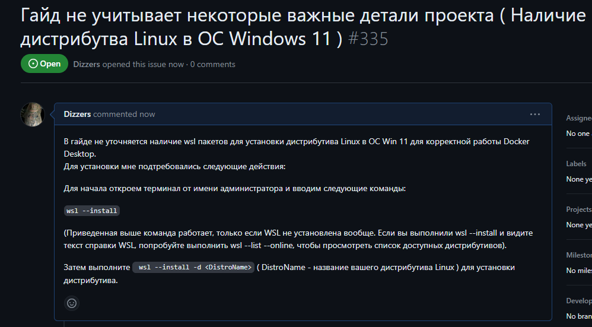
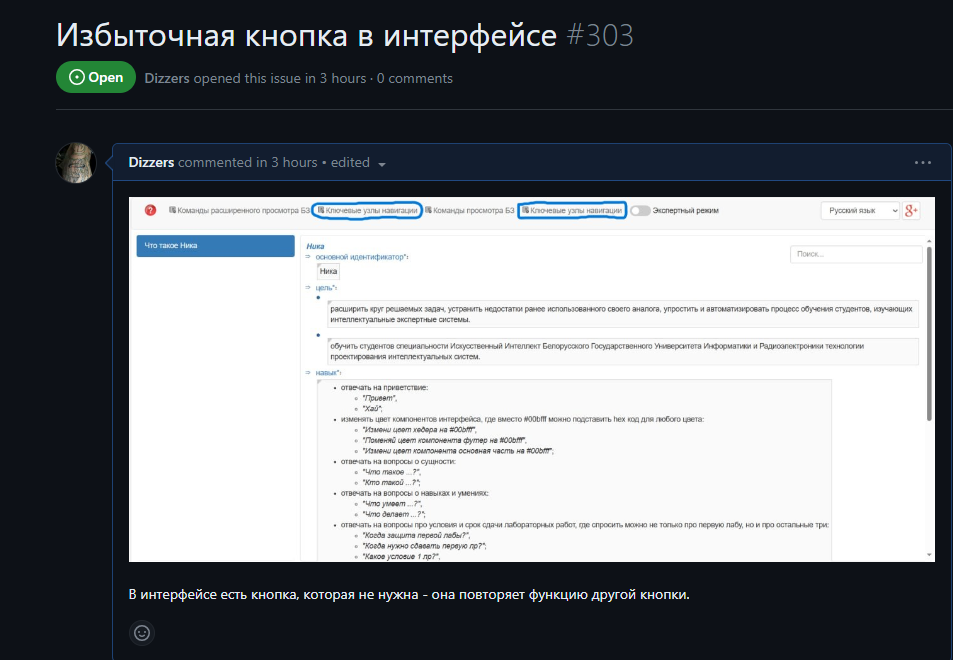
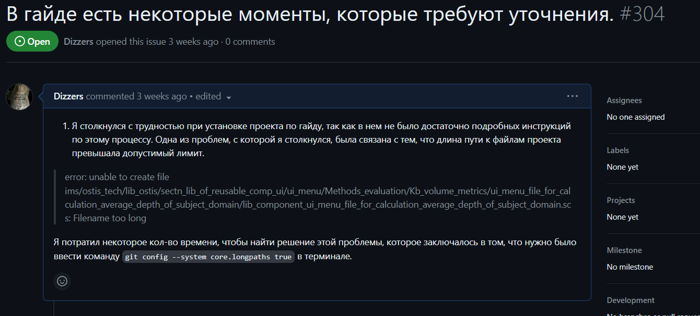

 Министерство образования Республики Беларусь

Учреждение образования

“Брестский Государственный технический университет”

Кафедра ИИТ

       

Лабораторная работа №5

По дисциплине “Общая теория интеллектуальных систем”

Тема: “Работа с проектами”

     

Выполнил:

Студент 2 курса

Группы ИИ-23

Медведь П. В.

Проверил:

Иванюк Д. С.

     

Брест 2023

---
# Общее задание #
1. Изучить следующие открытые проекты:
   1. 1. The OSTIS Technology project;
   2. 2. The OSTIS Applications;

2. Внести свой вклад в проект (в виде оформления вопросов (issues)):
    - предложить исправления в ошибках в документации (синтаксические, орфографические и т.п.);
    - предложить исправления в исходном коде;
    - предложить новую функциональность.
3. Написать отчет по выполненной работе в .md формате (readme.md) и с помощью pull request разместить его в следующем каталоге: trunk\ii0xxyy\task_05\doc.

---

# Completing the task #

В процессе выполнения лабораторной работы №4 по проекту NIKA я столкнулся с трудностью на веб-странице sc-web (localhost:8000). Я обратился к гайду за помощью, но обнаружил, что он неполный и имеет ряд недочетов. Я зарегистрировал эту трудность в репозитории проекта, чтобы дать обратную связь и помочь другим студентам, которые могут столкнуться с такой же ситуацией.

1) Гайд не учитывает некоторые важные детали проекта ( Наличие дистрибутва Linux в ОС Windows 11 ):

https://github.com/ostis-apps/nika/issues/335

2) Избыточная кнопка в интерфейсе:

https://github.com/ostis-apps/nika/issues/303

3) Гайд не полностью отражает все аспекты работы с проектом и имеет ряд недостатков:

https://github.com/ostis-apps/nika/issues/304

