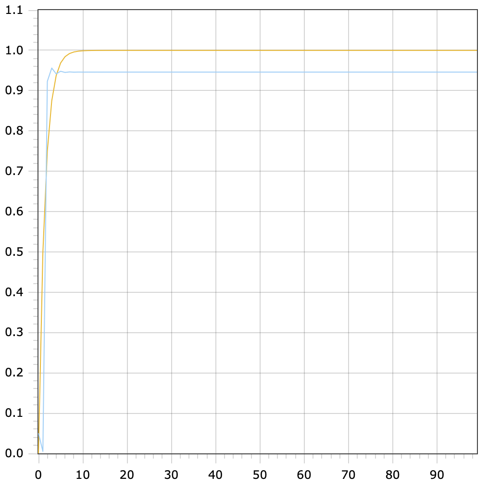

Министерство образования Республики Беларусь

Учреждение образования

“Брестский Государственный технический университет”

Кафедра ИИТ

Лабораторная работа №1

По дисциплине “Общая теория интеллектуальных систем”

Тема: “Моделирования температуры объекта”

Выполнил:

Студент 2 курса

Группы ИИ-23

Новицкая В.Д.

Проверил:

Иванюк Д. С.

Брест 2023

---

# Общее задание #
1. Написать отчет по выполненной лабораторной работе №1 в .md формате (readme.md) и с помощью запроса на внесение изменений (**pull request**) разместить его в следующем каталоге: trunk\ii0xxyy\task_01\doc (где xx - номер группы, yy - номер студента, например **ii02102**).
2. Исходный код написанной программы разместить в каталоге: **trunk\ii0xxyy\task_01\src**.

## Task 1. Modeling controlled object ##
Let's get some object to be controlled. We want to control its temperature, which can be described by this differential equation:

$$\Large\frac{dy(\tau)}{d\tau}=\frac{u(\tau)}{C}+\frac{Y_0-y(\tau)}{RC} $$ (1)

where $\tau$ – time; $y(\tau)$ – input temperature; $u(\tau)$ – input warm; $Y_0$ – room temperature; $C,RC$ – some constants.

After transformation we get these linear (2) and nonlinear (3) models:

$$\Large y_{\tau+1}=ay_{\tau}+bu_{\tau}$$ (2)
$$\Large y_{\tau+1}=ay_{\tau}-by_{\tau-1}^2+cu_{\tau}+d\sin(u_{\tau-1})$$ (3)

where $\tau$ – time discrete moments ($1,2,3{\dots}n$); $a,b,c,d$ – some constants.

---

# Выполнение задания #

Код программы:

#include <iostream>
#include <fstream>
#include <cmath>

using namespace std;

class Object {
private:
    const double a = 0.5;
    const double b = 0.5;
    const double c = 0.5;
    const double d = 0.5;
    
    int i = 1;
    int t = 100;
    int u = 1;
public:
    void line(double y) {
        ofstream file("line.txt",ios::out);
        cout << "line "<<endl ;
        for (int l = i; l <= t; l++) {
            file << l << " " << y << endl;
            cout << y << endl;
            y = a * y + b * u;
        }
    }
    void nonline (double y, double y1) {
        ofstream file1("nonline.txt", ios::out);
        cout << "nonline "<<endl ;
        for (int l = i; l <= t; l++) {
            file1 << l << " " << y << endl;
            cout << y << endl;
            if (l == 1) {
                y = a * y - b * y1 * y1 + c * 0 + d * sin(0);
            }
            else {
                y = a * y - b * y1 * y1 + c * u + d * sin(u);
            }
            y1 = y;
        }
    }
};
int main () {
double y = 0;
ofstream LineFile("line.txt");
Object LineFunctions;
LineFunctions.line(y);
LineFile.close();
        
y = 0.05;
double y1 = 0.2;
ofstream NonLineFile1("nonline.txt");
Object NonLineFunctions;
NonLineFunctions.nonline(y, y1);
NonLineFile1.close();
        
return 0;
    }

 Линейный график и нелинейный графики:
 
 
