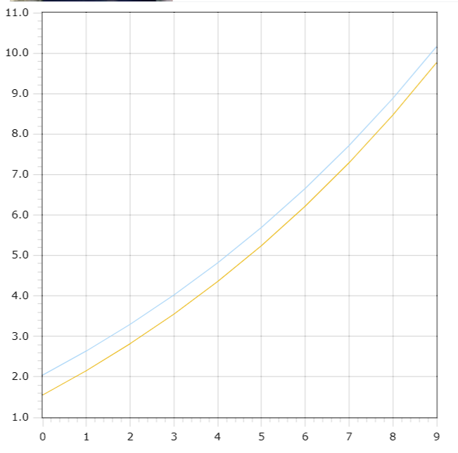

<p style="text-align: center;">Министерство образования Республики Беларусь</p>
<p style="text-align: center;">Учреждение образования</p>
<p style="text-align: center;">“Брестский Государственный технический университет”</p>
<p style="text-align: center;">Кафедра ИИТ</p>
<div style="margin-bottom: 10em;"></div>
<p style="text-align: center;">Лабораторная работа №1</p>
<p style="text-align: center;">По дисциплине “Общая теория интеллектуальных систем”</p>
<p style="text-align: center;">Тема: “Моделирования температуры объекта”</p>
<div style="margin-bottom: 10em;"></div>
<p style="text-align: right;">Выполнил:</p>
<p style="text-align: right;">Студентка 2 курса</p>
<p style="text-align: right;">Группы ИИ-23</p>
<p style="text-align: right;">Осипова А.Е.</p>
<p style="text-align: right;">Проверил:</p>
<p style="text-align: right;">Иванюк Д. С.</p>
<div style="margin-bottom: 10em;"></div>
<p style="text-align: center;">Брест 2023</p>

---

# Общее задание #
1. Написать отчет по выполненной лабораторной работе №1 в .md формате (readme.md) и с помощью запроса на внесение изменений (**pull request**) разместить его в следующем каталоге: **trunk\ii0xxyy\task_01\doc** (где **xx** - номер группы, **yy** - номер студента, например **ii02302**).
2. Исходный код написанной программы разместить в каталоге: **trunk\ii0xxyy\task_01\src**.

## Task 1. Modeling controlled object ##
Let's get some object to be controlled. We want to control its temperature, which can be described by this differential equation:

$$\Large\frac{dy(\tau)}{d\tau}=\frac{u(\tau)}{C}+\frac{Y_0-y(\tau)}{RC} $$ (1)

where $\tau$ – time; $y(\tau)$ – input temperature; $u(\tau)$ – input warm; $Y_0$ – room temperature; $C,RC$ – some constants.

After transformation we get these linear (2) and nonlinear (3) models:

$$\Large y_{\tau+1}=ay_{\tau}+bu_{\tau}$$ (2)
$$\Large y_{\tau+1}=ay_{\tau}-by_{\tau-1}^2+cu_{\tau}+d\sin(u_{\tau-1})$$ (3)

where $\tau$ – time discrete moments ($1,2,3{\dots}n$); $a,b,c,d$ – some constants.

Task is to write program (**С++**), which simulates this object temperature.


---
# Выполнение задания #
```C++
Код программы:
#include<iostream>
#include<cmath>
using namespace std;

class Model {
private:
    double a;
    double b;
    double c;
    double d;
    double y;
    double u;
    double y0;
    double u0;
public:
    Model(double a, double b, double c, double d) {
        this->a = a;
        this->b = b;
        this->c = c;
        this->d = d;
        y = 0.02;
        u = 1;
        y0 = 0.00;
        u0 = 0.00;
    }

    double lfunc() {
        y = a * y + b * u;
        return y;
    }

    double nonlfunc() {
        double y1 = a * y - b * pow(y0, 2) + c * u + d * sin(u0);
        y0 = y;
        y = y1;
        return y;
    }

    void simulateLinear(int n) {
        cout << "Linear:" << endl;
        for (int i = 0; i < n; i++) {
            cout << i << endl;
            cout << lfunc() << endl;
        }
    }

    void simulateNonlinear(int n) {
        cout << "Nonlinear:" << endl;
        for (int i = 0; i < n; i++) {
            cout << i << endl;
            cout << nonlfunc() << endl;
        }
    }
};

int main() {
    double a = 0.23;
    double b = 0.77;
    double c = 0.45;
    double d = 0.11;
    const int n = 99;
    Model model(a, b, c, d);

    model.simulateLinear(n);
    model.simulateNonlinear(n);

    return 0;
}

```     

Вывод программы:

Linear:
0 0.7746
1 0.948158
2 0.988076
3 0.997258
4 0.999369
5 0.999855
6 0.999967
7 0.999992
8 0.999998
9 1
10 1
11 1
12 1
13 1
14 1
15 1
16 1
17 1
18 1
19 1
20 1
21 1
22 1
23 1
24 1
25 1
26 1
27 1
28 1
29 1
30 1
31 1
32 1
33 1
34 1
35 1
36 1
37 1
38 1
39 1
40 1
41 1
42 1
43 1
44 1
45 1
46 1
47 1
48 1
49 1
50 1
51 1
52 1
53 1
54 1
55 1
56 1
57 1
58 1
59 1
60 1
61 1
62 1
63 1
64 1
65 1
66 1
67 1
68 1
69 1
70 1
71 1
72 1
73 1
74 1
75 1
76 1
77 1
78 1
79 1
80 1
81 1
82 1
83 1
84 1
85 1
86 1
87 1
88 1
89 1
90 1
91 1
92 1
93 1
94 1
95 1
96 1
97 1
98 1

Nonlinear:
0 0.68
1 -0.1636
2 0.056324
3 0.442346
4 0.549297
5 0.425673
6 0.315575
7 0.38306
8 0.461421
9 0.443141
10 0.387982
11 0.388028
12 0.423338
13 0.431432
14 0.411234
15 0.401261
16 0.412073
17 0.420799
18 0.416035
19 0.409343
20 0.410874
21 0.415479
22 0.415571
23 0.412662
24 0.411934
25 0.413622
26 0.414472
27 0.413595
28 0.412851
29 0.413239
30 0.413802
31 0.413684
32 0.413299
33 0.413285
34 0.413527
35 0.413592
36 0.413452
37 0.413379
38 0.413451
39 0.413514
40 0.413483
41 0.413436
42 0.413445
43 0.413477
44 0.413479
45 0.413458
46 0.413453
47 0.413464
48 0.413471
49 0.413465
50 0.413459
51 0.413462
52 0.413466
53 0.413465
54 0.413462
55 0.413462
56 0.413464
57 0.413464
58 0.413463
59 0.413463
60 0.413463
61 0.413464
62 0.413464
63 0.413463
64 0.413463
65 0.413464
66 0.413464
67 0.413463
68 0.413463
69 0.413464
70 0.413464
71 0.413464
72 0.413463
73 0.413463
74 0.413464
75 0.413464
76 0.413464
77 0.413464
78 0.413464
79 0.413464
80 0.413464
81 0.413464
82 0.413464
83 0.413464
84 0.413464
85 0.413464
86 0.413464
87 0.413464
88 0.413464
89 0.413464
90 0.413464
91 0.413464
92 0.413464
93 0.413464
94 0.413464
95 0.413464
96 0.413464
97 0.413464
98 0.413464

