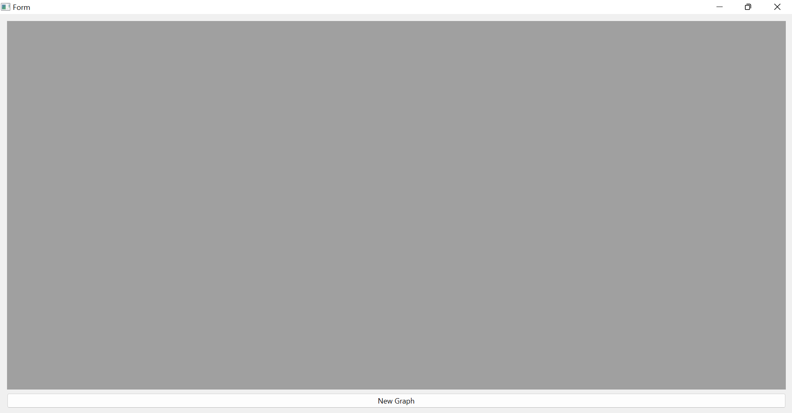
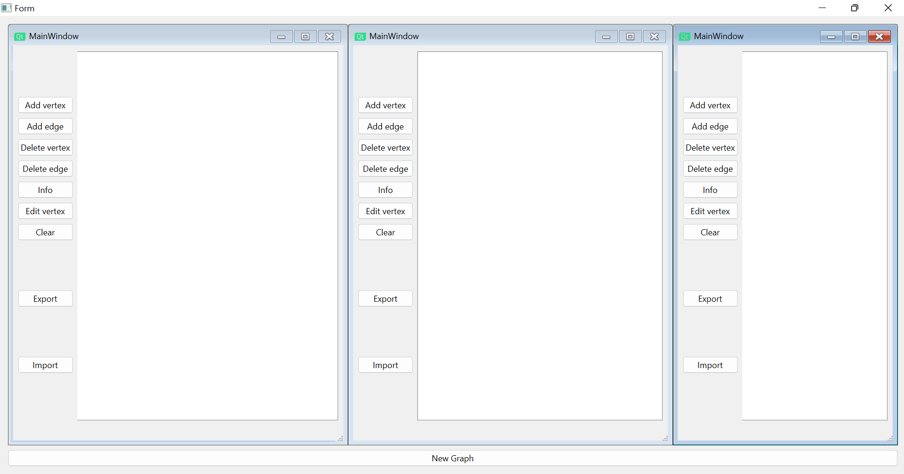
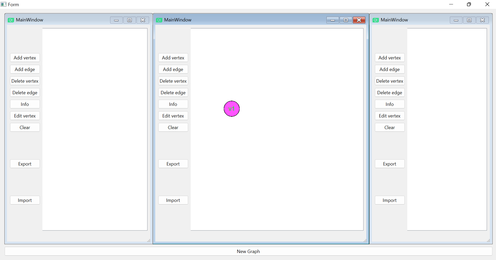
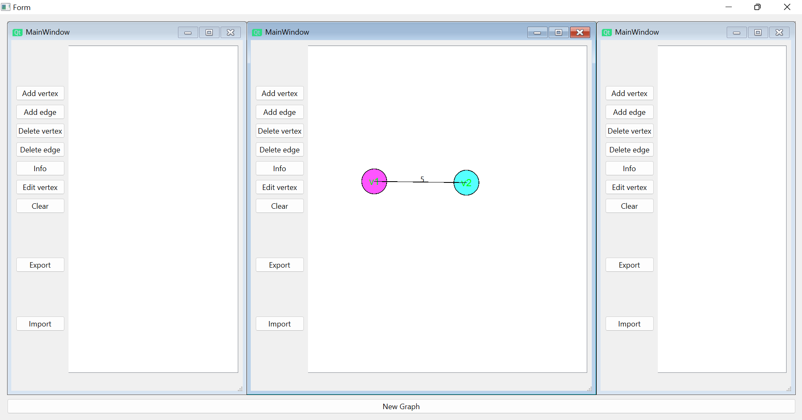
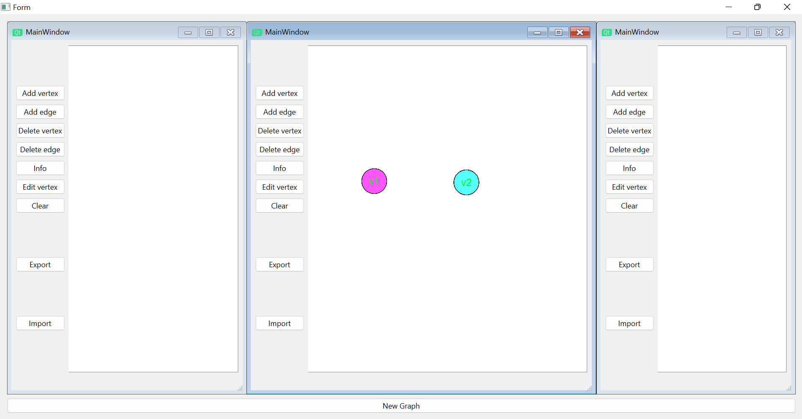
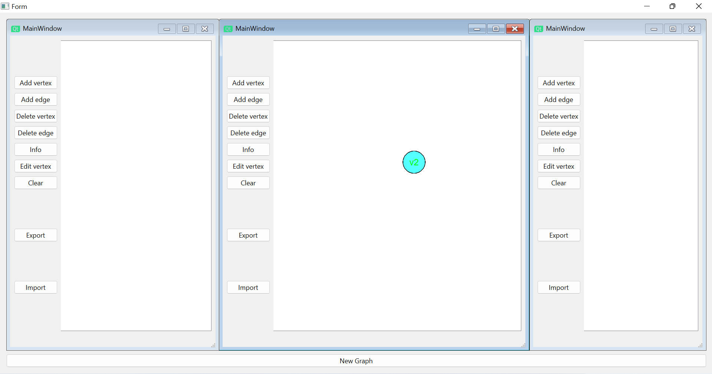
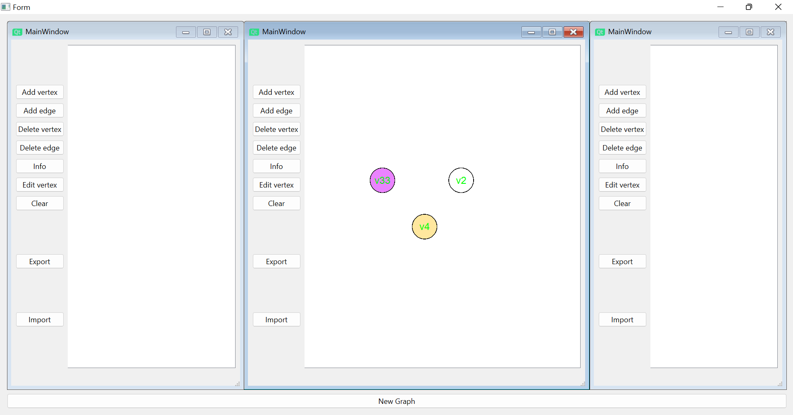
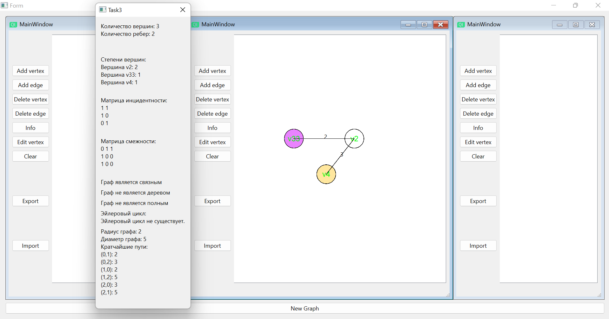
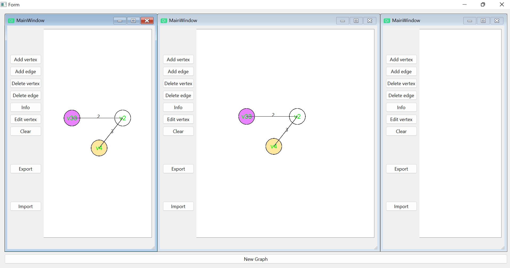
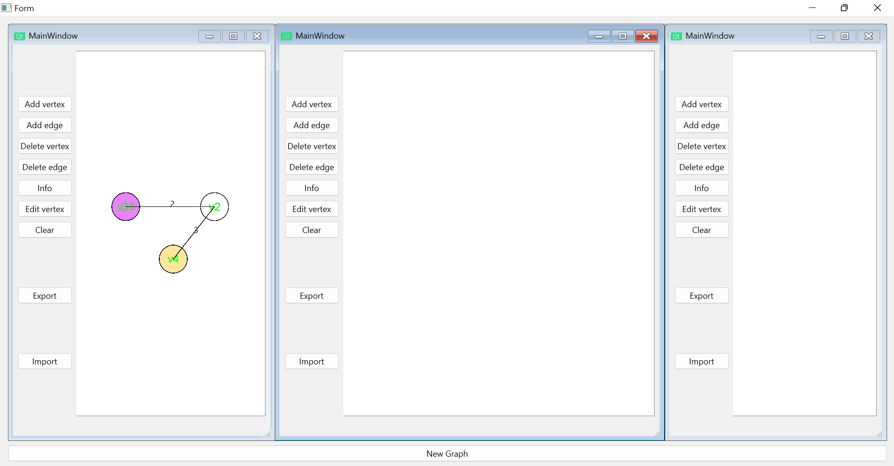

 Министерство образования Республики Беларусь

Учреждение образования

“Брестский Государственный технический университет”

Кафедра ИИТ

       

Лабораторная работа №3

По дисциплине “Общая теория интеллектуальных систем”

Тема: “Разработка редакторов графов”

     

Выполнил:

Студент 2 курса

Группы ИИ-23

Осипова А. Е.

Проверил:

Иванюк Д. С.

     

Брест 2023

---
# Реализованные функции:

# Стартовое окно:

# Рабочие окна:

# Cоздание вершины:

# Соединение ребер:

# Удаление ребер:

# Удаление вершины:

# Изменение вершины:

# Информация о графе:

# Импорт и экспорт графа через файл:

# Полная очистка:

