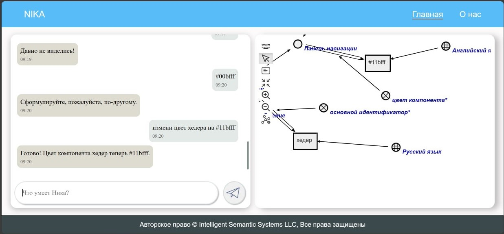
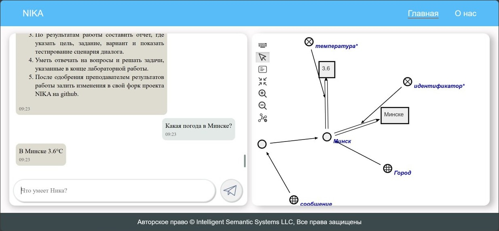
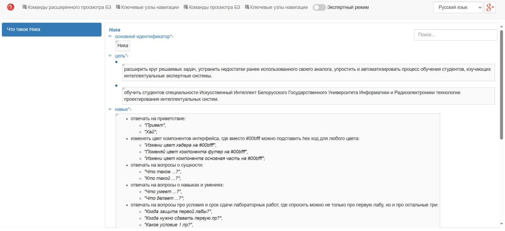

<p align="center">Министерство образования Республики Беларусь</p>
<p align="center">Учреждение образования</p>
<p align="center">“Брестский Государственный технический университет”</p>
<p align="center">Кафедра ИИТ</p>
<br><br><br><br><br><br><br>
<p align="center">Лабораторная работа №4</p>
<p align="center">По дисциплине “Общая теория интеллектуальных систем”</p>
<p align="center">Тема: “Работа с проектом "NIKA" (Intelligent Knowledge-driven Assistant)”</p>
<br><br><br><br><br>
<p align="right">Выполнила:</p>
<p align="right">Студентка 2 курса</p>
<p align="right">Группы ИИ-23</p>
<p align="right">Осипова А.Е.</p>
<p align="right">Проверил:</p>
<p align="right">Иванюк Д. С.</p>
<br><br><br><br><br>
<p align="center">Брест 2023</p>

---

# Запуск проекта

Было изучено руководство по работе с проектом "NIKA", проект был запущен на локальной машине(ноутбуке).
После команды ```docker compose up --no-build``` происходит запуск веб-интерфейсов: 
sc-web - ```localhost:8000```,
dialogue web UI - ```localhost:3033```.
  
# Результаты работы



