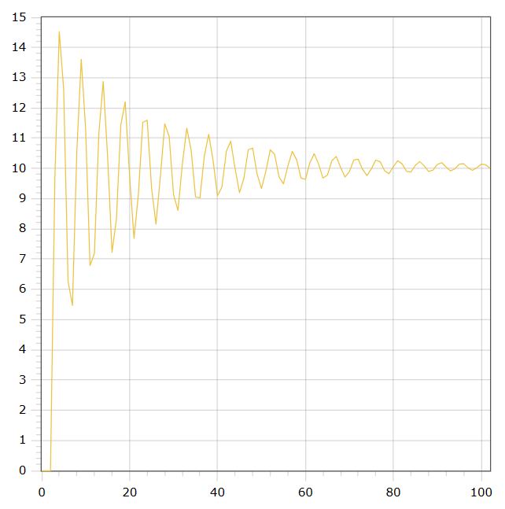

<p align="center"> Министерство образования Республики Беларусь</p>
<p align="center">Учреждение образования</p>
<p align="center">“Брестский Государственный технический университет”</p>
<p align="center">Кафедра ИИТ</p>
<br><br><br><br><br><br><br>
<p align="center">Лабораторная работа №1</p>
<p align="center">По дисциплине “Общая теория интеллектуальных систем”</p>
<p align="center">Тема: “Моделирования температуры объекта”</p>
<br><br><br><br><br>
<p align="right">Выполнил:</p>
<p align="right">Студент 2 курса</p>
<p align="right">Группы ИИ-23</p>
<p align="right">Романюк А. П.</p>
<p align="right">Проверил:</p>
<p align="right">Иванюк Д. С.</p>
<br><br><br><br><br>
<p align="center">Брест 2023</p>

---

# Общее задание #
1. Написать отчет по выполненной лабораторной работе №1 в .md формате (readme.md) и с помощью запроса на внесение изменений (**pull request**) разместить его в следующем каталоге: **trunk\ii0xxyy\task_02\doc** (где **xx** - номер группы, **yy** - номер студента, например **ii02102**).
2. Исходный код написанной программы разместить в каталоге: **trunk\ii0xxyy\task_02\src**.

# Задание #
На C++ реализовать программу, моделирующую рассмотренный выше ПИД-регулятор.  В качестве объекта управления использовать математическую модель, полученную в предыдущей работе.
В отчете также привести графики для разных заданий температуры объекта, пояснить полученные результаты.

---

# Выполнение задания #

Код программы:
```C++
#include <iostream>
#include <cmath>
#include <vector>
#include <fstream>

using namespace std;

class func {
private:
    double K = 0.0001;
    double T = 100;
    double T_D = 100;
    double T_0 = 1;

    double q_0 = K * (1 + T_D / T_0);
    double q_1 = -K * (1 + 2 * T_D / T_0 - T_0 / T);
    double q_2 = K * T_D / T_0;

    vector<double> q = { q_0, q_1, q_2 };
    vector<double> e = { 0, 0, 0 };
    vector<double> y = { 0, 0, 0 };
    vector<double> u = { 1, 1 };

public:
    double sum() {
        double sum = 0;
        for (int i = 0; i < 3; i++) {
            sum += q[i] * e[i];
        }
        return sum;
    }

    void nonlin(int time, double setpoint, double a = 0.5, double b = 0.3, double c = 0.9, double d = 0.7) {
        for (int i = 0; i < time; i++) {
            e[0] = setpoint - y[y.size() - 1];
            e[1] = setpoint - y[y.size() - 2];
            e[2] = setpoint - y[y.size() - 3];
            u[0] = u[1] + sum();
            y.push_back(a * y[y.size() - 1] - b * y[y.size() - 2] * y[y.size() - 2] + c * u[0] + d * sin(u[1]));
            u[1] = u[0];
        }
    }

    vector<double> getY() const{
        return y;
    }
};

int main() {
    double setpoint;
    ofstream out("output.txt");
    func f;

    if (out.is_open()) {
        cout << "Enter the setpoint: ";
        cin >> setpoint;
        f.nonlin(100, setpoint);
        vector<double> y_values = f.getY();

        for (int i = 0; i < y_values.size(); i++) {
            double scaledValue = y_values[i] * setpoint / y_values[y_values.size() - 1];
            cout << i << " " << scaledValue << endl;
            out << i << " " << scaledValue << endl;
        }

        out.close();
    }
    else {
        cerr << "Error: Cannot open the output file." << endl;
    }

    return 0;
}


```     

Вывод программы:

    0.0
    0.0
    0.0
    9.69140581303558
    14.449097032902666
    12.505277323667597
    6.318736882385786
    5.704833796489725
    10.73183301628717
    13.513535520540419
    11.094195656604356
    6.831378548074819
    7.480944261478211
    11.290776203159307
    12.71993436830598
    10.147240033233507
    7.324509676566069
    8.642628326039585
    11.538664676655939
    11.986498761095012
    ...
    10.14942655058238
    10.099062772982727
    9.998275633418178
    9.995925139904656
    10.08749381353281
    10.13428947400506
    10.073031372947419
    10.0

