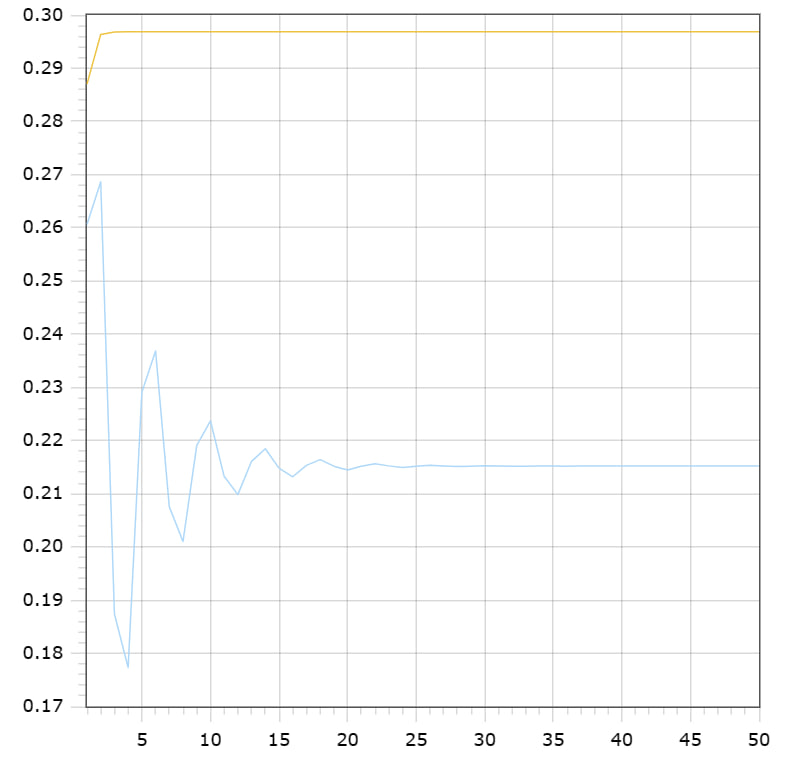

<p align="center"> Министерство образования Республики Беларусь</p>
<p align="center">Учреждение образования</p>
<p align="center">“Брестский Государственный технический университет”</p>
<p align="center">Кафедра ИИТ</p>
<br><br><br><br><br><br><br>
<p align="center">Лабораторная работа №1</p>
<p align="center">По дисциплине “Общая теория интеллектуальных систем”</p>
<p align="center">Тема: “Моделирования температуры объекта”</p>
<br><br><br><br><br>

<p align="right">Выполнил:</p>
<p align="right">Студент 2 курса</p>
<p align="right">Группы ИИ-23</p>
<p align="right">Швороб В.А.</p>
<p align="right">Проверил:</p>
<p align="right">Иванюк Д. С.</p>
<br><br><br><br><br>
<p align="center">Брест 2023</p>

---


# Общее задание

1. Написать отчет по выполненной лабораторной работе №1 в .md формате (readme.md) и с помощью запроса на внесение изменений (**pull request**) разместить его в следующем каталоге: **trunk\ii0xxyy\task_01\doc** (где **xx** - номер группы, **yy** - номер студента, например **ii02102**).
2. Исходный код написанной программы разместить в каталоге: **trunk\ii0xxyy\task_01\src**.

## Task 1. Modeling controlled object

Let's get some object to be controlled. We want to control its temperature, which can be described by this differential equation:

$$\Large\frac{dy(\tau)}{d\tau}=\frac{u(\tau)}{C}+\frac{Y_0-y(\tau)}{RC} $$ (1)

where $\tau$ – time; $y(\tau)$ – input temperature; $u(\tau)$ – input warm; $Y_0$ – room temperature; $C,RC$ – some constants.

After transformation we get these linear (2) and nonlinear (3) models:

$$\Large y_{\tau+1}=ay_{\tau}+bu_{\tau}$$ (2)
$$\Large y_{\tau+1}=ay_{\tau}-by_{\tau-1}^2+cu_{\tau}+d\sin(u_{\tau-1})$$ (3)

where $\tau$ – time discrete moments ($1,2,3{\dots}n$); $a,b,c,d$ – some constants.


##Task is to write program (**C++**), which simulates this object temperature.

---

# Выполнение задания #

Код программы:
```C++
#include <iostream>
#include <cmath>

struct Modeling_object 
{ 

double a = 0.05; 
double b = 1.41; 
double c = 1.15; 
double d = 0.2;
double u = 0.2; 
};

double function1(const Modeling_object* model, double y_t) 
{
	return model->a * y_t + model->b * model->u; 
}

double function2(const Modeling_object* model, double y_t, double y_t_mines) 
{ 
	return model->a * y_t - model->b * y_t_mines * y_t_mines + model->c * model->u + model->d * sin(model->u);
}
int main() 
{
    Modeling_object model;

    double val1_t = 0.1;
    double val2_t = 0.1;
    double val3_t_mines = 0.1;

    int t;
    std::cout << "Enter the number of iterations :";
    std::cin >> t;

    std::cout << "Linear model :"<<std::endl;

    for (int i = 0; i < t; i++)
    {
        val1_t = function1(&model, val1_t);
        std::cout << i + 1 << "; " << val1_t  << std::endl;
    }

    std::cout << std::endl;

    std::cout << "Unlinear model :"<< std::endl;

    for (int i = 0; i < t; i++)
    {
        double temp = val2_t;
        val2_t = function2(&model, val2_t, val3_t_mines);
        val3_t_mines = temp;
        std::cout << i + 1 << "; " << val2_t << std::endl;
    }

    return 0;
}
```     

Вывод программы:

Enter the number of iterations :50

Linear model :
	
	1; 0.287
	
	2; 0.29635
	
	3; 0.296817
	
	4; 0.296841
	
	5; 0.296842
	
	6; 0.296842
	
	7; 0.296842
	
	8; 0.296842
	
	9; 0.296842
	
	10; 0.296842
	
	11; 0.296842
	
	12; 0.296842
	
	13; 0.296842
	
	14; 0.296842
	
	15; 0.296842
	
	16; 0.296842
	
	17; 0.296842
	
	18; 0.296842
	
	19; 0.296842
	
	20; 0.296842
	
	21; 0.296842
	
	22; 0.296842
	
	23; 0.296842
	
	24; 0.296842
	
	25; 0.296842
	
	26; 0.296842
	
	27; 0.296842
	
	28; 0.296842
	
	29; 0.296842
	
	30; 0.296842
	
	31; 0.296842
	
	32; 0.296842
	
	33; 0.296842
	
	34; 0.296842
	
	35; 0.296842
	
	36; 0.296842
	
	37; 0.296842
	
	38; 0.296842
	
	39; 0.296842
	
	40; 0.296842
	
	41; 0.296842
	
	42; 0.296842
	
	43; 0.296842
	
	44; 0.296842
	
	45; 0.296842
	
	46; 0.296842
	
	47; 0.296842
	
	48; 0.296842
	
	49; 0.296842
	
	50; 0.296842
	
	
	
	Unlinear model :
	
	1; 0.260634
	
	2; 0.268666
	
	3; 0.187386
	
	4; 0.177328
	
	5; 0.22909
	
	6; 0.236851
	
	7; 0.207576
	
	8; 0.201014
	
	9; 0.219031
	
	10; 0.223712
	
	11; 0.213276
	
	12; 0.209831
	
	13; 0.21609
	
	14; 0.218457
	
	15; 0.214817
	
	16; 0.213185
	
	17; 0.215327
	
	18; 0.216419
	
	19; 0.215179
	
	20; 0.214452
	
	21; 0.21517
	
	22; 0.215647
	
	23; 0.215236
	
	24; 0.214926
	
	25; 0.21516
	
	26; 0.21536
	
	27; 0.215228
	
	28; 0.2151
	
	29; 0.215174
	
	30; 0.215255
	
	31; 0.215214
	
	32; 0.215163
	
	33; 0.215185
	
	34; 0.215217
	
	35; 0.215205
	
	36; 0.215185
	
	37; 0.215191
	
	38; 0.215204
	
	39; 0.215201
	
	40; 0.215193
	
	41; 0.215194
	
	42; 0.215199
	
	43; 0.215199
	
	44; 0.215196
	
	45; 0.215196
	
	46; 0.215198
	
	47; 0.215198
	
	48; 0.215197
	
	49; 0.215197
	
	50; 0.215197


   
