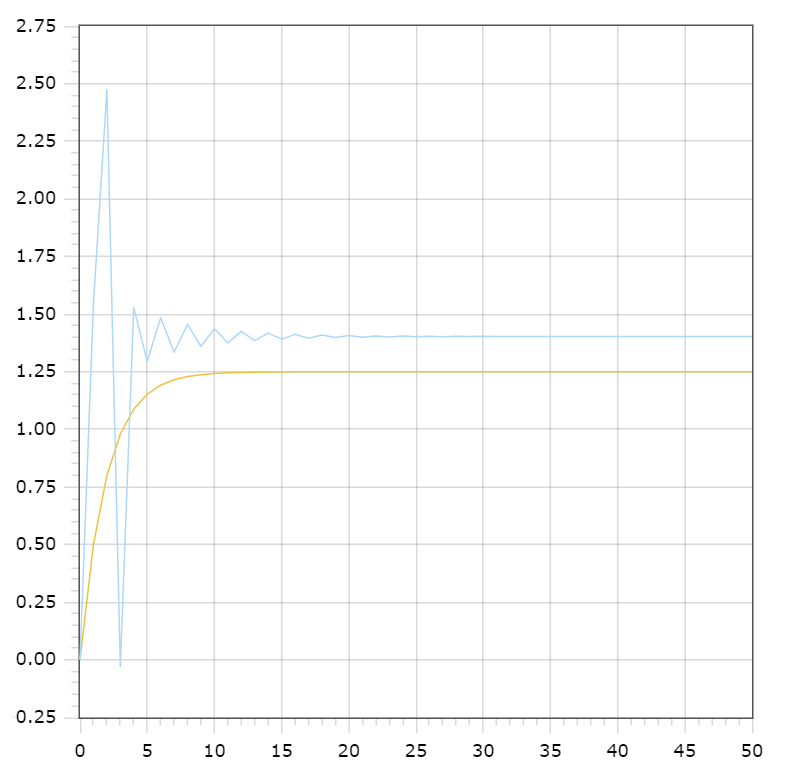

<p align="center"> Министерство образования Республики Беларусь</p>
<p align="center">Учреждение образования</p>
<p align="center">“Брестский Государственный технический университет”</p>
<p align="center">Кафедра ИИТ</p>
<br><br><br><br><br><br><br>
<p align="center">Лабораторная работа №1</p>
<p align="center">По дисциплине “Общая теория интеллектуальных систем”</p>
<p align="center">Тема: “Моделирования температуры объекта”</p>
<br><br><br><br><br>
<p align="right">Выполнил:</p>
<p align="right">Студент 2 курса</p>
<p align="right">Группы ИИ-23</p>
<p align="right">Швороб В.А.</p>
<p align="right">Проверил:</p>
<p align="right">Иванюк Д. С.</p>
<br><br><br><br><br>
<p align="center">Брест 2023</p>

---

# Общее задание

1. Написать отчет по выполненной лабораторной работе №1 в .md формате (readme.md) и с помощью запроса на внесение изменений (**pull request**) разместить его в следующем каталоге: **trunk\ii0xxyy\task_01\doc** (где **xx** - номер группы, **yy** - номер студента, например **ii02102**).
2. Исходный код написанной программы разместить в каталоге: **trunk\ii0xxyy\task_01\src**.

## Task 1. Modeling controlled object

Let's get some object to be controlled. We want to control its temperature, which can be described by this differential equation:

$$\Large\frac{dy(\tau)}{d\tau}=\frac{u(\tau)}{C}+\frac{Y_0-y(\tau)}{RC} $$ (1)

where $\tau$ – time; $y(\tau)$ – input temperature; $u(\tau)$ – input warm; $Y_0$ – room temperature; $C,RC$ – some constants.

After transformation we get these linear (2) and nonlinear (3) models:

$$\Large y_{\tau+1}=ay_{\tau}+bu_{\tau}$$ (2)
$$\Large y_{\tau+1}=ay_{\tau}-by_{\tau-1}^2+cu_{\tau}+d\sin(u_{\tau-1})$$ (3)

where $\tau$ – time discrete moments ($1,2,3{\dots}n$); $a,b,c,d$ – some constants.

Task is to write program (**C++**), which simulates this object temperature.

---

# Выполнение задания

Код программы:

```C++
#include <iostream>
#include <fstream>
#include <cmath>

using namespace std;

class Solution {
private:
    double y1, y2, u;

    double a = 0.6;
    double b = 0.5;
    double c = 0.62;
    double d = 1.1;

    int i = 0;
public:
    double func1(double y, double u);
    double func2(double y, double u, double y1);
    void input();
    void output(ofstream& outFile);
};

double Solution::func1(double y, double u) {
    return a * y + b * u;
}

double Solution::func2(double y, double u, double y1) {
    return a * y - b * pow(y1, 2) + c * u + d * sin(u);
}

void Solution::input() {
    cin >> y1 >> u;
}

void Solution::output(ofstream& outFile) {
    outFile << i << " " << y1 << " " << y1 << endl;
    y1 = func1(y1, u);
    y2 = func2(y1, u, y1);
    i++;
    outFile << i << " " << y1 << " " << y2 << endl;

    for (i = 2; i < 100; i++) {
        y1 = func1(y1, u);
        y2 = func2(y2, u, y1);
        outFile << i << " " << y1 << " " << y2 << endl;
    }
}

int main() {
    ofstream outFile("output.txt");

    Solution object;
    object.input();
    object.output(outFile);

    return 0;
}
```

Вывод программы:

    	0 0 0
    	1 0.5 1.54562
    	2 0.8 2.47299
    	3 0.98 -0.0284257
    	4 1.088 1.52816
    	5 1.1528 1.29488
    	6 1.19168 1.48419
    	7 1.21501 1.33472
    	8 1.229 1.45571
    	9 1.2374 1.3595
    	10 1.24244 1.4372
    	11 1.24547 1.37517
    	12 1.24728 1.42518
    	13 1.24837 1.38516
    	14 1.24902 1.41738
    	15 1.24941 1.39156
    	16 1.24965 1.41233
    	17 1.24979 1.39568
    	18 1.24987 1.40907
    	19 1.24992 1.39832
    	20 1.24995 1.40696
    	21 1.24997 1.40003
    	22 1.24998 1.4056
    	23 1.24999 1.40113
    	24 1.24999 1.40472
    	25 1.25 1.40183
    	26 1.25 1.40415
    	27 1.25 1.40229
    	28 1.25 1.40378
    	29 1.25 1.40258
    	30 1.25 1.40355
    	31 1.25 1.40277
    	32 1.25 1.4034
    	33 1.25 1.4029
    	34 1.25 1.4033
    	35 1.25 1.40298
    	36 1.25 1.40323
    	37 1.25 1.40303
    	38 1.25 1.40319
    	39 1.25 1.40306
    	40 1.25 1.40317
    	41 1.25 1.40308
    	42 1.25 1.40315
    	43 1.25 1.40309
    	44 1.25 1.40314
    	45 1.25 1.4031
    	46 1.25 1.40313
    	47 1.25 1.40311
    	48 1.25 1.40313
    	49 1.25 1.40311
    	50 1.25 1.40312


