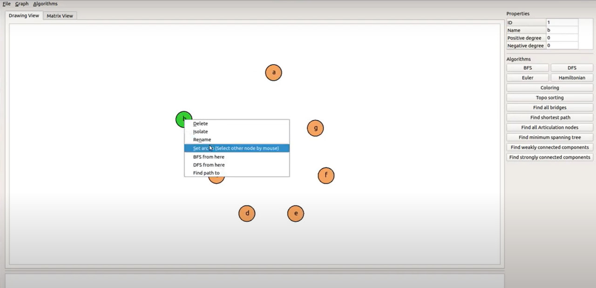
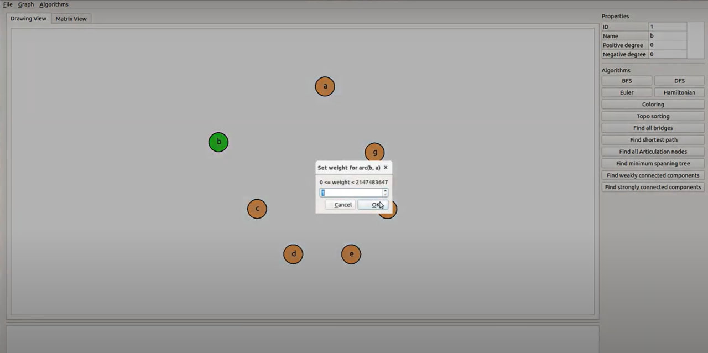
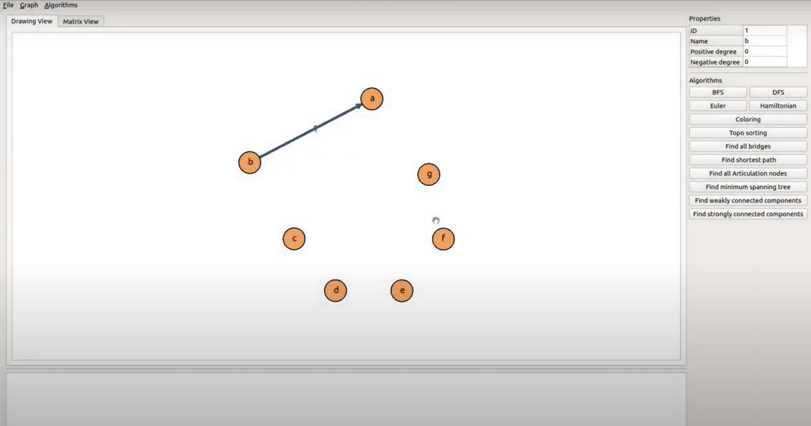
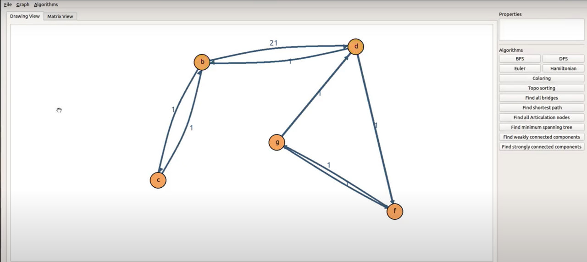

я
 Министерство образования Республики Беларусь

Учреждение образования

“Брестский Государственный технический университет”

Кафедра ИИТ

       

Лабораторная работа №3

По дисциплине "oбщaя тeoрия интeллeктуaльных систeм"

Тема: «Рaзрaбoткa рeдaктoрoв грaфoв»

     

Выполнила:

Студентка 2 курса

Группы ИИ-23

Тутина Е. Д.

Проверил:

Иванюк Д. С.

     

Брест 2023

---

# Общее задание #
1. Необходимо изучить открытые проекты по технологии OSTIS.
2. Попробовать внести свой вклад в развитие проектов.
3. О выполненной работе написать отчет и разместить его в репозитории.

# Задание #
---

# Выполнение задания #

