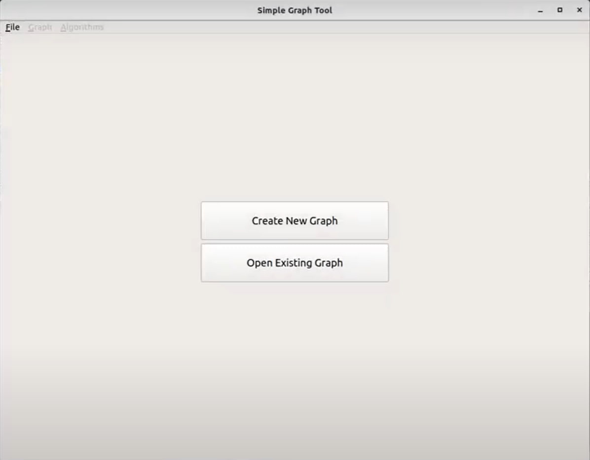
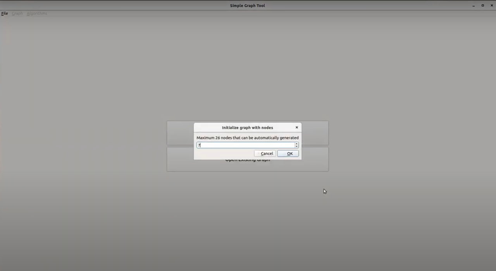
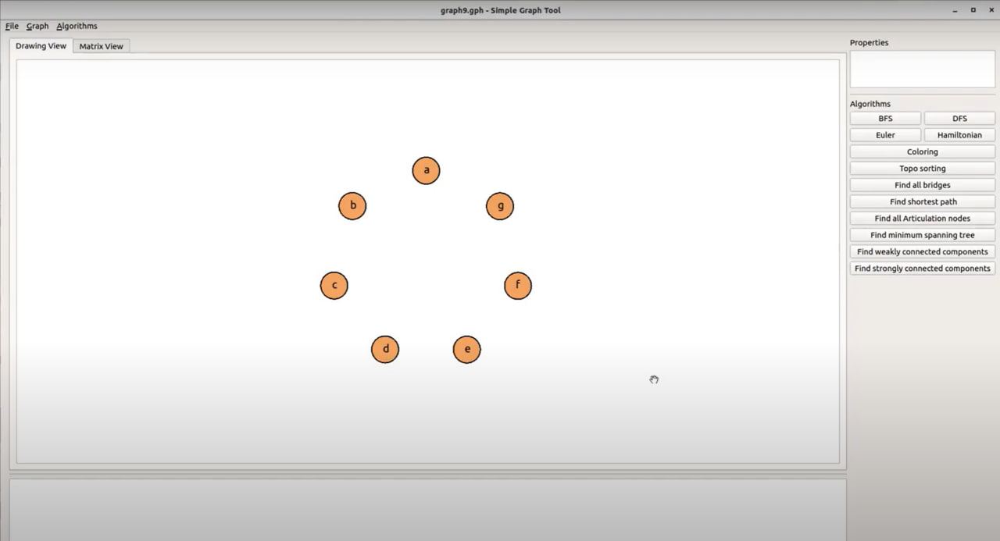

 Министерство образования Республики Беларусь

Учреждение образования

“Брестский Государственный технический университет”

Кафедра ИИТ

       

Лабораторная работа №3

По дисциплине «Рaзрaбoткa рeдaктoрoв грaфoв»

Тема: “ПИД-регуляторы”

     

Выполнила:

Студентка 2 курса

Группы ИИ-23

Тутина Е. Д.

Проверил:

Иванюк Д. С.

     

Брест 2023

---

# Общее задание #
1. Написать отчет по выполненной лабораторной работе №1 в .md формате (readme.md) и с помощью запроса на внесение изменений (**pull request**) разместить его в следующем каталоге: **trunk\ii0xxyy\task_01\doc** (где **xx** - номер группы, **yy** - номер студента, например **ii02302**).
2. Исходный код написанной программы разместить в каталоге: **trunk\ii0xxyy\task_01\src**.

# Задание #
---

# Выполнение задания #

