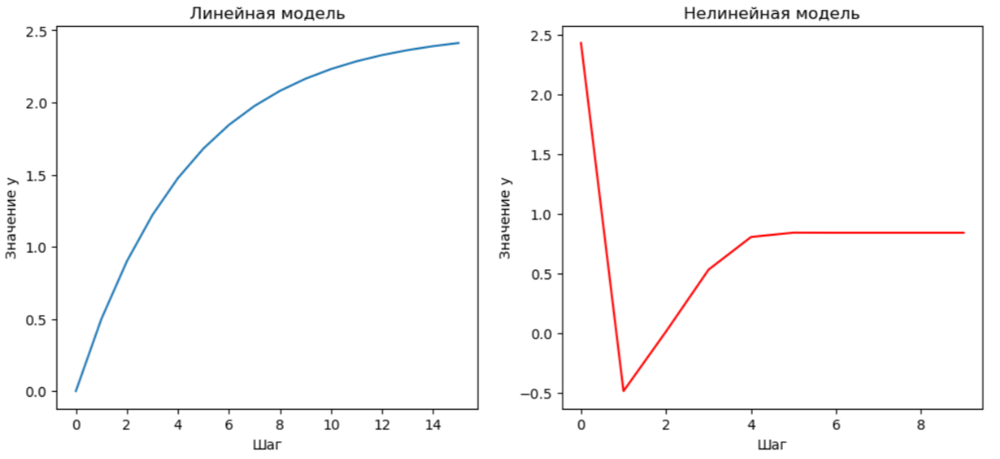

<p style="text-align: center;">Министерство образования Республики Беларусь</p>
<p style="text-align: center;">Учреждение образования</p>
<p style="text-align: center;">“Брестский Государственный технический университет”</p>
<p style="text-align: center;">Кафедра ИИТ</p>
<div style="margin-bottom: 10em;"></div>
<p style="text-align: center;">Лабораторная работа №1</p>
<p style="text-align: center;">По дисциплине “Общая теория интеллектуальных систем”</p>
<p style="text-align: center;">Тема: “Моделирования температуры объекта”</p>
<div style="margin-bottom: 10em;"></div>
<p style="text-align: right;">Выполнила:</p>
<p style="text-align: right;">Студентка 2 курса</p>
<p style="text-align: right;">Группы ИИ-24</p>
<p style="text-align: right;">Алешко А.В.</p>
<p style="text-align: right;">Проверил:</p>
<p style="text-align: right;">Иванюк Д. С.</p>
<div style="margin-bottom: 10em;"></div>
<p style="text-align: center;">Брест 2023</p>

---

# Общее задание #
1. Написать отчет по выполненной лабораторной работе №1 в .md формате (readme.md) и с помощью запроса на внесение изменений (**pull request**) разместить его в следующем каталоге: **trunk\ii0xxyy\task_01\doc** (где **xx** - номер группы, **yy** - номер студента, например **ii02302**).
2. Исходный код написанной программы разместить в каталоге: **trunk\ii0xxyy\task_01\src**.

## Task 1. Modeling controlled object ##
Let's get some object to be controlled. We want to control its temperature, which can be described by this differential equation:

$$\Large\frac{dy(\tau)}{d\tau}=\frac{u(\tau)}{C}+\frac{Y_0-y(\tau)}{RC} $$ (1)

where $\tau$ – time; $y(\tau)$ – input temperature; $u(\tau)$ – input warm; $Y_0$ – room temperature; $C,RC$ – some constants.

After transformation we get these linear (2) and nonlinear (3) models:

$$\Large y_{\tau+1}=ay_{\tau}+bu_{\tau}$$ (2)
$$\Large y_{\tau+1}=ay_{\tau}-by_{\tau-1}^2+cu_{\tau}+d\sin(u_{\tau-1})$$ (3)

where $\tau$ – time discrete moments ($1,2,3{\dots}n$); $a,b,c,d$ – some constants.

Task is to write program (**С++**), which simulates this object temperature.


---
# Выполнение задания #
```C++
#include <iostream>
#include <cmath>

class functs {
public:
    double a = 0.2;  // Modified value
    double b = 0.3;  // Modified value
    double c = 0.2;  // Modified value
    double d = 0.3;  // Modified value
    double u = 1.0;
    double y = 0.0;

    void println(double val) {
        std::cout << val << std::endl;
    }

    // Modified linear model
    double linear(double y, int n, int t) {
        if (n < t) {
            println(y);
            return linear(a * y + b * u, n + 1, t);
        }
        println(y);
        return a * y + b * u;
    }
};

int main() {
    functs f;

    std::cout << "Modified Линейная модель" << std::endl;
    std::cout << f.linear(f.y, 0, 10) << std::endl;
    std::cout << "                   " << std::endl;
    std::cout << "Modified Нелинейная модель" << std::endl;
    f.println(f.y);
    double y_prev = f.y;
    double u_prev = f.u;
    f.y = f.a * f.y - f.b * y_prev * y_prev + f.c * 1.0 + f.d * sin(1.0);
    for (int i = 1; i < 10; i++) {
        f.println(f.y);
        double temp = f.y;
        f.y = f.a * f.y - f.b * y_prev * y_prev + f.c * f.u + f.d * sin(u_prev);
        y_prev = temp;
        u_prev = f.u;
    }

    return 0;
}

```     

Вывод программы:

Линейная модель
0
0.4
0.52
0.556
0.5668
0.57004
0.571012
0.571304
0.571391
0.571417
0.571425
0.571428

Нелинейная модель
0
0.520735
0.676956
0.615356
0.522034
0.525881
0.569492
0.580963
0.565296
0.555317

