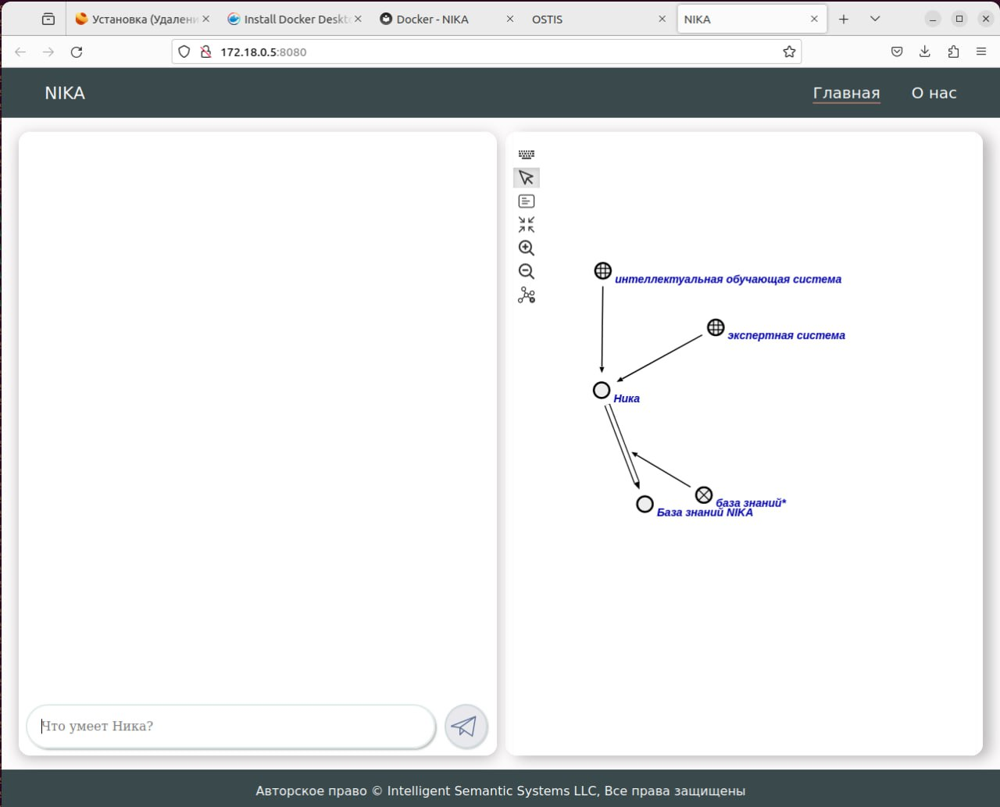
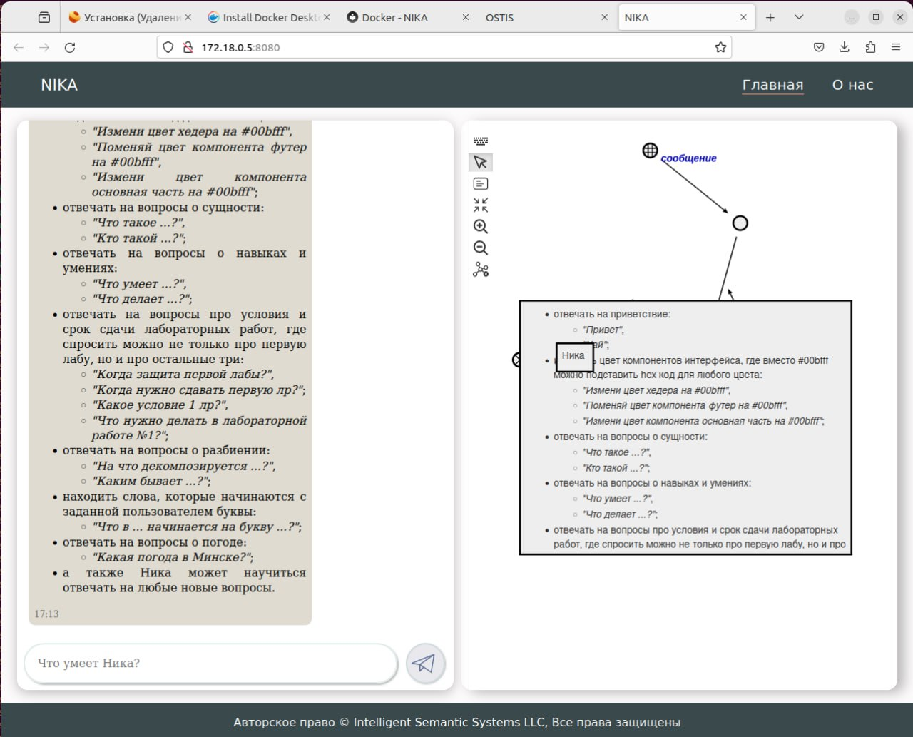
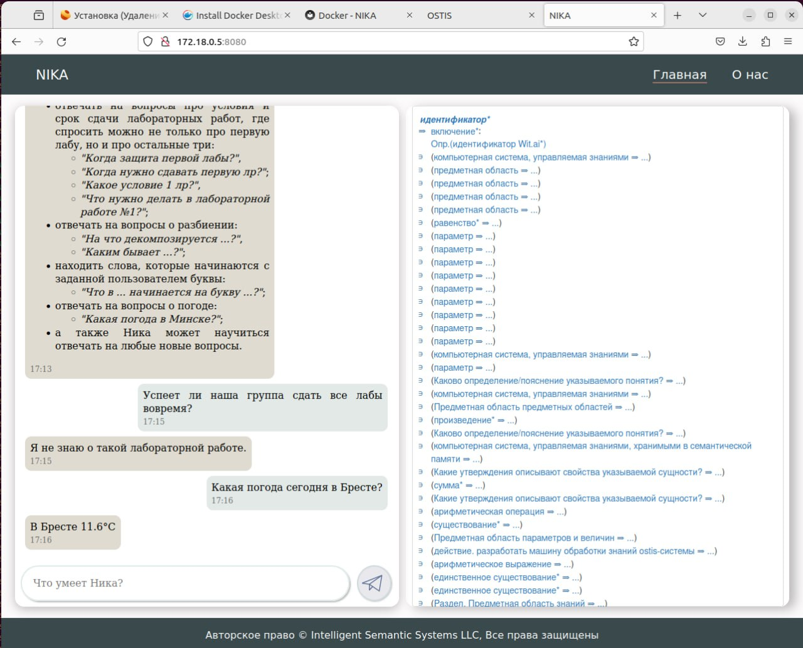
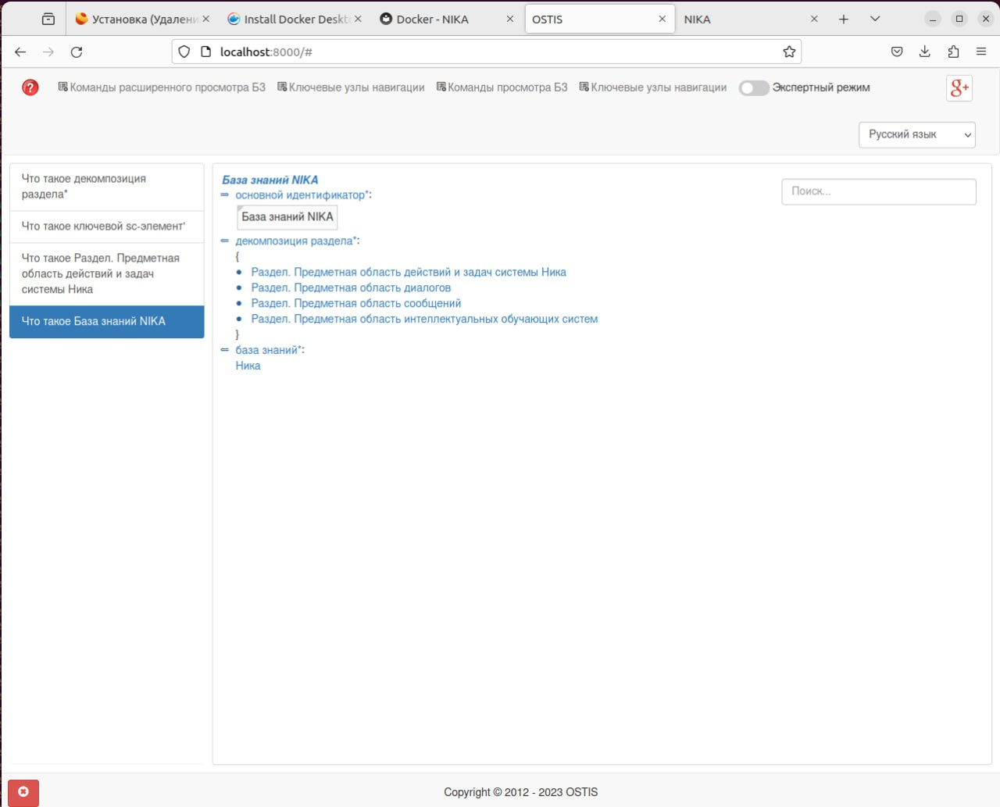
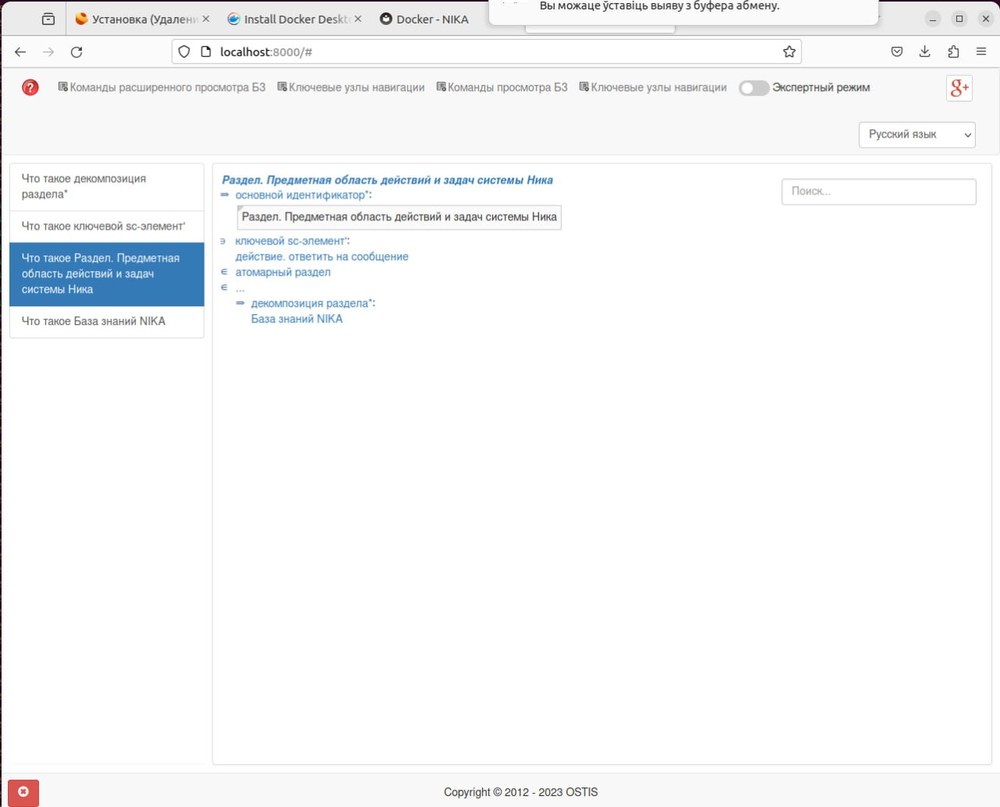
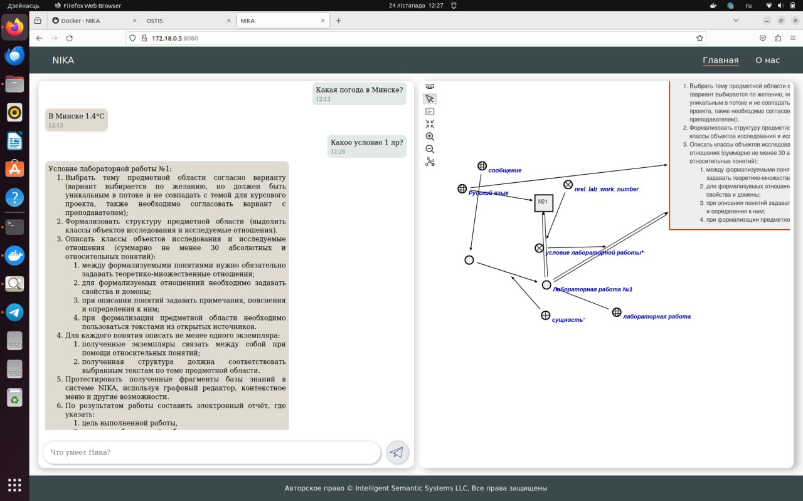

 Министерство образования Республики Беларусь

Учреждение образования

“Брестский Государственный технический университет”

Кафедра ИИТ

       

Лабораторная работа №4

По дисциплине “Общая теория интеллектуальных систем”

Тема: “Работа с проектом "NIKA" (Intelligent Knowledge-driven Assistant)”

     

Выполнила:

Студентка 2 курса

Группы ИИ-24

Алешко А. В.

Проверил:

Иванюк Д. С.

     

Брест 2023

---

# Задание

1.  Изучить [руководство](https://github.com/ostis-apps/nika).

2.  Запустить данный проект на локальной машине (домашний персональный компьютер, ноутбук, рабочая машина в аудитории и т.п.). Продемонстрировать работу проекта преподавателю.

3.  Написать отчет по выполненной работе в .md формате (readme.md) и с помощью pull request разместить его в следующем каталоге: trunk\ii0xxyy\task_04\doc.

---
# Выполнение задания

---